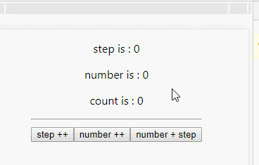
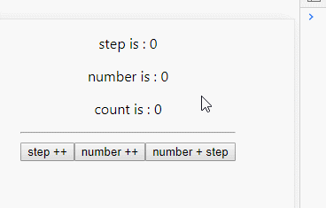
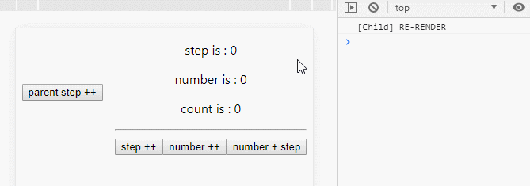
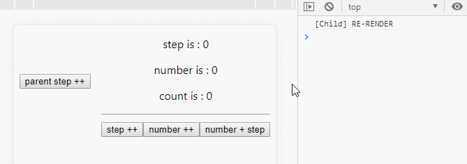

从 API 名字就可以看出， createContext 能够创建一个 React 的 上下文（context），然后订阅了这个上下文的组件中，可以拿到上下文中提供的数据或者其他信息。

基本的使用方法：

```javascript
const MyContext = React.createContext(defaultValue)
```

其中 `defaultValue` 是传入的默认值。

如果要使用创建的上下文，需要通过 `Context.Provider` 最外层包装组件，并且需要显示的通过 `<MyContext.Provider value={{xx:xx}}>` 的方式传入 `value`，指定 context 要对外暴露的信息。

子组件在匹配过程中只会匹配最新的 Provider，也就是说如果有下面三个组件：`ContextA.Provider->A->ContexB.Provider->B->C`

如果 ContextA 和 ContextB 提供了相同的方法，则 C 组件只会选择 ContextB 提供的方法。

**为什么要默认值？**

如果匹配不到最新的 Provider 则会使用默认值，默认值一般只有在**对组件进行单元测试**（组件并未嵌入到父组件中）的时候，比较有用。


## 二、使用 useContext 获取上下文

useContext 文档地址：https://zh-hans.reactjs.org/docs/hooks-reference.html#usecontext

通过 React.createContext 创建出来的上下文，在子组件中可以通过 `useContext` 这个 Hook 获取 Provider 提供的内容

```jsx
const {funcName} = useContext(MyContext);
```

从上面代码可以发现，useContext 需要将 `MyContext` 这个 **Context 实例传入**，不是字符串，就是实例本身。

这种用法会存在一个比较尴尬的地方，父子组件不在一个目录中，如何共享 `MyContext` 这个 Context 实例呢？

一般这种情况下，我会通过 Context Manager 统一管理上下文的实例，然后通过 `export` 将实例导出，在子组件中在将实例 import 进来。


## 三、createContext 和 useContext 结合使用实现方法共享

举个实际的例子：**子组件中修改父组件的 state**

一般的做法是将父组件的方法比如 setXXX 通过 props 的方式传给子组件，而一旦子组件多层级的话，就要层层透传。

使用 Context 的方式则可以免去这种层层透传


### 1、context-manager.js

创建一个上下文管理的组件，用来统一导出 Context 实例

```javascript
import React from 'react';

export const MyContext = React.createContext(null);
```


### 2、父组件 Provider 提供上下文 value

下面代码中，父组件引入了实例，并且通过 `MyContext.Provider` 将父组件包装，并且通过 `Provider.value` 将方法提供出去。

下面的实例提供了三个 state 操作方法：

- setStep
- setCount
- setNumber

以及一个副作用方法：

- fetchData

子组件 `Child` 接受的 props 只有三个 state 的值 `step/number/count`。

```jsx
import React, { useState } from 'react';
import Child from './Child';
import { MyContext } from './context-manager';

const fetchData = () => {
    return new Promise((resolve, reject) => {
        setTimeout(() => {
            resolve(1);
        })
    });
}

export default (props = {}) => {
    const [step, setStep] = useState(0);
    const [count, setCount] = useState(0);
    const [number, setNumber] = useState(0);


    return (
        <MyContext.Provider value={{ setStep, setCount, setNumber, fetchData }}>
            <Child step={step} number={number} count={count} />
        </MyContext.Provider>
    );
}
```


### 3、子组件 useContext 解析上下文

下面是子组件，相同的，也需要从 `context-manager` 中引入 MyContext 这个实例，然后才能通过 `const { setStep, setNumber, setCount, fetchData } = useContext(MyContext);` 解析出上下文中的方法，在子组件中则可以直接使用这些方法，修改父组件的 state。

```javascript
import React, { useContext, useEffect, memo } from 'react';

import { MyContext } from './context-manager';

export default (props = {}) => {
    const { setStep, setNumber, setCount, fetchData } = useContext(MyContext);

    useEffect(() => {
        fetchData().then((res) => {
            console.log(`FETCH DATA: ${res}`);
        })
    }, []);

    return (
        <div>
            <p>step is : {props.step}</p>
            <p>number is : {props.number}</p>
            <p>count is : {props.count}</p>
            <hr />
            <div>
                <button onClick={() => { setStep(props.step + 1) }}>step ++</button>
                <button onClick={() => { setNumber(props.number + 1) }}>number ++</button>
                <button onClick={() => { setCount(props.step + props.number) }}>number + step</button>
            </div>
        </div>
    );
};
```


### 4、效果：



可以发现，在子组件中点击按钮，直接调用 Context 透传过来的方法，可以修改父组件的 state，子组件则会重新渲染。

**这种方式显式的避免了多级 props 的层层透传问题，虽然 Demo 只有一级 子组件，即使存在多级子组件也可以直接修改**


## 四、使用 useReducer 减少 Context 的复杂程度

上面的示例虽然实现了多级组件方法共享，但是暴露出一个问题：所有的方法都放在了 Context.Provider.value 属性中传递，必然造成整个 Context Provider 提供的方法越来越多，也会臃肿。

`<MyContext.Provider value={{ setStep, setCount, setNumber, fetchData }} />` 里面的方法可能越来越多

而向 `setStep`、`setCount`、`setNumber` 这三个方法，是可以通过 `useReducer` 包装，并且通过 `dispatch` 触发的，因此修改一下父组件：

下面的父组件与之前不同地方只是去掉了 setXXX 这些设置 state 的方法，并且在 **Provider value** 中，只传入了 `value={{dispatch}}`

```javascript
import React, { useReducer } from 'react';
import Child from './Child';
import { MyContext } from './context-manager';

const initState = { count: 0, step: 0, number: 0 };

const reducer = (state, action) => {
    switch (action.type) {
        case 'stepInc': return Object.assign({}, state, { step: state.step + 1 });
        case 'numberInc': return Object.assign({}, state, { number: state.number + 1 });
        case 'count': return Object.assign({}, state, { count: state.step + state.number });
        default: return state;
    }
}

export default (props = {}) => {
    const [state, dispatch] = useReducer(reducer, initState);
    const { step, number, count } = state;

    return (
        <MyContext.Provider value={{ dispatch }}>
            <Child step={step} number={number} count={count} />
        </MyContext.Provider>
    );
}
```

因此此时子组件只需要拿到 `dispatch` 即可修改父组件的 state:

> 子组件唯一的不同就是点击事件执行的是 `dispatch`

```javascript
import React, { useContext, memo } from 'react';

import { MyContext } from './context-manager';

export default memo((props = {}) => {
    const { dispatch } = useContext(MyContext);

    return (
        <div>
            <p>step is : {props.step}</p>
            <p>number is : {props.number}</p>
            <p>count is : {props.count}</p>
            <hr />
            <div>
                <button onClick={() => { dispatch({ type: 'stepInc' }) }}>step ++</button>
                <button onClick={() => { dispatch({ type: 'numberInc' }) }}>number ++</button>
                <button onClick={() => { dispatch({ type: 'count' }) }}>number + step</button>
            </div>
        </div>
    );
});
```

效果如下：




## 五、将 state 也通过 Context 传递给子组件

上面的所有示例中，子组件获取父组件的 state 还是通过 props ，多级子组件又会存在层层嵌套

如果将整个 state 通过 Context 传入就无需层层组件的 props 传递（如果不需要整个state，可以只将某几个 state 给 Provider）


### 1、父组件

父组件的变化只是将 state 也给了 Provider，然后去掉了 Child 组件的 props 透传

```javascript
import React, { useReducer } from 'react';
import Child from './Child';
import { MyContext } from './context-manager';

const initState = { count: 0, step: 0, number: 0 };

const reducer = (state, action) => {
    switch (action.type) {
        case 'stepInc': return Object.assign({}, state, { step: state.step + 1 });
        case 'numberInc': return Object.assign({}, state, { number: state.number + 1 });
        case 'count': return Object.assign({}, state, { count: state.step + state.number });
        default: return state;
    }
}

export default (props = {}) => {
    const [state, dispatch] = useReducer(reducer, initState);
    return (
        <MyContext.Provider value={{ state, dispatch }}>
            <button onClick={() => { dispatch({ type: 'stepInc' }) }}>parent step ++</button>
            <Child />
        </MyContext.Provider>
    );
}
```


### 2、子组件直接使用父组件的 state

下面代码中可以看出，原来的 `props.number` 都变成了 `state.number`

**注意：在 return 内部我写了一个 console**

```javascript
import React, { useContext, memo } from 'react';

import { MyContext } from './context-manager';

export default memo((props = {}) => {
    const { state, dispatch } = useContext(MyContext);
    return (
        <div>
            {console.log('[Child] RE-RENDER')}
            <p>step is : {state.step}</p>
            <p>number is : {state.number}</p>
            <p>count is : {state.count}</p>
            <hr />
            <div>
                <button onClick={() => { dispatch({ type: 'stepInc' }) }}>step ++</button>
                <button onClick={() => { dispatch({ type: 'numberInc' }) }}>number ++</button>
                <button onClick={() => { dispatch({ type: 'count' }) }}>number + step</button>
            </div>
        </div>
    );
});
```


### 3、效果




### 4、直接使用父组件 state 带来的性能问题

注意看上面的动图，在点击子组件的 【number + step】 按钮的时候，虽然 count 的值没有发生任何变化，但是一直触发 re-render，即使子组件是通过 `React.memo` 包装过的。

出现这个问题原因是 React.memo 只会对 props 进行浅比较，而通过 Context 我们直接将 state 注入到了组件内部，因此 state 的变化必然会触发 re-render，整个 state 变化是绕过了 memo。


## 六、使用 useMemo() 解决 state Context 透传的性能问题

既然 `React.memo()` 无法拦截注入到 Context 的 state 的变化，那就需要我们在组件内部进行更细粒度的性能优化，这个时候可以使用 `useMemo()`


### 1、使用 useMemo 优化子组件渲染

下面是对子组件的改造，去掉了 `React.memo`，在 return 内部通过 `useMemo()` 包装，并且声明了所有依赖项：（包括：step/number/count/dispatch）

```javascript
import React, { useContext, useMemo } from 'react';

import { MyContext } from './context-manager';

export default (props = {}) => {
    const { state, dispatch } = useContext(MyContext);
    return useMemo(() => {
        console.log('[Child] RE-RENDER');
        return (
            <div>
                <p>step is : {state.step}</p>
                <p>number is : {state.number}</p>
                <p>count is : {state.count}</p>
                <hr />
                <div>
                    <button onClick={() => { dispatch({ type: 'stepInc' }) }}>step ++</button>
                    <button onClick={() => { dispatch({ type: 'numberInc' }) }}>number ++</button>
                    <button onClick={() => { dispatch({ type: 'count' }) }}>number + step</button>
                </div>
            </div>
        )
    }, [state.count, state.number, state.step, dispatch]);
}
```


### 2、优化后效果：



从上面效果可以发现，当 number+step=count 不变的时候，是不会触发 return 中 DOM 的重新渲染的 