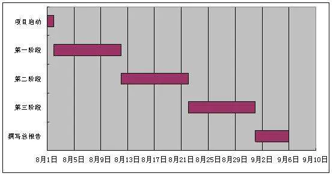
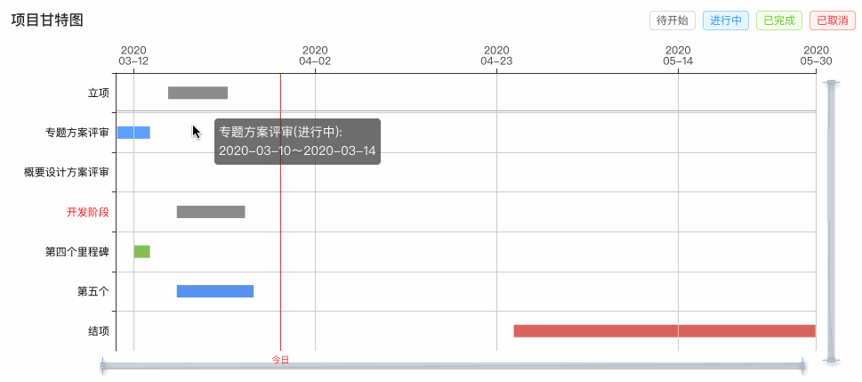
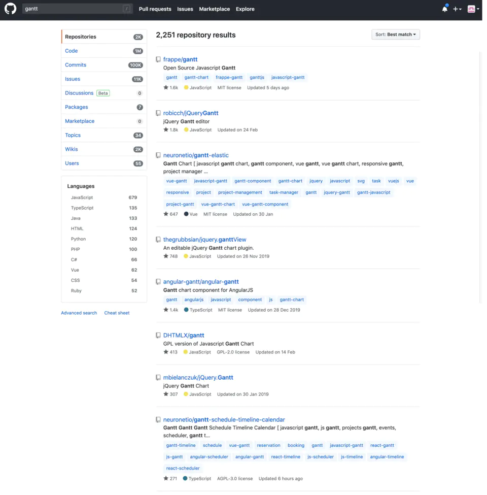
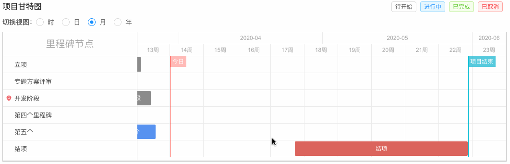
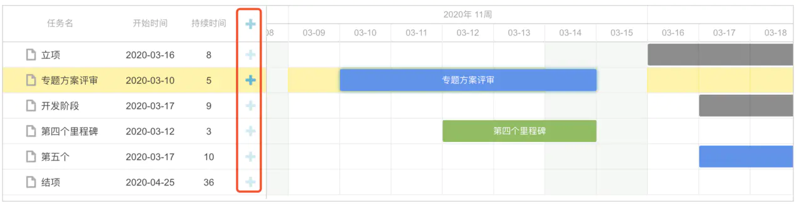
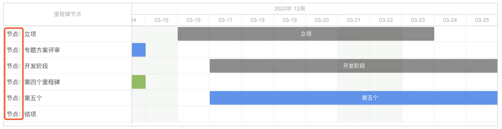
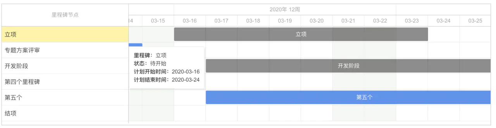
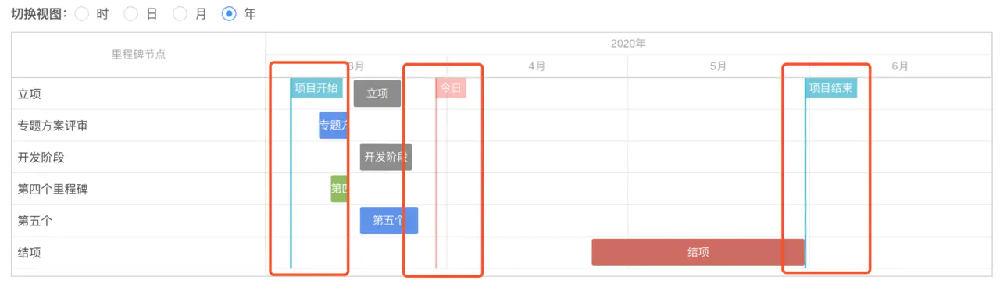
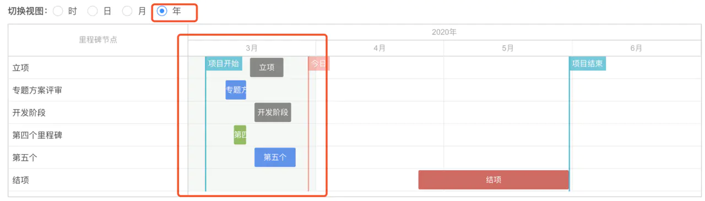
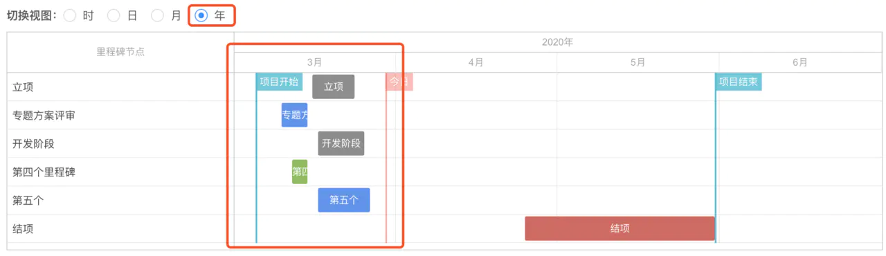

# [甘特图](https://github.com/DHTMLX/gantt)

## 事情是这样的 👀

- 早些时候，我接到了一个需求，说要将项目里程碑用甘特图展示，一脸懵逼的我先是搜一下什么是“甘特图” 🧐：

> From 百度百科：甘特图（Gantt chart）又称为横道图、条状图(Bar chart)。其通过条状图来显示项目，进度，和其他时间相关的系统进展的内在关系随着时间进展的情况。

- 配合图片感受 😰：



- 心想，刚好最近用 [echarts](https://www.echartsjs.com/zh/index.html) 画过许多图表，这货应该也能用 `echarts` 来实现，历尽千辛和万苦，于是有了👇：



- 产品一看，说：“这不是我要的甘特图，重做！”，缓缓地打出一个“好的”，实际上心情如👇图：


- 在 `github` 上一搜，甘特图组件不算多，由于时间紧急，当时还没发现只有413个 🌟的真命天子（`dhtmlxGantt`）😭，仅试用了前面4款 🌟比较多的：



- 结果均是以失败告终（不符合业务需求，改造难度大）。


- 调整一下心情，重新踏上甘特图组件调研之路 🤕，终于，被我发现了 [Top 5 : Best free jQuery and JavaScript Dynamic Gantt Charts for web applications](https://ourcodeworld.com/articles/read/434/top-5-best-free-jquery-and-javascript-dynamic-gantt-charts-for-web-applications) 这个网站，真命天子 `dhtmlxGantt` 排名TOP1，于是我开始对其进行了试用及研究。
- 经过一番折腾，终于做出了符合业务方需求的甘特图 👇：



- 有一说一，与 `echarts` 模拟的甘特图一比，`dhtmlxGantt` 确实功能强大了许多，除了能实现对重要日期（如今日/项目开始时间/项目结束时间等）进行标示、tooltip、里程碑状态区分等功能之外，最重要的是可以实现按时/日/月/年的切换。
- 由于 `dhtmlxGantt` 有免费版和付费版，一开始试用也不知道成不成功，所以我下载了免费版的[源码](https://dhtmlx.com/docs/products/dhtmlxGantt/download/thankyou.shtml)进行了一番研究，幸好最后的结果也是可以通过一些配置来实现需求，下面将介绍怎么实现。

## 通过配置 dhtmlxGantt 实现的功能

### 在 react 项目中使用

- `dhtmlxGantt` 在 [github](https://github.com/DHTMLX/gantt) 提供了在 `Vue.js/Angular/React` 项目中的使用方法入口，本文将对如何在 react 项目中使用进行介绍（经实践）。
- 下载命令：

```bash
yarn add dhtmlx-gantt
复制代码
```

- 在组件中使用：

```bash
import 'dhtmlx-gantt';
import 'dhtmlx-gantt/codebase/dhtmlxgantt.css';
import 'dhtmlx-gantt/codebase/ext/dhtmlxgantt_marker.js';
import 'dhtmlx-gantt/codebase/ext/dhtmlxgantt_tooltip.js';
import 'dhtmlx-gantt/codebase/locale/locale_cn.js';
import * as React from 'react';
import { getGanttConfigByZoomValue } from '../../utils/milestone.lib';
import Toolbar from './components/Toolbar';
import * as styles from './index.module.less';

export default class Gantt extends React.Component<any> {
  state = {
    currentZoom: 'Days', // 默认按日维度展示
    isMount: false,
  };

  private ganttContainer: any;

  componentWillReceiveProps (nextProps: any) {
    this.generateGantt();
    this.setState({ isMount: true });
  }

  handleZoomChange = (zoom: string) => {
    this.setState({ currentZoom: zoom }, () => {
      this.generateGantt();
    });
  }

  async generateGantt () {
    const { ganttData } = this.props;
    if (this.state.isMount) { // 若不加判断，首次使用会报错
      gantt.clearAll(); // 移除所有任务，否则更新时任务会叠加
    }
    this.setConfig(); // 添加配置
    gantt.init(this.ganttContainer); // 初始化 dhtmlxGantt 到 ganttContainer 容器中
    gantt.parse(ganttData); // 将数据注入到甘特图
  }

  setConfig () {
    ...
  }

  setZoom (value: string) {
    gantt.config = {
      ...gantt.config,
      ...getGanttConfigByZoomValue(value), // 根据维度展示不同的日期格式
    };
  }

  renderContent () {
    const { currentZoom } = this.state;
    return (
      <React.Fragment>
        <div className={styles.zoomBar}>
          <Toolbar zoom={currentZoom} onZoomChange={this.handleZoomChange} />
        </div>
        <div className={styles.gantt}}>
          <div
            ref={input => {
              this.ganttContainer = input;
            }}
            style={{ width: '100%', height: '100%' }}
          />
        </div>
      </React.Fragment>
    );
  }
  
  render () {
    return (
      <div className={styles.ganttWrapper}>
        {this.renderContent()}
      </div>
    );
  }
}
复制代码
```

- 根据 `setConfig` 和 `setZoom` 方法可以看到，我们可以通过对 `gantt` 实例进行操作来实现不同的功能。

### 只读模式

- 在初始化 `dhtmlxGantt` 之前，通过将 `gantt.config.readonly` 设置为 `true` 来限制甘特图为只读模式：

```bash
gantt.config.readonly = true;
gantt.init(this.ganttContainer);
复制代码
```

- 可以看到，尽管设置了只读模式，表格行被选中后无法取消选中，同时，表格列最右边仍有➕号按钮，虽然点了没有反应：



- 解决表格行被选中后无法取消选中的问题，可以通过以下设置即可解决：

```bash
gantt.config.readonly = true; // 开启只读模式
select_task: false, // 禁止任务被选中,
gantt.init(this.ganttContainer);
复制代码
```

- 至于表格列最右边仍有➕号按钮的问题，可以通过自定义表格列来解决 👇。

### 自定义表格列

- 表格列设置如下：

```bash
gantt.config.columns = [
  {
    name: 'text',
    label: '里程碑节点',
    width: 280,
    template: function (obj: any) {
      return `节点：${obj.text}`; // 通过 template 回调可以指定返回内容值
    },
  },
];
gantt.init(this.ganttContainer);
复制代码
```

- 结果如下：



### 自定义tooltip

- 如果我们要自定义鼠标移动到任务上的 tooltip 提示，非常重要的一点是需要引入 `dhtmlxgantt_tooltip.js`，才可以使用通过 `gantt.attachEvent` 方法添加 tooltip，然后可以开始进行自定义：

```
// 自定义tooltip内容
gantt.templates.tooltip_text = function (start: Date, end: Date, task: any) {
  const t = gantt;
  const output = `<b>里程碑：</b>${task.text}<br/><b>状态：</b>${
    MILESTONE_STATE_MAP[task.state]
    }<br/><b>计划开始时间：</b>${t.templates.tooltip_date_format(
    start,
    )}<br/><b>计划结束时间：</b>${t.templates.tooltip_date_format(end)}`;
  return output;
},
// 添加tooltip
gantt.attachEvent('onGanttReady', function () {
  var tooltips = gantt.ext.tooltips;
  tooltips.tooltip.setViewport((gantt as any).$task_data);
});
复制代码
```

- 当鼠标移动到项目上时，可以看到我们自定义的 tooltip 内容：



### 展示今日、项目开始和结束标示线

- 与 tooltip 功能类似，如果需要使用标示线的功能，需要引入 `dhtmlxgantt_marker.js`，这样才能通过 `gantt.addMarker` 方法为一些重要日期的增加标示：

```bash
const { online_date, offline_date } = this.props;
// 今日红线
let today = new Date(`${getEndOfDate()}`); // getEndOfDate 为获取今天结束时间的方法
gantt.addMarker({
    start_date: today,
    css: 'today',
    text: '今日',
});

// 项目开始时间
if (online_date) {
  gantt.addMarker({
    start_date: online_date,
    css: 'projectStartDate',
    text: '项目开始',
  });
}

// 项目结束时间
if (offline_date) {
  gantt.addMarker({
    start_date: offline_date,
    css: 'projectEndDate',
    text: '项目结束',
  });
}
复制代码
```

- 需要注意 ⚠️：除了今日标示线已经有默认样式以外，新增加的标示线需要指定css类名来增加样式：

```bash
.projectStartDate, .projectEndDate {
  background: #00bcd4;
}
复制代码
```

- 结果：



### 自定义任务颜色

- 可以通过设置 `gantt.templates.task_class` 实现任务颜色自定义：

```bash
task_class: function (start: Date, end: Date, task: any) {
  return `milestone-${task.state}`; // task.state值为default/unfinished/finished/canceled其中一种
},
复制代码
```

- css:

```bash
.milestone-default {
  border: none;
  background: rgba(0, 0, 0, 0.45);
}
.milestone-unfinished {
  border: none;
  background: #5692f0;
}
.milestone-finished {
  border: none;
  background: #84bd54;
}
.milestone-canceled {
  border: none;
  background: #da645d;
}
复制代码
```

### 高亮周末日期颜色

- 由于公司周末不上班 😄，可以将周末日期颜色进行高亮：

```bash
// 突出周末颜色
(gantt.templates as any).timeline_cell_class = function (item: any, date: Date): string {
  if (date.getDay() === 0 || date.getDay() === 6) {
    return 'weekend';
  }
  return '';
};
复制代码
```

- 结果：



- 可以看到，由于按月和按年视图展示，会用当前列的时间去做计算，这样会导致整周/整月都被高亮，这明显不是我们想要的结果，那就改造一下吧：

```bash
// 突出周末颜色
const disableHighlight =
  this.state.currentZoom === 'Years' || this.state.currentZoom === 'Months';
(gantt.templates as any).timeline_cell_class = function (item: any, date: Date): string {
  if (!disableHighlight && (date.getDay() === 0 || date.getDay() === 6)) {
    return 'weekend';
  }
  return '';
};
复制代码
```

- 可以看到，三月这一列变正常了：



### 切换视图

- 切换视图的 `Toolbar` 组件在[文档](https://dhtmlx.com/blog/create-react-gantt-chart-component-dhtmlxgantt/)中有详细介绍，这里就不进行复述了，核心是`getGanttConfigByZoomValue`方法，用于设置不同视图的具体时间格式，代码如下：

```bash
export function getGanttConfigByZoomValue (value: string) {
  switch (value) {
    case 'Hours':
      return {
        scale_unit: 'day',
        scale_height: 50,
        min_column_width: 30,
        date_scale: '%Y-%m-%d',
        subscales: [
          {
            unit: 'hour',
            step: 1,
            date: '%H',
          },
        ],
      };
    case 'Days':
      return {
        scale_unit: 'week',
        scale_height: 50,
        min_column_width: 70,
        date_scale: '%Y年 %W周',
        subscales: [
          {
            unit: 'day',
            step: 1,
            date: '%m-%d',
          },
        ],
      };
    case 'Months':
      return {
        scale_unit: 'month',
        scale_height: 50,
        min_column_width: 70,
        date_scale: '%Y-%m',
        subscales: [
          {
            unit: 'week',
            step: 1,
            date: '%W周',
          },
        ],
      };
    case 'Years':
      return {
        scale_unit: 'year',
        scale_height: 50,
        min_column_width: 70,
        date_scale: '%Y年',
        subscales: [
          {
            unit: 'month',
            step: 1,
            date: '%M',
          },
        ],
      };
    default:
      return {};
  }
}
复制代码
```

- 通过上面介绍的配置，即可实现符合业务方需求的甘特图 👇：


## 总