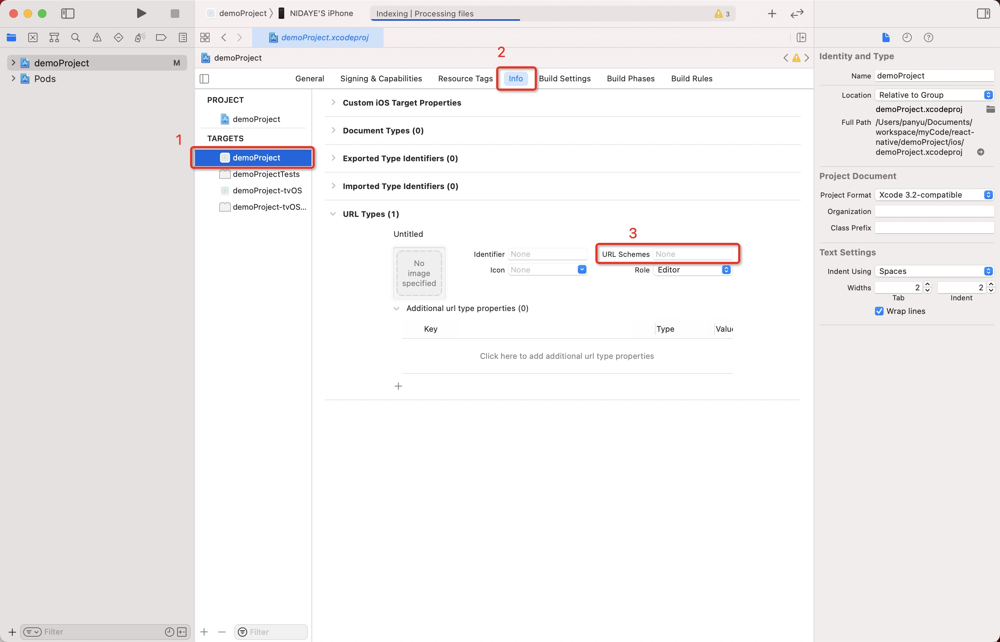

### `URL Scheme` 有什么作用

需要在网站中打开/唤起`APP`,或其他`APP`中打开`APP`,则需要设置`URL Scheme`。比如微信的是：`weixin://`

### `URL Scheme`介绍

#### `URL Scheme`是什么？

`URL Scheme`是一种页面内跳转协议，是一种非常好的实现机制，通过定义自己的`scheme`协议，可以非常方便跳转`APP`中的各个页面；通过`scheme`协议，服务器可以定制化告诉`APP`跳转那个页面，可以通过通知栏消息定制化跳转页面，可以通过`H5`页面跳转页面等。

苹果手机中的`APP`都有一个沙盒，`APP`就是一个信息孤岛，相互是不可以进行通信的。但是`iOS`的`APP`可以注册自己的`URL Scheme`，`URL Scheme`是为方便`APP`之间互相调用而设计的。

`URL Scheme`必须能唯一标识一个`APP`，如果你设置的`URL Scheme`与别的`APP`的`URL Scheme`冲突时，你的`APP`不一定会被启动起来。因为当你的`APP`在安装的时候，系统里面已经注册了你的`URL Scheme`。

#### `URL Scheme`应用场景

客户端应用可以向操作系统注册一个 URL scheme，该 scheme 用于从浏览器或其他应用中启动本应用。通过指定的 URL 字段，可以让应用在被调起后直接打开某些特定页面，比如商品详情页、活动详情页等等。也可以执行某些指定动作，如完成支付等。也可以在应用内通过 html 页来直接调用显示 app 内的某个页面。综上URL Scheme使用场景大致分以下几种：

1. 服务器下发跳转路径，客户端根据服务器下发跳转路径跳转相应的页面
2. H5页面点击锚点，根据锚点具体跳转路径`APP`端跳转具体的页面
3. `APP`端收到服务器端下发的PUSH通知栏消息，根据消息的点击跳转路径跳转相关页面
4. `APP`根据`URL`跳转到另外一个`APP`指定页面

#### `URL Scheme`的协议格式

```
opengs://tasks:8088/tasksDetail?tasksId=102
```

通过上面的路径 `Scheme`、`Host`、`port`、`path`、`query`全部包含，基本上平时使用路径就是这样子的。

1. `opengs` 代表该 `Scheme` 协议名称
2. `tasks` 代表`Scheme`作用于哪个地址域
3. `tasksDetail`代表`Scheme`指定的页面
4. `tasksId`代表传递的参数
5. `8088`代表该路径的端口号

### URL Scheme配置

#### 安卓配置

> URL Scheme的使用要先在AndroidManifest.xml中配置能接受Scheme方式启动的activity

```
        <activity
                android:name=".MainActivity"
                android:configChanges="keyboard|keyboardHidden|orientation|screenSize"
                android:label="@string/app_name"
                android:screenOrientation="portrait"
                android:windowSoftInputMode="adjustResize">
            <intent-filter>
                <action android:name="android.intent.action.MAIN"/>
                <!--如果没有这行配置app安装后将无法在安卓手机中显示-->
                <category android:name="android.intent.category.LAUNCHER"/>

            </intent-filter>
            <!-- 同一个intent-filter设置了多个category,会导致打包安装后出现了APP图标消失问题，所以这里要分成分两个intent-filter-->
            <intent-filter>
                <!--  Scheme 协议名称-->
                <data android:scheme="scheme"/>
                <action android:name="android.intent.action.VIEW"/>
                <!--如果希望该应用可以通过浏览器的连接启动，则添加该项-->
                <category android:name="android.intent.category.BROWSABLE"/>
                <!--表示该页面可以被隐式调用，必须加上该项-->
                <category android:name="android.intent.category.DEFAULT"/>
            </intent-filter>
        </activity>
```

#### IOS 配置

> 注册URL Scheme，即配置info.plist 文件即可



### 调用方式

#### web端调用

1. js 调起

```
window.open('opengs://tasks:8088/tasksDetail?tasksId=102')
```

1. a标签调起

```
<a href="opengs://tasks:8088/tasksDetail?tasksId=102">
```

#### 安卓原生调用

```
Intent intent = new Intent(Intent.ACTION_VIEW,Uri.parse("opengs://tasks:8088/tasksDetail?tasksId=102"));
startActivity(intent);
```

#### ios原生调用

```
 NSString *url = @"opengs://";
 //    NSString *url = @"opengs://com.opengs.www";
 if ([[UIApplication sharedApplication]
      canOpenURL:[NSURL URLWithString:url]])
 {
     [[UIApplication sharedApplication] openURL:[NSURL URLWithString:url]];
 }
 else
 {
     NSLog(@"can not open URL scheme opengs");
 }
```

#### react-native 调用

```
import { Linking } from 'react-native'
// ……
_openUrl =async ()=>{
    const url = ""
    const supported = await  Linking.canOpenURL(url)
    if(!supported)return 
    return   Linking.openURL(url)
}
```