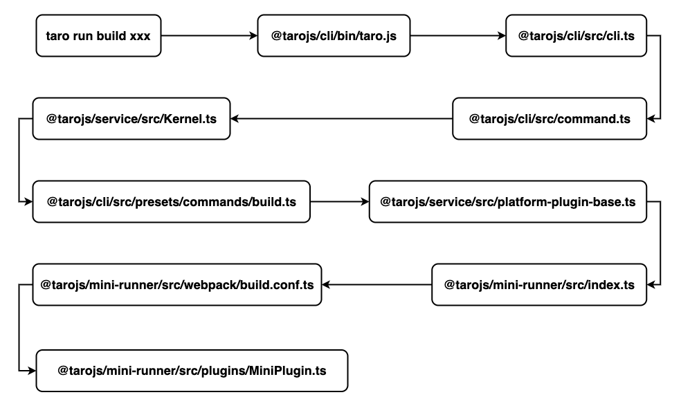

## 介绍

taro 源码解析这一块的博客文章与其说是技术分享博客，其实称之为我自己阅读源码的方式或笔记会比较合适。这些文章会比较枯燥无聊甚至阅读时还可能会越来越困。
这里建议与源码一起阅读。让我的笔记作为你思考的辅助。如果觉得不错就 [给个 star 吧](https://github.com/panyu97py/blog) 。

### 我的源码阅读顺序
> 由 `taro build xxx` 为切入点

## 模块

taro 用 lerna 做多模块管理

### 公共模块

#### 核心功能模块

* shared
* taro
* [taro-cli](taro-cli源码解析.md)
* taro-api
* taro-utils
* taro-helper
* [taro-service](taro-service源码解析.md)
* babel-preset-taro
* postcss-pxtransform

#### 辅助模块

* eslint-config-taro
* eslint-plugin-taro

### 小程序相关模块

* postcss-unit-transform
* taro-loader
* taro-react
* [taro-mini-runner](taro-mini-runner源码解析.md)
* taro-runtime

#### 编译平台插件

* taro-swan
* taro-tt
* taro-weapp
* taro-jd
* taro-h5
* taro-alipay
* taro-qq

#### 功能插件

* taro-plugin-mini-ci

### APP相关模块

* taro-rn-runner
* taro-rn-style-transformer
* taro-rn-supporter
* taro-rn-transformer
* taro-router-rn
* taro-runtime-rn
* stylelint-taro-rn
* stylelint-config-taro-rn
* babel-plugin-transform-react-jsx-to-rn-stylesheet
* css-to-react-native

#### 编译平台插件

* taro-rn

### H5相关模块

* postcss-html-transform
* postcss-plugin-constparse
* babel-plugin-transform-taroapi
* taro-extend
* taro-h5
* taro-plugin-html
* taro-webpack-runner

### 未分类

* babel-plugin-transform-jsx-to-stylesheet
* taro-router
* taro-runner-utils
* taro-with-weapp
* taroize
* taro-components
* taro-components-qa
* taro-components-react
* taro-components-rn
