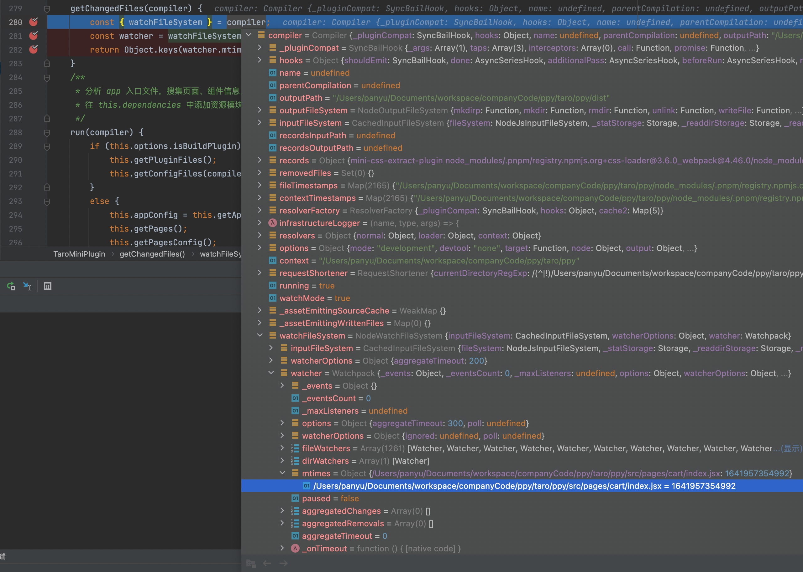

## 介绍

根据 `@tarojs/mini-runner` 代码库中`README.md`文件中的描述。`@tarojs/mini-runner`是暴露给 `@tarojs/cli` 的小程序 Webpack 启动器。

`@tarojs/mini-runner` 从 `@tarojs/cli` 接受 [Taro 编译配置](https://taro-docs.jd.com/taro/docs/config.html)，把编译配置分解成 Webpack 配置，并刚启动 Webpack 把项目源码编译为适配小程序目录结构的代码。

## `package.json`

```json
{
  "name": "@tarojs/mini-runner",
  "version": "3.3.17",
  "description": "Mini app runner for taro",
  "main": "index.js",
  "scripts": {
    "build": "npm run clean && npm run prod",
    "dev": "npm run mv:comp && tsc -w",
    "prod": "tsc && npm run mv:comp"
    // ....
  }
  // ...
}
```
由`main`配置可知代码的入口文件为`index.js`。

## `@tarojs/mini-runner/src/index.ts`

基于[`@tarojs/service/src/platform-plugin-base.ts`](taro-service源码解析.md)中`getRunner`方法的调用可知，当执行`taro build ...`时运行的时指向的是`@tarojs/mini-runner`

而我们基于`package.json`入口文件的配置可知，最后执行的是`@tarojs/mini-runner/src/index.ts`文件中的`build`方法

`build`方法先是获取各种配置，最后通过 [`webpack`](https://webpack.docschina.org/api/node/) 进行编译。

```typescript

import * as webpack from 'webpack'
import { META_TYPE } from '@tarojs/helper'

import { IBuildConfig, Func } from './utils/types'
import { printBuildError, bindProdLogger, bindDevLogger } from './utils/logHelper'
import buildConf from './webpack/build.conf'
import { Prerender } from './prerender/prerender'
import { isEmpty } from 'lodash'
import { makeConfig } from './webpack/chain'

const customizeChain = async (chain, modifyWebpackChainFunc: Func, customizeFunc?: Func) => {
    if (modifyWebpackChainFunc instanceof Function) {
        await modifyWebpackChainFunc(chain, webpack)
    }
    if (customizeFunc instanceof Function) {
        customizeFunc(chain, webpack, META_TYPE)
    }
}

export default async function build (appPath: string, config: IBuildConfig): Promise<webpack.Stats> {
  const mode = config.mode

  // 获取 sass 配置
  const newConfig = await makeConfig(config)

  // 初始化 webpackChain
  const webpackChain = buildConf(appPath, mode, newConfig)

  // 通过 webpackChain 执行 modifyWebpackChain 自定义修改 webpack 配置 
  await customizeChain(webpackChain, newConfig.modifyWebpackChain, newConfig.webpackChain)

    
  // 注册 webpack 生命周期回调 onWebpackChainReady
  if (typeof newConfig.onWebpackChainReady === 'function') {
    newConfig.onWebpackChainReady(webpackChain)
  }

  // 将 webpackChain 转换为 webpackConfig
  const webpackConfig: webpack.Configuration = webpackChain.toConfig()

  return new Promise<webpack.Stats>((resolve, reject) => {
      
    // 通过 Webpack 提供的 Node.js API 获取 Compiler 实例。https://webpack.docschina.org/api/node/
    const compiler = webpack(webpackConfig)
    
    // .......

    const callback = async (err: Error, stats: webpack.Stats) => {
        // .....
    }

    // 通过 webpack 编译
    if (newConfig.isWatch) {
      bindDevLogger(compiler)
      compiler.watch({
        aggregateTimeout: 300,
        poll: undefined
      }, callback)
    } else {
      bindProdLogger(compiler)
      compiler.run(callback)
    }
  })
}
```

## `@tarojs/mini-runner/src/webpack/build.conf.ts`

`@tarojs/mini-runner/src/index.ts` 中`export default`的`build`方法中使用`buildConf`方法初始化了`webpackConfig`及相关的配置。于是我们就顺着逻辑看看`buildConf`方法到底做了什么。

1. 使用 [`copy-webpack-plugin`](https://www.webpackjs.com/plugins/copy-webpack-plugin/) 实现了编译过程中文件的拷贝即 [`copy`](https://docs.taro.zone/docs/config-detail#copy) 配置。
2. 基于`framework`配置修改`react-dom`指向。

   在 `react` 体系中，`react` 库实现了 `ReactComponent` 和 `ReactElement` 的核心部分，而 `react-dom` 库负责通过操作 `DOM` 来实现 `react` 在浏览器中的渲染更新操作。在小程序中，并不能直接操作 `DOM` 树或者说没有传统的 `DOM` 树，此时直接使用 `react-dom` 则会导致报错。所以，`taro` 实现了一套在小程序上的 仿 `react-dom` 运行时，以保证 `React` 可以正常在小程序端渲染、更新节点。我们也可以这么理解，`react-dom` 是浏览器端的 `render`，`react-native` 是原生 APP 的 `render`，而 `@tarojs/react` 是小程序上的 `render`。`nervjs`同理。
3. 使用 [`webpack.DefinePlugin`](https://webpack.docschina.org/plugins/define-plugin/) 实现了[`defineConstants`](https://docs.taro.zone/docs/config-detail#defineconstants) 配置。
4. `@tarojs/mini-runner/src/plugins/MiniSplitChunksPlugin.ts` 压缩主包大小。
5. 使用`@tarojs/mini-runner/src/plugins/BuildNativePlugin.ts`或`@tarojs/mini-runner/src/plugins/MiniPlugin.ts`将 `framework` 源文件转换为 `platform` 平台代码。
6. 使用 [`mini-css-extract-plugin`](https://webpack.docschina.org/plugins/mini-css-extract-plugin/) 将所有的 `css` 文件提取到一个文件中
7. 使用 [`webpack.ProvidePlugin`](https://www.webpackjs.com/plugins/provide-plugin/) 将运行时环境从浏览器环境切换到 `taro` 的运行时环境，比如将 `window` 替换成 [`@tarojs/runtime`](taro-runtime源码解析.md) 中导出的 `window`
8. 使用 [`terser-webpack-plugin`](https://webpack.docschina.org/plugins/terser-webpack-plugin/) 开启 `js` 代码压缩
9. 使用 [`csso-webpack-plugin`](https://github.com/zoobestik/csso-webpack-plugin) 压缩 `css` 代码

```typescript

// ......

import getBaseConf from './base.conf'

// ......

export default (appPath: string, mode, config: Partial<IBuildConfig>): any => {
    const chain = getBaseConf(appPath)
    const {
        // ....
    } = config
    config.modifyComponentConfig?.(componentConfig, config)

    
    // taro 中 copy 配置的实现  https://docs.taro.zone/docs/config-detail#copy
    let { copy } = config
    
    // ..... 省略一些 copy-webpack-plugin 配置初始化的代码
    
    if (copy) {
        // 这边使用 copy-webpack-plugin 实现文件的拷贝
        plugin.copyWebpackPlugin = getCopyWebpackPlugin({ copy, appPath })
    }
    alias[taroJsComponents + '$'] = taroComponentsPath || `${taroJsComponents}/mini`
    if (framework === 'react') {
        // 使用 @tarojs/react 替代 react-dom
        alias['react-dom$'] = '@tarojs/react'
        
        // ...
        
    }
    if (framework === 'nerv') {
        // 使用 nervjs 替代 react-dom
        alias['react-dom'] = 'nervjs'
        alias.react = 'nervjs'
    }
    
    env.FRAMEWORK = JSON.stringify(framework)
    env.TARO_ENV = JSON.stringify(buildAdapter)
    
    // 从配置中读取运行时常量
    const runtimeConstants = getRuntimeConstants(runtime)
    
    // 合并运行时常量与 defineConstants 中配置的常量。
    const constantsReplaceList = mergeOption([processEnvOption(env), defineConstants, runtimeConstants])
    
    const entryRes = getEntry({
        sourceDir,
        entry,
        isBuildPlugin
    })
    const defaultCommonChunks = isBuildPlugin
        ? ['plugin/runtime', 'plugin/vendors', 'plugin/taro', 'plugin/common']
        : ['runtime', 'vendors', 'taro', 'common']
    let customCommonChunks = defaultCommonChunks
    if (typeof commonChunks === 'function') {
        customCommonChunks = commonChunks(defaultCommonChunks.concat()) || defaultCommonChunks
    } else if (Array.isArray(commonChunks) && commonChunks.length) {
        customCommonChunks = commonChunks
    }
    
    // 使用 webpack.DefinePlugin 实现全局变量
    plugin.definePlugin = getDefinePlugin([constantsReplaceList])

   // 主包大小优化
   if (optimizeMainPackage.enable) {
      plugin.miniSplitChunksPlugin = getMiniSplitChunksPlugin({
         exclude: optimizeMainPackage.exclude,
         fileType
      })
   }
    
   // 初始化 miniPlugin 插件配置
   const miniPluginOptions = {
      // ......
   }

   // 将 framework 源文件转换为 platform 平台代码
   plugin.miniPlugin = !isBuildNativeComp ? getMiniPlugin(miniPluginOptions) : getBuildNativePlugin(miniPluginOptions)

   // 使用 mini-css-extract-plugin 将所有的 css 文件提取到一个文件中
   plugin.miniCssExtractPlugin = getMiniCssExtractPlugin([{
      filename: `[name]${fileType.style}`,
      chunkFilename: `[name]${fileType.style}`
   }, miniCssExtractPluginOption])

   // 使用 webpack.ProvidePlugin 将运行时环境从浏览器环境切换到 taro 的运行时环境，比如将 window 替换成 @tarojs/runtime 中导出的 window
   plugin.providerPlugin = getProviderPlugin({
      window: ['@tarojs/runtime', 'window'],
      document: ['@tarojs/runtime', 'document'],
      navigator: ['@tarojs/runtime', 'navigator'],
      requestAnimationFrame: ['@tarojs/runtime', 'requestAnimationFrame'],
      cancelAnimationFrame: ['@tarojs/runtime', 'cancelAnimationFrame'],
      Element: ['@tarojs/runtime', 'TaroElement'],
      SVGElement: ['@tarojs/runtime', 'SVGElement']
   })

   const isCssoEnabled = !((csso && csso.enable === false))

   const isTerserEnabled = !((terser && terser.enable === false))

   if (mode === 'production') {
       
       // 使用 terser-webpack-plugin 开启代码压缩
      if (isTerserEnabled) {
         minimizer.push(getTerserPlugin([
            enableSourceMap,
            terser ? terser.config : {}
         ]))
      }

      // 使用 csso-webpack-plugin 压缩 js 代码
      if (isCssoEnabled) {
         const cssoConfig: any = csso ? csso.config : {}
         plugin.cssoWebpackPlugin = getCssoWebpackPlugin([cssoConfig])
      }
   }
    
   // 修改通用 webapck 配置
   chain.merge({
      mode,
      devtool: getDevtool(enableSourceMap, sourceMapType),
      entry: entryRes!.entry,
      output: getOutput(appPath, [{
         outputRoot,
         publicPath: '/',
         globalObject
      }, output]),
      target: createTarget({
         framework
      }),
      // rule 及对应 loader 配置，其中包括了相对比较重要的 miniTemplateLoader
      module: getModule(appPath,{
          // ......
      }),
      // 路径别名配置
      resolve: { alias },
      // webpack 插件配置
      plugin,
      optimization:{
          // ....
      }
   })

   switch (framework) {
      // 适配 vue 2.x 修改 webpack 配置
      case FRAMEWORK_MAP.VUE:
         customVueChain(chain)
         break
      // 适配 vue 3.x 修改 webpack 配置
      case FRAMEWORK_MAP.VUE3:
         customVue3Chain(chain)
         break
      default:
   }

   return chain
}
```

## `@tarojs/mini-runner/src/plugins/MiniPlugin.ts`

### 插件入口`apply`

> 由插件入口注册各钩子函数，用于`webpack`各生命周期执行。

```typescript
export default class TaroMiniPlugin {
  // ......
  
  /**
   * 插件入口
   */
  apply (compiler: webpack.Compiler) {

    this.context = compiler.context
    
    // 获取入口文件路径
    this.appEntry = this.getAppEntry(compiler)
    
    // 获取插件传入的一些参数
    const {
   	// ......
    } = this.options
    
    /** build mode */
    compiler.hooks.run.tapAsync(
    	// ...... 注册生命周期钩子函数，当 webpack 开始编译时执行 ......
    )
    
    /** watch mode */
    compiler.hooks.watchRun.tapAsync(
    	// ...... 注册生命周期钩子函数，在 webpack 监听模式下，一个新的编译被触发之后执行 ......
    )
    
    /** compilation.addEntry */
    compiler.hooks.make.tapAsync(
    	// ...... 注册生命周期钩子函数，在 webpack 完成编译之前执行 ......
    )
    
    compiler.hooks.compilation.tap(PLUGIN_NAME, (compilation, { normalModuleFactory }) => {
    	// ...... 注册生命周期钩子函数，在 compilation 创建成功之后执行，compilation 代表一次单独的编译 ......
      
      /**
       * webpack NormalModule 在 runLoaders 真正解析资源的前一刻，
       * 往 NormalModule.loaders 中插入对应的 Taro Loader
       */
      compilation.hooks.normalModuleLoader.tap(
    		// ......
    	)
      
      /**
       * 与原生小程序混写时解析模板与样式
       */
      compilation.hooks.afterOptimizeAssets.tap(
		// ......
    	)
      
    })
    
    compiler.hooks.emit.tapAsync(
    	// ...... 注册生命周期钩子函数，在 webpack 生成资源到 output 目录之前执行 ......
    )
    
    compiler.hooks.afterEmit.tapAsync(
	// ...... 注册生命周期钩子函数，在 webpack 生成资源到 output 目录之后执行 ......
    )
    
    // 在注册完了生命周期钩子函数后，继续调用 TaroNormalModulesPlugin 插件的 apply 方法
    new TaroNormalModulesPlugin(this.options.onParseCreateElement).apply(compiler)
  }
  
  // ......
}
```


#### `TaroLoadChunksPlugin`

```typescript

```


#### [`compiler.hooks.run`](https://webpack.js.org/api/compiler-hooks/#run)

> 当 webpack 开始编译时执行

```typescript
import TaroLoadChunksPlugin from './TaroLoadChunksPlugin'
const PLUGIN_NAME = 'TaroMiniPlugin'

export default class TaroMiniPlugin {
  // ......
  
   apply (compiler: webpack.Compiler) {
    // ......
     
    /** build mode */
    compiler.hooks.run.tapAsync(
      PLUGIN_NAME,
      // 当 webpack 开始编译时执行
      this.tryAsync(async (compiler: webpack.Compiler) => {
        await this.run(compiler)
        new TaroLoadChunksPlugin({
          commonChunks: commonChunks,
          isBuildPlugin,
          addChunkPages: addChunkPages,
          pages: this.pages,
          framework: framework,
          isBuildQuickapp
        }).apply(compiler)
      })
    )
     
    // ......
   
   }
  
  // ......
  
  /**
   * 分析 app 入口文件，搜集页面、组件信息，
   * 往 this.dependencies 中添加资源模块
   */
  run (compiler: webpack.Compiler) {
    if (this.options.isBuildPlugin) {
      
      // 读取插件文件并根据类型 分别添加至 this.components 、 this.pages
      // 并在 this.dependencies 中新增或修改 app、模板组件、页面、组件等资源模块
      this.getPluginFiles()
      
      // 判断文件是否存在，存在则往 this.dependencies 中新增或修改所有 config 配置模块
      // 并在 webpack createChunkAssets 前 删除与 this.filesConfig 同名 chunks
      this.getConfigFiles(compiler)
    } else {
      // 从 app.config.js 读取配置
      this.appConfig = this.getAppConfig()
      
      // 基于 app config 的 pages 配置项，收集所有页面信息（包含 subPackages），并保存至 this.pages
      this.getPages()
      
      // 基于 this.pages 读取页面及其依赖的组件的配置，并保存至 this.filesConfig。
      // 并基于  app config 的  usingComponents 配置项 递归收集依赖的第三方组件 保存至 this.components并将相关配置保存至 this.filesConfig
      this.getPagesConfig()
      
      // 收集 dark mode 配置中的文件
      this.getDarkMode()
      
      // 判断文件是否存在，存在则往 this.dependencies 中新增或修改所有 config 配置模块
      // 并在 webpack createChunkAssets 前 删除与 this.filesConfig 同名 chunks
      this.getConfigFiles(compiler)
      
      // 在 this.dependencies 中新增或修改 app、模板组件、页面、组件等资源模块
      this.addEntries()
    }
  }
  
  // ......
}
```


#### [`compiler.hooks.watchRun`](https://webpack.js.org/api/compiler-hooks/#watchrun)

> 触发新编译后并在新编译执行之前,即每次文件变更后新编译执行之前。

```typescript
export default class TaroMiniPlugin {
  // ......
  
   apply (compiler: webpack.Compiler) {
    // ......
        /** watch mode */
    compiler.hooks.watchRun.tapAsync(
      PLUGIN_NAME,
      this.tryAsync(async (compiler: webpack.Compiler) => {
        
        // 获取改变的文件
        const changedFiles = this.getChangedFiles(compiler)
        
        // 存在文件改变则修改 this.isWatch 状态 
        if (changedFiles.length) {
          this.isWatch = true
        }
        
        // 重新执行 compiler.hooks.run 钩子中的方法
        await this.run(compiler)
        if (!this.loadChunksPlugin) {
          this.loadChunksPlugin = new TaroLoadChunksPlugin({
            commonChunks: commonChunks,
            isBuildPlugin,
            addChunkPages: addChunkPages,
            pages: this.pages,
            framework: framework,
            isBuildQuickapp
          })
          this.loadChunksPlugin.apply(compiler)
        }
      })
    )
    // ......
   }
  
  // ........
  
  getChangedFiles (compiler) {
    const { watchFileSystem } = compiler
    // webpack 文档中并没有提及，但查阅相关资料了解到这是一个包含变更文件路径的对象 
    // https://stackoverflow.com/questions/43140501/can-webpack-report-which-file-triggered-a-compilation-in-watch-mode
    const watcher = watchFileSystem.watcher || watchFileSystem.wfs.watcher

    return Object.keys(watcher.mtimes)
  }
  
  // ........
}
```


##### `watchFileSystem debugger` 截图

> 图中被选中的即为我变更的文件路径





#### [`compiler.hooks.make`](https://webpack.js.org/api/compiler-hooks/#make)

> webpack 完成编译之前执行

``` typescript
const PLUGIN_NAME = 'TaroMiniPlugin'

export default class TaroMiniPlugin {
  // ......
  
   apply (compiler: webpack.Compiler) {
    // ......
     
    /** compilation.addEntry */
    compiler.hooks.make.tapAsync(
      PLUGIN_NAME,
      this.tryAsync(async (compilation: webpack.compilation.Compilation) => {
        const dependencies = this.dependencies
        const promises: Promise<null>[] = []
        this.compileIndependentPages(compiler, compilation, dependencies, promises)
        dependencies.forEach(dep => {
          promises.push(new Promise<null>((resolve, reject) => {
            compilation.addEntry(this.options.sourceDir, dep, dep.name, err => err ? reject(err) : resolve(null))
          }))
        })
        await Promise.all(promises)
        await this.options.onCompilerMake?.(compilation)
      })
    )
     
     // ......
   }
  
  // ......
}
```


## `@tarojs/mini-runner/src/plugins/BuildNativePlugin.ts`

## `@tarojs/mini-runner/src/plugins/miniTemplateLoader.ts`


## 参考
[Taro 源码解读 - miniRunner 篇](https://github.com/a1029563229/blogs/blob/master/Source-Code/taro/4.md)

[Taro 源码解读 - TaroMiniPlugin 上篇](https://github.com/a1029563229/blogs/blob/master/Source-Code/taro/5.md)

