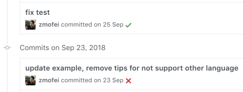

# 使用Travis-ci自动SSH部署vue代码

## 1. 从手动部署到自动部署

在整个代码部署的道路上，我经历了手动部署到`shell`半自动部署再到现在的`Travis`自动部署。

### 1.1 石器时代 - 手动部署

很早很早之前，我采用完全手动的方式部署代码：


这个过程中我需要，先在本地编写并调试代码然后上传到Git服务器上，再手动`SSH`登录机器通过`git pull`下载最新的代码，最后在服务器上进行编译和重启服务。

这种原始的模式往往最傻瓜有效，但意味着需要手动做一些列的工作，每次部署都会变得极其麻烦。

### 1.2 青铜时代 - shell半自动部署

后来我想到了把登录机器、编译、部署的事情交给shell自动执行，于是我就写了个shell脚本，主要的内容是：本地编译完成之后shell脚本自动的把代码打包，然后上传到服务器上，部署并重启服务。



使用了`shell`之后大大的解放了双手，每次决定上线的时候只需要执行`sh deploy.sh`然后坐等结果就好了。但是使用shell也有他的弊端：每次上线都得手动执行部署命令，然后等待代码自动的打包上传以及部署，如果遇到网络抖动或者打包后的文件过大存在着失败的可能性，就有可能还需要再来一次。说是自动化，其实还是需要人工去观察和干预的，于是Mofei就想了，能不能有一种更高效的方式进行部署呢？于是就有了现在的部署方式。

### 1.3 现代 - Travis自动部署

通过配合`Travis`的使用，我们可以实现如下的效果：

* 测试部署：每次`push`代码到`dev`分支，`Travis`会自动进行单元测试，然后自动的通过SSH将代码部署到对应的开发机器上并重启服务，以保持开发机上始终是最新的版本。
* 正式部署：决定上线的时候可以将代码`push`代码到`deploy`分支上，`Travis`会自动将代码部署到正式的开发环境。


当然了这个过程可以根据自己的团队进行适当的调整以决定何时进行部署。
## 2.调教Travis

步入正题，要完成自动部署，首先`Travis`要能监听`Git`的变化，然后`Travis`还需要有权限登录到我们的`SSH服务器`进行部署：


1. 配置`Travis`，让`Travis`能监听`Git`的某个分支。
2. `Git`某个分支提交之后，Travis能自动发现提交并进行编译。
3. `Travis`将编译后的产物通过SSH部署到给我们指定的机器。
### 2.1 初始化Travis

> 开始之前，如果你还没有`Travis`账号，请使用`Github`登录`Traivs`，并关联你的项目。

`Travis`是通过项目中的`.travis.yml`文件来配置任务的，首先我们需要在项目的根目录建立`.travis.yml`文件，我们以该配置为例。

新建`.travis.yml`文件，写上如下代码：

```
language: node_js
node_js:
- 8
```

其中`language`指得是项目运行语言，因为这里是`node.js`项目，所以写的是`node_js`，如果你使用的是其他的语言可以参考官方的文档。之后的`-8`指的是使用`v8版本`的`node.js`.当然你也可以指定多个版本来分别执行代码，如：

```
node_js:
- stable
- '6'
- '4'
```

那么我们以`vue`项目为例：

如果不用 `travis`，对于一个 `vuejs`项目来说，大概有这两种部署方式：

1. 开发环境打包:在开发机上打包出静态文件，再将`dist` 上传到生产环境。
```
npm install
npm run build
rsync ./dist/* <USERNAME>@<HOST>:<TARGET-PATH>
```

1. 生产环境打包:在生产环境中拉取仓库，打包，再拷贝到目标路径。
```
npm install
npm run build
cp ./dist/* <TARGET-PATH>
```

所以`vue`项目完整的`.travis.yml`文件如下：

```
language: node_js
node_js: stable
branches:
  only:
  - master
addons:
  ssh_known_hosts:
  - <HOST>
install:
- npm install
script:
- npm run build
after_success:
- rsync -az --delete ./dist/* <USERNAME>@<HOST>:<TARGET-PATH>
```

添加好`.travis.yml`文件之后，每次上传到Git中的代码都会自动进行`Travis`的构建，如果通过了可以在对应的`commit`后面看到一个绿色的勾，如果失败了会是一个红色的叉。


但是如果仅仅是像上面那样配置的话，`travis build` 的时候会卡住。因为 `rsync` 工具需要输入`ssh` 登录密码，而在 `travis build` 环境里，我们根本无法输入密码。

### 2.2 Travis添加SSH密钥

通常我们是通过ssh命令加上用户名和密码访问服务器的，虽然理论上我们也可以在`travis`的命令中写上诸如`ssh mofei@zhuwenlong.com -p abc`的脚本，但是这样的代码如果提交到了公开的仓库中会有很大的泄露服务器密码的风险，所以我们需要一个别人无法窃取密码或者密钥的方式让`Travis`登录我们的服务器。

通常的免密登录是基于`SSH`信任关系的，那么如果我们能把密钥以加密的形式保持在`Travis`的服务器中，`Travis`就能登录我们的服务器了。这里我们可以使用`Travis`的文件加密功能，把我们的密钥进行加密保存。


在这个过程中，我们的密钥首先会被被`Travis`加密，解密的密钥被存储在`Travis`中，就是说只有`Travis`可以进行解密。所以我们可以大胆的把这个加密后的文件上传到`github`中，不用担心其他人盗用我们的密钥。

既然我们想要使用`Travis`加密文件，第一件事情就是在本地安装`Travis`。

> 这里有一点一定要注意就是如果你的目标服务器为`linux`系统的话那么你的以下步骤也必须在`linux`系统中执行！！！！

#### 2.2.1 本地安装Travis

```
sudo gem install travis
```

由于`Travis`使用的是`ruby`，如果遇到众所周知的原因无发现下载的话，可以将`ruby`更换成国内的源，具体可以参考这里。

```
gem sources --add https://gems.ruby-china.com/ --remove https://rubygems.org/
```

然后再次运行安装`Travis`的命令 `sudo gem install travis`

安装好`Travis`之后，我们需要在命令行中登录`Travis`

```
travis login --pro
```

一路输入你的`github`账号和密码很快就完成了。

#### 2.2.2 生成并加密SSH密钥

万事俱备只欠东风，我们现在只要生成`SSH`密钥，然后添加信任关系，并用`Travis`加密保存即可。

在命令行中执行如下脚本：

```
# 在当前目录生成密钥
ssh-keygen -t rsa -b 4096 -C 'build@travis-ci.org' -f ./deploy_rsa
# 使用Travis加密
travis encrypt-file deploy_rsa --add
# 添加信任关系
ssh-copy-id -i deploy_rsa.pub <ssh-user>@<deploy-host>
# 删除敏感文件
rm -f deploy_rsa deploy_rsa.pub
# 将修改添加到git中
git add deploy_rsa.enc .travis.yml
```

我们详细来看一下代码（如果你理解所有的命令，可以略过这一小段）：

* 在当前目录生成密钥
```
ssh-keygen -t rsa -b 4096 -C 'build@travis-ci.org' -f ./deploy_rsa
```

首先，我们使用ssh的命令在当前目录中生成了一个`ssh`密钥，这段代码执行完成之后，会在目录中生成2个文件，私钥`deploy_rsa`和公钥`deploy_rsa.pub`，前者是用来免密登录服务器时候使用的，后者服务器用来鉴定私钥的有效性的。

* 使用Travis加密
```
travis encrypt-file deploy_rsa --add
```

因为`Travis`只需要使用到私钥，所以我们这里讲私钥进行加密保存，这句话执行完成之后，你会看到在`.travis.yml`文件中被自动加了下面的代码(`--add`)，同时文件夹中也发现一个加密后的文件`deploy_rsa.enc`。

```
before_install:
- openssl aes-256-cbc -K $encrypted_137f45644142_key -iv $encrypted_137f45644142_iv
  -in deploy_rsa.enc -out deploy_rsa -d
```

这几行被自动添加的代码的意思是，在`install`之前执行解开`deploy_rsa.enc`文件的命令并放置到`deploy_rsa`以供使用，其中这里的`$encrypted_137f45644142_key`和`$encrypted_137f45644142_iv`是解开这个文件的两个变量被存储在了`Travis`的服务器上。

* 添加信任关系
```
ssh-copy-id -i deploy_rsa.pub <ssh-user>@<deploy-host>
```

这句话的意思是向目标服务器(`<ssh-user>@<deploy-host>`这里的`user`和`host`需要替换成自己服务器的用户名和地址)添加公钥，添加成功之后，所有用该公钥对应的私钥访问服务器都会直接被认证通过。也就是说如果`Travis`保持了私钥的话，就可以免密的通过`ssh`登录我们的服务器了。

* 删除敏感文件并将修改添加到git中
```
rm -f deploy_rsa deploy_rsa.pub和git add deploy_rsa.enc .travis.yml
```

私钥`deploy_rsa`和`公钥deploy_rsa.pub`已经完成了他们的使命，我们可以把它删除以免被其他人恶意使用，并把生成的加密文件`deploy_rsa.enc`和修改后的`.travis.yml`添加到`git`中。

### 2.3 Travis部署脚本

所有的一切都准备好之后，我们就可以修改`.travis.yml`文件让`travis`来进行部署了。

首先，我们需要在部署之前解密私钥，并使其生效，所以我们添加如下代码：

```
before_install:
- openssl aes-256-cbc -K $encrypted_137f45644142_key -iv $encrypted_137f45644142_iv
  -in deploy_rsa.enc -out /tmp/deploy_rsa -d
- eval "$(ssh-agent -s)"
- chmod 600 /tmp/deploy_rsa
- ssh-add /tmp/deploy_rsa
```

`before_install`字段标明了Travis在部署之前需要执行的命令，其中第一行是解密`ssh`文件，后面的3行是使`ssh`密钥生效。

于是我们最终的`.travis.yml`文件内容如下：

```
language: node_js
node_js: stable
branches:
  only:
  - master
addons:
  ssh_known_hosts:
  - <HOST>
before_install:
- openssl aes-256-cbc -K $encrypted_137f45644142_key -iv $encrypted_137f45644142_iv
  -in deploy_rsa.enc -out /tmp/deploy_rsa -d
- eval "$(ssh-agent -s)"
- chmod 600 /tmp/deploy_rsa
- ssh-add /tmp/deploy_rsa
install:
- npm install
script:
- npm run build
after_success:
- rsync -az --delete ./dist/* <USERNAME>@<HOST>:<TARGET-PATH>
```

然后就可以在每次`push`之后玩去了。`Travis-ci`会自动帮我们完成部署。

%23%23%201.%20%E4%BB%8E%E6%89%8B%E5%8A%A8%E9%83%A8%E7%BD%B2%E5%88%B0%E8%87%AA%E5%8A%A8%E9%83%A8%E7%BD%B2%0A%E5%9C%A8%E6%95%B4%E4%B8%AA%E4%BB%A3%E7%A0%81%E9%83%A8%E7%BD%B2%E7%9A%84%E9%81%93%E8%B7%AF%E4%B8%8A%EF%BC%8C%E6%88%91%E7%BB%8F%E5%8E%86%E4%BA%86%E6%89%8B%E5%8A%A8%E9%83%A8%E7%BD%B2%E5%88%B0%60shell%60%E5%8D%8A%E8%87%AA%E5%8A%A8%E9%83%A8%E7%BD%B2%E5%86%8D%E5%88%B0%E7%8E%B0%E5%9C%A8%E7%9A%84%60Travis%60%E8%87%AA%E5%8A%A8%E9%83%A8%E7%BD%B2%E3%80%82%0A%23%23%23%201.1%20%E7%9F%B3%E5%99%A8%E6%97%B6%E4%BB%A3%20-%20%E6%89%8B%E5%8A%A8%E9%83%A8%E7%BD%B2%0A%E5%BE%88%E6%97%A9%E5%BE%88%E6%97%A9%E4%B9%8B%E5%89%8D%EF%BC%8C%E6%88%91%E9%87%87%E7%94%A8%E5%AE%8C%E5%85%A8%E6%89%8B%E5%8A%A8%E7%9A%84%E6%96%B9%E5%BC%8F%E9%83%A8%E7%BD%B2%E4%BB%A3%E7%A0%81%EF%BC%9A%0A%0A!%5Bc539620b2167badb349dc8cc4bfd0293.png%5D(evernotecid%3A%2F%2FBA936014-CAFA-4899-8277-AF3B3F2FA668%2Fappyinxiangcom%2F13794041%2FENResource%2Fp5)%0A%0A%E8%BF%99%E4%B8%AA%E8%BF%87%E7%A8%8B%E4%B8%AD%E6%88%91%E9%9C%80%E8%A6%81%EF%BC%8C%E5%85%88%E5%9C%A8%E6%9C%AC%E5%9C%B0%E7%BC%96%E5%86%99%E5%B9%B6%E8%B0%83%E8%AF%95%E4%BB%A3%E7%A0%81%E7%84%B6%E5%90%8E%E4%B8%8A%E4%BC%A0%E5%88%B0Git%E6%9C%8D%E5%8A%A1%E5%99%A8%E4%B8%8A%EF%BC%8C%E5%86%8D%E6%89%8B%E5%8A%A8%60SSH%60%E7%99%BB%E5%BD%95%E6%9C%BA%E5%99%A8%E9%80%9A%E8%BF%87%60git%20pull%60%E4%B8%8B%E8%BD%BD%E6%9C%80%E6%96%B0%E7%9A%84%E4%BB%A3%E7%A0%81%EF%BC%8C%E6%9C%80%E5%90%8E%E5%9C%A8%E6%9C%8D%E5%8A%A1%E5%99%A8%E4%B8%8A%E8%BF%9B%E8%A1%8C%E7%BC%96%E8%AF%91%E5%92%8C%E9%87%8D%E5%90%AF%E6%9C%8D%E5%8A%A1%E3%80%82%0A%0A%E8%BF%99%E7%A7%8D%E5%8E%9F%E5%A7%8B%E7%9A%84%E6%A8%A1%E5%BC%8F%E5%BE%80%E5%BE%80%E6%9C%80%E5%82%BB%E7%93%9C%E6%9C%89%E6%95%88%EF%BC%8C%E4%BD%86%E6%84%8F%E5%91%B3%E7%9D%80%E9%9C%80%E8%A6%81%E6%89%8B%E5%8A%A8%E5%81%9A%E4%B8%80%E4%BA%9B%E5%88%97%E7%9A%84%E5%B7%A5%E4%BD%9C%EF%BC%8C%E6%AF%8F%E6%AC%A1%E9%83%A8%E7%BD%B2%E9%83%BD%E4%BC%9A%E5%8F%98%E5%BE%97%E6%9E%81%E5%85%B6%E9%BA%BB%E7%83%A6%E3%80%82%0A%23%23%23%201.2%20%E9%9D%92%E9%93%9C%E6%97%B6%E4%BB%A3%20-%20shell%E5%8D%8A%E8%87%AA%E5%8A%A8%E9%83%A8%E7%BD%B2%0A%E5%90%8E%E6%9D%A5%E6%88%91%E6%83%B3%E5%88%B0%E4%BA%86%E6%8A%8A%E7%99%BB%E5%BD%95%E6%9C%BA%E5%99%A8%E3%80%81%E7%BC%96%E8%AF%91%E3%80%81%E9%83%A8%E7%BD%B2%E7%9A%84%E4%BA%8B%E6%83%85%E4%BA%A4%E7%BB%99shell%E8%87%AA%E5%8A%A8%E6%89%A7%E8%A1%8C%EF%BC%8C%E4%BA%8E%E6%98%AF%E6%88%91%E5%B0%B1%E5%86%99%E4%BA%86%E4%B8%AAshell%E8%84%9A%E6%9C%AC%EF%BC%8C%E4%B8%BB%E8%A6%81%E7%9A%84%E5%86%85%E5%AE%B9%E6%98%AF%EF%BC%9A%E6%9C%AC%E5%9C%B0%E7%BC%96%E8%AF%91%E5%AE%8C%E6%88%90%E4%B9%8B%E5%90%8Eshell%E8%84%9A%E6%9C%AC%E8%87%AA%E5%8A%A8%E7%9A%84%E6%8A%8A%E4%BB%A3%E7%A0%81%E6%89%93%E5%8C%85%EF%BC%8C%E7%84%B6%E5%90%8E%E4%B8%8A%E4%BC%A0%E5%88%B0%E6%9C%8D%E5%8A%A1%E5%99%A8%E4%B8%8A%EF%BC%8C%E9%83%A8%E7%BD%B2%E5%B9%B6%E9%87%8D%E5%90%AF%E6%9C%8D%E5%8A%A1%E3%80%82%0A%0A!%5B36a6816fa09180ccc5f514091a7c03e5.png%5D(evernotecid%3A%2F%2FBA936014-CAFA-4899-8277-AF3B3F2FA668%2Fappyinxiangcom%2F13794041%2FENResource%2Fp6)%0A%0A%E4%BD%BF%E7%94%A8%E4%BA%86%60shell%60%E4%B9%8B%E5%90%8E%E5%A4%A7%E5%A4%A7%E7%9A%84%E8%A7%A3%E6%94%BE%E4%BA%86%E5%8F%8C%E6%89%8B%EF%BC%8C%E6%AF%8F%E6%AC%A1%E5%86%B3%E5%AE%9A%E4%B8%8A%E7%BA%BF%E7%9A%84%E6%97%B6%E5%80%99%E5%8F%AA%E9%9C%80%E8%A6%81%E6%89%A7%E8%A1%8C%60sh%20deploy.sh%60%E7%84%B6%E5%90%8E%E5%9D%90%E7%AD%89%E7%BB%93%E6%9E%9C%E5%B0%B1%E5%A5%BD%E4%BA%86%E3%80%82%E4%BD%86%E6%98%AF%E4%BD%BF%E7%94%A8shell%E4%B9%9F%E6%9C%89%E4%BB%96%E7%9A%84%E5%BC%8A%E7%AB%AF%EF%BC%9A%E6%AF%8F%E6%AC%A1%E4%B8%8A%E7%BA%BF%E9%83%BD%E5%BE%97%E6%89%8B%E5%8A%A8%E6%89%A7%E8%A1%8C%E9%83%A8%E7%BD%B2%E5%91%BD%E4%BB%A4%EF%BC%8C%E7%84%B6%E5%90%8E%E7%AD%89%E5%BE%85%E4%BB%A3%E7%A0%81%E8%87%AA%E5%8A%A8%E7%9A%84%E6%89%93%E5%8C%85%E4%B8%8A%E4%BC%A0%E4%BB%A5%E5%8F%8A%E9%83%A8%E7%BD%B2%EF%BC%8C%E5%A6%82%E6%9E%9C%E9%81%87%E5%88%B0%E7%BD%91%E7%BB%9C%E6%8A%96%E5%8A%A8%E6%88%96%E8%80%85%E6%89%93%E5%8C%85%E5%90%8E%E7%9A%84%E6%96%87%E4%BB%B6%E8%BF%87%E5%A4%A7%E5%AD%98%E5%9C%A8%E7%9D%80%E5%A4%B1%E8%B4%A5%E7%9A%84%E5%8F%AF%E8%83%BD%E6%80%A7%EF%BC%8C%E5%B0%B1%E6%9C%89%E5%8F%AF%E8%83%BD%E8%BF%98%E9%9C%80%E8%A6%81%E5%86%8D%E6%9D%A5%E4%B8%80%E6%AC%A1%E3%80%82%E8%AF%B4%E6%98%AF%E8%87%AA%E5%8A%A8%E5%8C%96%EF%BC%8C%E5%85%B6%E5%AE%9E%E8%BF%98%E6%98%AF%E9%9C%80%E8%A6%81%E4%BA%BA%E5%B7%A5%E5%8E%BB%E8%A7%82%E5%AF%9F%E5%92%8C%E5%B9%B2%E9%A2%84%E7%9A%84%EF%BC%8C%E4%BA%8E%E6%98%AFMofei%E5%B0%B1%E6%83%B3%E4%BA%86%EF%BC%8C%E8%83%BD%E4%B8%8D%E8%83%BD%E6%9C%89%E4%B8%80%E7%A7%8D%E6%9B%B4%E9%AB%98%E6%95%88%E7%9A%84%E6%96%B9%E5%BC%8F%E8%BF%9B%E8%A1%8C%E9%83%A8%E7%BD%B2%E5%91%A2%EF%BC%9F%E4%BA%8E%E6%98%AF%E5%B0%B1%E6%9C%89%E4%BA%86%E7%8E%B0%E5%9C%A8%E7%9A%84%E9%83%A8%E7%BD%B2%E6%96%B9%E5%BC%8F%E3%80%82%0A%23%23%23%201.3%20%E7%8E%B0%E4%BB%A3%20-%20Travis%E8%87%AA%E5%8A%A8%E9%83%A8%E7%BD%B2%0A%E9%80%9A%E8%BF%87%E9%85%8D%E5%90%88%60Travis%60%E7%9A%84%E4%BD%BF%E7%94%A8%EF%BC%8C%E6%88%91%E4%BB%AC%E5%8F%AF%E4%BB%A5%E5%AE%9E%E7%8E%B0%E5%A6%82%E4%B8%8B%E7%9A%84%E6%95%88%E6%9E%9C%EF%BC%9A%0A%0A*%20%E6%B5%8B%E8%AF%95%E9%83%A8%E7%BD%B2%EF%BC%9A%E6%AF%8F%E6%AC%A1%60push%60%E4%BB%A3%E7%A0%81%E5%88%B0%60dev%60%E5%88%86%E6%94%AF%EF%BC%8C%60Travis%60%E4%BC%9A%E8%87%AA%E5%8A%A8%E8%BF%9B%E8%A1%8C%E5%8D%95%E5%85%83%E6%B5%8B%E8%AF%95%EF%BC%8C%E7%84%B6%E5%90%8E%E8%87%AA%E5%8A%A8%E7%9A%84%E9%80%9A%E8%BF%87SSH%E5%B0%86%E4%BB%A3%E7%A0%81%E9%83%A8%E7%BD%B2%E5%88%B0%E5%AF%B9%E5%BA%94%E7%9A%84%E5%BC%80%E5%8F%91%E6%9C%BA%E5%99%A8%E4%B8%8A%E5%B9%B6%E9%87%8D%E5%90%AF%E6%9C%8D%E5%8A%A1%EF%BC%8C%E4%BB%A5%E4%BF%9D%E6%8C%81%E5%BC%80%E5%8F%91%E6%9C%BA%E4%B8%8A%E5%A7%8B%E7%BB%88%E6%98%AF%E6%9C%80%E6%96%B0%E7%9A%84%E7%89%88%E6%9C%AC%E3%80%82%0A*%20%E6%AD%A3%E5%BC%8F%E9%83%A8%E7%BD%B2%EF%BC%9A%E5%86%B3%E5%AE%9A%E4%B8%8A%E7%BA%BF%E7%9A%84%E6%97%B6%E5%80%99%E5%8F%AF%E4%BB%A5%E5%B0%86%E4%BB%A3%E7%A0%81%60push%60%E4%BB%A3%E7%A0%81%E5%88%B0%60deploy%60%E5%88%86%E6%94%AF%E4%B8%8A%EF%BC%8C%60Travis%60%E4%BC%9A%E8%87%AA%E5%8A%A8%E5%B0%86%E4%BB%A3%E7%A0%81%E9%83%A8%E7%BD%B2%E5%88%B0%E6%AD%A3%E5%BC%8F%E7%9A%84%E5%BC%80%E5%8F%91%E7%8E%AF%E5%A2%83%E3%80%82%0A!%5B%5D(https%3A%2F%2Fuser-gold-cdn.xitu.io%2F2019%2F2%2F25%2F1692356b70ecc127%3Fw%3D1132%26h%3D456%26f%3Dpng%26s%3D67559)%0A%E5%BD%93%E7%84%B6%E4%BA%86%E8%BF%99%E4%B8%AA%E8%BF%87%E7%A8%8B%E5%8F%AF%E4%BB%A5%E6%A0%B9%E6%8D%AE%E8%87%AA%E5%B7%B1%E7%9A%84%E5%9B%A2%E9%98%9F%E8%BF%9B%E8%A1%8C%E9%80%82%E5%BD%93%E7%9A%84%E8%B0%83%E6%95%B4%E4%BB%A5%E5%86%B3%E5%AE%9A%E4%BD%95%E6%97%B6%E8%BF%9B%E8%A1%8C%E9%83%A8%E7%BD%B2%E3%80%82%0A%23%23%202.%E8%B0%83%E6%95%99Travis%0A%E6%AD%A5%E5%85%A5%E6%AD%A3%E9%A2%98%EF%BC%8C%E8%A6%81%E5%AE%8C%E6%88%90%E8%87%AA%E5%8A%A8%E9%83%A8%E7%BD%B2%EF%BC%8C%E9%A6%96%E5%85%88%60Travis%60%E8%A6%81%E8%83%BD%E7%9B%91%E5%90%AC%60Git%60%E7%9A%84%E5%8F%98%E5%8C%96%EF%BC%8C%E7%84%B6%E5%90%8E%60Travis%60%E8%BF%98%E9%9C%80%E8%A6%81%E6%9C%89%E6%9D%83%E9%99%90%E7%99%BB%E5%BD%95%E5%88%B0%E6%88%91%E4%BB%AC%E7%9A%84%60SSH%E6%9C%8D%E5%8A%A1%E5%99%A8%60%E8%BF%9B%E8%A1%8C%E9%83%A8%E7%BD%B2%EF%BC%9A%0A%0A!%5B1d4fcb3fb7aebdf198c83d23405e294d.png%5D(evernotecid%3A%2F%2FBA936014-CAFA-4899-8277-AF3B3F2FA668%2Fappyinxiangcom%2F13794041%2FENResource%2Fp7)%0A%0A1.%20%E9%85%8D%E7%BD%AE%60Travis%60%EF%BC%8C%E8%AE%A9%60Travis%60%E8%83%BD%E7%9B%91%E5%90%AC%60Git%60%E7%9A%84%E6%9F%90%E4%B8%AA%E5%88%86%E6%94%AF%E3%80%82%0A2.%20%60Git%60%E6%9F%90%E4%B8%AA%E5%88%86%E6%94%AF%E6%8F%90%E4%BA%A4%E4%B9%8B%E5%90%8E%EF%BC%8CTravis%E8%83%BD%E8%87%AA%E5%8A%A8%E5%8F%91%E7%8E%B0%E6%8F%90%E4%BA%A4%E5%B9%B6%E8%BF%9B%E8%A1%8C%E7%BC%96%E8%AF%91%E3%80%82%0A3.%20%60Travis%60%E5%B0%86%E7%BC%96%E8%AF%91%E5%90%8E%E7%9A%84%E4%BA%A7%E7%89%A9%E9%80%9A%E8%BF%87SSH%E9%83%A8%E7%BD%B2%E5%88%B0%E7%BB%99%E6%88%91%E4%BB%AC%E6%8C%87%E5%AE%9A%E7%9A%84%E6%9C%BA%E5%99%A8%E3%80%82%0A%23%23%23%202.1%20%E5%88%9D%E5%A7%8B%E5%8C%96Travis%0A%3E%E5%BC%80%E5%A7%8B%E4%B9%8B%E5%89%8D%EF%BC%8C%E5%A6%82%E6%9E%9C%E4%BD%A0%E8%BF%98%E6%B2%A1%E6%9C%89%60Travis%60%E8%B4%A6%E5%8F%B7%EF%BC%8C%E8%AF%B7%E4%BD%BF%E7%94%A8%60Github%60%E7%99%BB%E5%BD%95%60Traivs%60%EF%BC%8C%E5%B9%B6%E5%85%B3%E8%81%94%E4%BD%A0%E7%9A%84%E9%A1%B9%E7%9B%AE%E3%80%82%0A%0A%60Travis%60%E6%98%AF%E9%80%9A%E8%BF%87%E9%A1%B9%E7%9B%AE%E4%B8%AD%E7%9A%84%60.travis.yml%60%E6%96%87%E4%BB%B6%E6%9D%A5%E9%85%8D%E7%BD%AE%E4%BB%BB%E5%8A%A1%E7%9A%84%EF%BC%8C%E9%A6%96%E5%85%88%E6%88%91%E4%BB%AC%E9%9C%80%E8%A6%81%E5%9C%A8%E9%A1%B9%E7%9B%AE%E7%9A%84%E6%A0%B9%E7%9B%AE%E5%BD%95%E5%BB%BA%E7%AB%8B%60.travis.yml%60%E6%96%87%E4%BB%B6%EF%BC%8C%E6%88%91%E4%BB%AC%E4%BB%A5%E8%AF%A5%E9%85%8D%E7%BD%AE%E4%B8%BA%E4%BE%8B%E3%80%82%0A%0A%E6%96%B0%E5%BB%BA%60.travis.yml%60%E6%96%87%E4%BB%B6%EF%BC%8C%E5%86%99%E4%B8%8A%E5%A6%82%E4%B8%8B%E4%BB%A3%E7%A0%81%EF%BC%9A%0A%60%60%60%0Alanguage%3A%20node_js%0Anode_js%3A%0A-%208%0A%60%60%60%0A%E5%85%B6%E4%B8%AD%60language%60%E6%8C%87%E5%BE%97%E6%98%AF%E9%A1%B9%E7%9B%AE%E8%BF%90%E8%A1%8C%E8%AF%AD%E8%A8%80%EF%BC%8C%E5%9B%A0%E4%B8%BA%E8%BF%99%E9%87%8C%E6%98%AF%60node.js%60%E9%A1%B9%E7%9B%AE%EF%BC%8C%E6%89%80%E4%BB%A5%E5%86%99%E7%9A%84%E6%98%AF%60node_js%60%EF%BC%8C%E5%A6%82%E6%9E%9C%E4%BD%A0%E4%BD%BF%E7%94%A8%E7%9A%84%E6%98%AF%E5%85%B6%E4%BB%96%E7%9A%84%E8%AF%AD%E8%A8%80%E5%8F%AF%E4%BB%A5%E5%8F%82%E8%80%83%E5%AE%98%E6%96%B9%E7%9A%84%E6%96%87%E6%A1%A3%E3%80%82%E4%B9%8B%E5%90%8E%E7%9A%84%60-8%60%E6%8C%87%E7%9A%84%E6%98%AF%E4%BD%BF%E7%94%A8%60v8%E7%89%88%E6%9C%AC%60%E7%9A%84%60node.js%60.%E5%BD%93%E7%84%B6%E4%BD%A0%E4%B9%9F%E5%8F%AF%E4%BB%A5%E6%8C%87%E5%AE%9A%E5%A4%9A%E4%B8%AA%E7%89%88%E6%9C%AC%E6%9D%A5%E5%88%86%E5%88%AB%E6%89%A7%E8%A1%8C%E4%BB%A3%E7%A0%81%EF%BC%8C%E5%A6%82%EF%BC%9A%0A%60%60%60%0Anode_js%3A%0A-%20stable%0A-%20'6'%0A-%20'4'%0A%60%60%60%0A%E9%82%A3%E4%B9%88%E6%88%91%E4%BB%AC%E4%BB%A5%60vue%60%E9%A1%B9%E7%9B%AE%E4%B8%BA%E4%BE%8B%EF%BC%9A%0A%E5%A6%82%E6%9E%9C%E4%B8%8D%E7%94%A8%20%60travis%60%EF%BC%8C%E5%AF%B9%E4%BA%8E%E4%B8%80%E4%B8%AA%20%60vuejs%20%60%E9%A1%B9%E7%9B%AE%E6%9D%A5%E8%AF%B4%EF%BC%8C%E5%A4%A7%E6%A6%82%E6%9C%89%E8%BF%99%E4%B8%A4%E7%A7%8D%E9%83%A8%E7%BD%B2%E6%96%B9%E5%BC%8F%EF%BC%9A%0A%0A1.%20%E5%BC%80%E5%8F%91%E7%8E%AF%E5%A2%83%E6%89%93%E5%8C%85%3A%E5%9C%A8%E5%BC%80%E5%8F%91%E6%9C%BA%E4%B8%8A%E6%89%93%E5%8C%85%E5%87%BA%E9%9D%99%E6%80%81%E6%96%87%E4%BB%B6%EF%BC%8C%E5%86%8D%E5%B0%86%60%20dist%60%20%E4%B8%8A%E4%BC%A0%E5%88%B0%E7%94%9F%E4%BA%A7%E7%8E%AF%E5%A2%83%E3%80%82%0A%60%60%60%0Anpm%20install%0Anpm%20run%20build%0Arsync%20.%2Fdist%2F*%20%3CUSERNAME%3E%40%3CHOST%3E%3A%3CTARGET-PATH%3E%0A%60%60%60%0A2.%20%E7%94%9F%E4%BA%A7%E7%8E%AF%E5%A2%83%E6%89%93%E5%8C%85%3A%E5%9C%A8%E7%94%9F%E4%BA%A7%E7%8E%AF%E5%A2%83%E4%B8%AD%E6%8B%89%E5%8F%96%E4%BB%93%E5%BA%93%EF%BC%8C%E6%89%93%E5%8C%85%EF%BC%8C%E5%86%8D%E6%8B%B7%E8%B4%9D%E5%88%B0%E7%9B%AE%E6%A0%87%E8%B7%AF%E5%BE%84%E3%80%82%0A%60%60%60%0Anpm%20install%0Anpm%20run%20build%0Acp%20.%2Fdist%2F*%20%3CTARGET-PATH%3E%0A%60%60%60%0A%E6%89%80%E4%BB%A5%60vue%60%E9%A1%B9%E7%9B%AE%E5%AE%8C%E6%95%B4%E7%9A%84%60.travis.yml%60%E6%96%87%E4%BB%B6%E5%A6%82%E4%B8%8B%EF%BC%9A%0A%60%60%60%0Alanguage%3A%20node_js%0Anode_js%3A%20stable%0Abranches%3A%0A%20%20only%3A%0A%20%20-%20master%0Aaddons%3A%0A%20%20ssh_known_hosts%3A%0A%20%20-%20%3CHOST%3E%0Ainstall%3A%0A-%20npm%20install%0Ascript%3A%0A-%20npm%20run%20build%0Aafter_success%3A%0A-%20rsync%20-az%20--delete%20.%2Fdist%2F*%20%3CUSERNAME%3E%40%3CHOST%3E%3A%3CTARGET-PATH%3E%0A%60%60%60%0A%E6%B7%BB%E5%8A%A0%E5%A5%BD%60.travis.yml%60%E6%96%87%E4%BB%B6%E4%B9%8B%E5%90%8E%EF%BC%8C%E6%AF%8F%E6%AC%A1%E4%B8%8A%E4%BC%A0%E5%88%B0Git%E4%B8%AD%E7%9A%84%E4%BB%A3%E7%A0%81%E9%83%BD%E4%BC%9A%E8%87%AA%E5%8A%A8%E8%BF%9B%E8%A1%8C%60Travis%60%E7%9A%84%E6%9E%84%E5%BB%BA%EF%BC%8C%E5%A6%82%E6%9E%9C%E9%80%9A%E8%BF%87%E4%BA%86%E5%8F%AF%E4%BB%A5%E5%9C%A8%E5%AF%B9%E5%BA%94%E7%9A%84%60commit%60%E5%90%8E%E9%9D%A2%E7%9C%8B%E5%88%B0%E4%B8%80%E4%B8%AA%E7%BB%BF%E8%89%B2%E7%9A%84%E5%8B%BE%EF%BC%8C%E5%A6%82%E6%9E%9C%E5%A4%B1%E8%B4%A5%E4%BA%86%E4%BC%9A%E6%98%AF%E4%B8%80%E4%B8%AA%E7%BA%A2%E8%89%B2%E7%9A%84%E5%8F%89%E3%80%82%0A%0A!%5Bacfe413cf19cc6c47b723d3ecf7f3ca2.png%5D(evernotecid%3A%2F%2FBA936014-CAFA-4899-8277-AF3B3F2FA668%2Fappyinxiangcom%2F13794041%2FENResource%2Fp8)%0A%0A%E4%BD%86%E6%98%AF%E5%A6%82%E6%9E%9C%E4%BB%85%E4%BB%85%E6%98%AF%E5%83%8F%E4%B8%8A%E9%9D%A2%E9%82%A3%E6%A0%B7%E9%85%8D%E7%BD%AE%E7%9A%84%E8%AF%9D%EF%BC%8C%60travis%20build%60%20%E7%9A%84%E6%97%B6%E5%80%99%E4%BC%9A%E5%8D%A1%E4%BD%8F%E3%80%82%E5%9B%A0%E4%B8%BA%20%60rsync%60%20%E5%B7%A5%E5%85%B7%E9%9C%80%E8%A6%81%E8%BE%93%E5%85%A5%60%20ssh%60%20%E7%99%BB%E5%BD%95%E5%AF%86%E7%A0%81%EF%BC%8C%E8%80%8C%E5%9C%A8%20%60travis%20build%60%20%E7%8E%AF%E5%A2%83%E9%87%8C%EF%BC%8C%E6%88%91%E4%BB%AC%E6%A0%B9%E6%9C%AC%E6%97%A0%E6%B3%95%E8%BE%93%E5%85%A5%E5%AF%86%E7%A0%81%E3%80%82%0A%23%23%23%202.2%20Travis%E6%B7%BB%E5%8A%A0SSH%E5%AF%86%E9%92%A5%0A%E9%80%9A%E5%B8%B8%E6%88%91%E4%BB%AC%E6%98%AF%E9%80%9A%E8%BF%87ssh%E5%91%BD%E4%BB%A4%E5%8A%A0%E4%B8%8A%E7%94%A8%E6%88%B7%E5%90%8D%E5%92%8C%E5%AF%86%E7%A0%81%E8%AE%BF%E9%97%AE%E6%9C%8D%E5%8A%A1%E5%99%A8%E7%9A%84%EF%BC%8C%E8%99%BD%E7%84%B6%E7%90%86%E8%AE%BA%E4%B8%8A%E6%88%91%E4%BB%AC%E4%B9%9F%E5%8F%AF%E4%BB%A5%E5%9C%A8%60travis%60%E7%9A%84%E5%91%BD%E4%BB%A4%E4%B8%AD%E5%86%99%E4%B8%8A%E8%AF%B8%E5%A6%82%60ssh%20mofei%40zhuwenlong.com%20-p%20abc%60%E7%9A%84%E8%84%9A%E6%9C%AC%EF%BC%8C%E4%BD%86%E6%98%AF%E8%BF%99%E6%A0%B7%E7%9A%84%E4%BB%A3%E7%A0%81%E5%A6%82%E6%9E%9C%E6%8F%90%E4%BA%A4%E5%88%B0%E4%BA%86%E5%85%AC%E5%BC%80%E7%9A%84%E4%BB%93%E5%BA%93%E4%B8%AD%E4%BC%9A%E6%9C%89%E5%BE%88%E5%A4%A7%E7%9A%84%E6%B3%84%E9%9C%B2%E6%9C%8D%E5%8A%A1%E5%99%A8%E5%AF%86%E7%A0%81%E7%9A%84%E9%A3%8E%E9%99%A9%EF%BC%8C%E6%89%80%E4%BB%A5%E6%88%91%E4%BB%AC%E9%9C%80%E8%A6%81%E4%B8%80%E4%B8%AA%E5%88%AB%E4%BA%BA%E6%97%A0%E6%B3%95%E7%AA%83%E5%8F%96%E5%AF%86%E7%A0%81%E6%88%96%E8%80%85%E5%AF%86%E9%92%A5%E7%9A%84%E6%96%B9%E5%BC%8F%E8%AE%A9%60Travis%60%E7%99%BB%E5%BD%95%E6%88%91%E4%BB%AC%E7%9A%84%E6%9C%8D%E5%8A%A1%E5%99%A8%E3%80%82%0A%0A%E9%80%9A%E5%B8%B8%E7%9A%84%E5%85%8D%E5%AF%86%E7%99%BB%E5%BD%95%E6%98%AF%E5%9F%BA%E4%BA%8E%60SSH%60%E4%BF%A1%E4%BB%BB%E5%85%B3%E7%B3%BB%E7%9A%84%EF%BC%8C%E9%82%A3%E4%B9%88%E5%A6%82%E6%9E%9C%E6%88%91%E4%BB%AC%E8%83%BD%E6%8A%8A%E5%AF%86%E9%92%A5%E4%BB%A5%E5%8A%A0%E5%AF%86%E7%9A%84%E5%BD%A2%E5%BC%8F%E4%BF%9D%E6%8C%81%E5%9C%A8%60Travis%60%E7%9A%84%E6%9C%8D%E5%8A%A1%E5%99%A8%E4%B8%AD%EF%BC%8C%60Travis%60%E5%B0%B1%E8%83%BD%E7%99%BB%E5%BD%95%E6%88%91%E4%BB%AC%E7%9A%84%E6%9C%8D%E5%8A%A1%E5%99%A8%E4%BA%86%E3%80%82%E8%BF%99%E9%87%8C%E6%88%91%E4%BB%AC%E5%8F%AF%E4%BB%A5%E4%BD%BF%E7%94%A8%60Travis%60%E7%9A%84%E6%96%87%E4%BB%B6%E5%8A%A0%E5%AF%86%E5%8A%9F%E8%83%BD%EF%BC%8C%E6%8A%8A%E6%88%91%E4%BB%AC%E7%9A%84%E5%AF%86%E9%92%A5%E8%BF%9B%E8%A1%8C%E5%8A%A0%E5%AF%86%E4%BF%9D%E5%AD%98%E3%80%82%0A%0A!%5Bba334bf81953713b75b4d4d661cb1989.png%5D(evernotecid%3A%2F%2FBA936014-CAFA-4899-8277-AF3B3F2FA668%2Fappyinxiangcom%2F13794041%2FENResource%2Fp9)%0A%0A%E5%9C%A8%E8%BF%99%E4%B8%AA%E8%BF%87%E7%A8%8B%E4%B8%AD%EF%BC%8C%E6%88%91%E4%BB%AC%E7%9A%84%E5%AF%86%E9%92%A5%E9%A6%96%E5%85%88%E4%BC%9A%E8%A2%AB%E8%A2%AB%60Travis%60%E5%8A%A0%E5%AF%86%EF%BC%8C%E8%A7%A3%E5%AF%86%E7%9A%84%E5%AF%86%E9%92%A5%E8%A2%AB%E5%AD%98%E5%82%A8%E5%9C%A8%60Travis%60%E4%B8%AD%EF%BC%8C%E5%B0%B1%E6%98%AF%E8%AF%B4%E5%8F%AA%E6%9C%89%60Travis%60%E5%8F%AF%E4%BB%A5%E8%BF%9B%E8%A1%8C%E8%A7%A3%E5%AF%86%E3%80%82%E6%89%80%E4%BB%A5%E6%88%91%E4%BB%AC%E5%8F%AF%E4%BB%A5%E5%A4%A7%E8%83%86%E7%9A%84%E6%8A%8A%E8%BF%99%E4%B8%AA%E5%8A%A0%E5%AF%86%E5%90%8E%E7%9A%84%E6%96%87%E4%BB%B6%E4%B8%8A%E4%BC%A0%E5%88%B0%60github%60%E4%B8%AD%EF%BC%8C%E4%B8%8D%E7%94%A8%E6%8B%85%E5%BF%83%E5%85%B6%E4%BB%96%E4%BA%BA%E7%9B%97%E7%94%A8%E6%88%91%E4%BB%AC%E7%9A%84%E5%AF%86%E9%92%A5%E3%80%82%0A%0A%E6%97%A2%E7%84%B6%E6%88%91%E4%BB%AC%E6%83%B3%E8%A6%81%E4%BD%BF%E7%94%A8%60Travis%60%E5%8A%A0%E5%AF%86%E6%96%87%E4%BB%B6%EF%BC%8C%E7%AC%AC%E4%B8%80%E4%BB%B6%E4%BA%8B%E6%83%85%E5%B0%B1%E6%98%AF%E5%9C%A8%E6%9C%AC%E5%9C%B0%E5%AE%89%E8%A3%85%60Travis%60%E3%80%82%0A%0A%3E%E8%BF%99%E9%87%8C%E6%9C%89%E4%B8%80%E7%82%B9%E4%B8%80%E5%AE%9A%E8%A6%81%E6%B3%A8%E6%84%8F%E5%B0%B1%E6%98%AF%E5%A6%82%E6%9E%9C%E4%BD%A0%E7%9A%84%E7%9B%AE%E6%A0%87%E6%9C%8D%E5%8A%A1%E5%99%A8%E4%B8%BA%60linux%60%E7%B3%BB%E7%BB%9F%E7%9A%84%E8%AF%9D%E9%82%A3%E4%B9%88%E4%BD%A0%E7%9A%84%E4%BB%A5%E4%B8%8B%E6%AD%A5%E9%AA%A4%E4%B9%9F%E5%BF%85%E9%A1%BB%E5%9C%A8%60linux%60%E7%B3%BB%E7%BB%9F%E4%B8%AD%E6%89%A7%E8%A1%8C%EF%BC%81%EF%BC%81%EF%BC%81%EF%BC%81%0A%23%23%23%23%202.2.1%20%E6%9C%AC%E5%9C%B0%E5%AE%89%E8%A3%85Travis%0A%60%60%60%0Asudo%20gem%20install%20travis%0A%60%60%60%0A%E7%94%B1%E4%BA%8E%60Travis%60%E4%BD%BF%E7%94%A8%E7%9A%84%E6%98%AF%60ruby%60%EF%BC%8C%E5%A6%82%E6%9E%9C%E9%81%87%E5%88%B0%E4%BC%97%E6%89%80%E5%91%A8%E7%9F%A5%E7%9A%84%E5%8E%9F%E5%9B%A0%E6%97%A0%E5%8F%91%E7%8E%B0%E4%B8%8B%E8%BD%BD%E7%9A%84%E8%AF%9D%EF%BC%8C%E5%8F%AF%E4%BB%A5%E5%B0%86%60ruby%60%E6%9B%B4%E6%8D%A2%E6%88%90%E5%9B%BD%E5%86%85%E7%9A%84%E6%BA%90%EF%BC%8C%E5%85%B7%E4%BD%93%E5%8F%AF%E4%BB%A5%E5%8F%82%E8%80%83%E8%BF%99%E9%87%8C%E3%80%82%0A%60%60%60%0Agem%20sources%20--add%20https%3A%2F%2Fgems.ruby-china.com%2F%20--remove%20https%3A%2F%2Frubygems.org%2F%0A%60%60%60%0A%E7%84%B6%E5%90%8E%E5%86%8D%E6%AC%A1%E8%BF%90%E8%A1%8C%E5%AE%89%E8%A3%85%60Travis%60%E7%9A%84%E5%91%BD%E4%BB%A4%20%60sudo%20gem%20install%20travis%60%0A%0A%E5%AE%89%E8%A3%85%E5%A5%BD%60Travis%60%E4%B9%8B%E5%90%8E%EF%BC%8C%E6%88%91%E4%BB%AC%E9%9C%80%E8%A6%81%E5%9C%A8%E5%91%BD%E4%BB%A4%E8%A1%8C%E4%B8%AD%E7%99%BB%E5%BD%95%60Travis%60%0A%60%60%60%0Atravis%20login%20--pro%0A%60%60%60%0A%E4%B8%80%E8%B7%AF%E8%BE%93%E5%85%A5%E4%BD%A0%E7%9A%84%60github%60%E8%B4%A6%E5%8F%B7%E5%92%8C%E5%AF%86%E7%A0%81%E5%BE%88%E5%BF%AB%E5%B0%B1%E5%AE%8C%E6%88%90%E4%BA%86%E3%80%82%0A%23%23%23%23%202.2.2%20%E7%94%9F%E6%88%90%E5%B9%B6%E5%8A%A0%E5%AF%86SSH%E5%AF%86%E9%92%A5%0A%E4%B8%87%E4%BA%8B%E4%BF%B1%E5%A4%87%E5%8F%AA%E6%AC%A0%E4%B8%9C%E9%A3%8E%EF%BC%8C%E6%88%91%E4%BB%AC%E7%8E%B0%E5%9C%A8%E5%8F%AA%E8%A6%81%E7%94%9F%E6%88%90%60SSH%60%E5%AF%86%E9%92%A5%EF%BC%8C%E7%84%B6%E5%90%8E%E6%B7%BB%E5%8A%A0%E4%BF%A1%E4%BB%BB%E5%85%B3%E7%B3%BB%EF%BC%8C%E5%B9%B6%E7%94%A8%60Travis%60%E5%8A%A0%E5%AF%86%E4%BF%9D%E5%AD%98%E5%8D%B3%E5%8F%AF%E3%80%82%0A%0A%E5%9C%A8%E5%91%BD%E4%BB%A4%E8%A1%8C%E4%B8%AD%E6%89%A7%E8%A1%8C%E5%A6%82%E4%B8%8B%E8%84%9A%E6%9C%AC%EF%BC%9A%0A%60%60%60%0A%23%20%E5%9C%A8%E5%BD%93%E5%89%8D%E7%9B%AE%E5%BD%95%E7%94%9F%E6%88%90%E5%AF%86%E9%92%A5%0Assh-keygen%20-t%20rsa%20-b%204096%20-C%20'build%40travis-ci.org'%20-f%20.%2Fdeploy_rsa%0A%23%20%E4%BD%BF%E7%94%A8Travis%E5%8A%A0%E5%AF%86%0Atravis%20encrypt-file%20deploy_rsa%20--add%0A%23%20%E6%B7%BB%E5%8A%A0%E4%BF%A1%E4%BB%BB%E5%85%B3%E7%B3%BB%0Assh-copy-id%20-i%20deploy_rsa.pub%20%3Cssh-user%3E%40%3Cdeploy-host%3E%0A%23%20%E5%88%A0%E9%99%A4%E6%95%8F%E6%84%9F%E6%96%87%E4%BB%B6%0Arm%20-f%20deploy_rsa%20deploy_rsa.pub%0A%23%20%E5%B0%86%E4%BF%AE%E6%94%B9%E6%B7%BB%E5%8A%A0%E5%88%B0git%E4%B8%AD%0Agit%20add%20deploy_rsa.enc%20.travis.yml%0A%60%60%60%0A%E6%88%91%E4%BB%AC%E8%AF%A6%E7%BB%86%E6%9D%A5%E7%9C%8B%E4%B8%80%E4%B8%8B%E4%BB%A3%E7%A0%81%EF%BC%88%E5%A6%82%E6%9E%9C%E4%BD%A0%E7%90%86%E8%A7%A3%E6%89%80%E6%9C%89%E7%9A%84%E5%91%BD%E4%BB%A4%EF%BC%8C%E5%8F%AF%E4%BB%A5%E7%95%A5%E8%BF%87%E8%BF%99%E4%B8%80%E5%B0%8F%E6%AE%B5%EF%BC%89%EF%BC%9A%0A*%20%E5%9C%A8%E5%BD%93%E5%89%8D%E7%9B%AE%E5%BD%95%E7%94%9F%E6%88%90%E5%AF%86%E9%92%A5%0A%60%60%60%0Assh-keygen%20-t%20rsa%20-b%204096%20-C%20'build%40travis-ci.org'%20-f%20.%2Fdeploy_rsa%0A%60%60%60%0A%E9%A6%96%E5%85%88%EF%BC%8C%E6%88%91%E4%BB%AC%E4%BD%BF%E7%94%A8ssh%E7%9A%84%E5%91%BD%E4%BB%A4%E5%9C%A8%E5%BD%93%E5%89%8D%E7%9B%AE%E5%BD%95%E4%B8%AD%E7%94%9F%E6%88%90%E4%BA%86%E4%B8%80%E4%B8%AA%60ssh%60%E5%AF%86%E9%92%A5%EF%BC%8C%E8%BF%99%E6%AE%B5%E4%BB%A3%E7%A0%81%E6%89%A7%E8%A1%8C%E5%AE%8C%E6%88%90%E4%B9%8B%E5%90%8E%EF%BC%8C%E4%BC%9A%E5%9C%A8%E7%9B%AE%E5%BD%95%E4%B8%AD%E7%94%9F%E6%88%902%E4%B8%AA%E6%96%87%E4%BB%B6%EF%BC%8C%E7%A7%81%E9%92%A5%60deploy_rsa%60%E5%92%8C%E5%85%AC%E9%92%A5%60deploy_rsa.pub%60%EF%BC%8C%E5%89%8D%E8%80%85%E6%98%AF%E7%94%A8%E6%9D%A5%E5%85%8D%E5%AF%86%E7%99%BB%E5%BD%95%E6%9C%8D%E5%8A%A1%E5%99%A8%E6%97%B6%E5%80%99%E4%BD%BF%E7%94%A8%E7%9A%84%EF%BC%8C%E5%90%8E%E8%80%85%E6%9C%8D%E5%8A%A1%E5%99%A8%E7%94%A8%E6%9D%A5%E9%89%B4%E5%AE%9A%E7%A7%81%E9%92%A5%E7%9A%84%E6%9C%89%E6%95%88%E6%80%A7%E7%9A%84%E3%80%82%0A*%20%E4%BD%BF%E7%94%A8Travis%E5%8A%A0%E5%AF%86%0A%60%60%60%0Atravis%20encrypt-file%20deploy_rsa%20--add%0A%60%60%60%0A%E5%9B%A0%E4%B8%BA%60Travis%60%E5%8F%AA%E9%9C%80%E8%A6%81%E4%BD%BF%E7%94%A8%E5%88%B0%E7%A7%81%E9%92%A5%EF%BC%8C%E6%89%80%E4%BB%A5%E6%88%91%E4%BB%AC%E8%BF%99%E9%87%8C%E8%AE%B2%E7%A7%81%E9%92%A5%E8%BF%9B%E8%A1%8C%E5%8A%A0%E5%AF%86%E4%BF%9D%E5%AD%98%EF%BC%8C%E8%BF%99%E5%8F%A5%E8%AF%9D%E6%89%A7%E8%A1%8C%E5%AE%8C%E6%88%90%E4%B9%8B%E5%90%8E%EF%BC%8C%E4%BD%A0%E4%BC%9A%E7%9C%8B%E5%88%B0%E5%9C%A8%60.travis.yml%60%E6%96%87%E4%BB%B6%E4%B8%AD%E8%A2%AB%E8%87%AA%E5%8A%A8%E5%8A%A0%E4%BA%86%E4%B8%8B%E9%9D%A2%E7%9A%84%E4%BB%A3%E7%A0%81(%60--add%60)%EF%BC%8C%E5%90%8C%E6%97%B6%E6%96%87%E4%BB%B6%E5%A4%B9%E4%B8%AD%E4%B9%9F%E5%8F%91%E7%8E%B0%E4%B8%80%E4%B8%AA%E5%8A%A0%E5%AF%86%E5%90%8E%E7%9A%84%E6%96%87%E4%BB%B6%60deploy_rsa.enc%60%E3%80%82%0A%60%60%60%0Abefore_install%3A%0A-%20openssl%20aes-256-cbc%20-K%20%24encrypted_137f45644142_key%20-iv%20%24encrypted_137f45644142_iv%0A%20%20-in%20deploy_rsa.enc%20-out%20deploy_rsa%20-d%0A%60%60%60%0A%E8%BF%99%E5%87%A0%E8%A1%8C%E8%A2%AB%E8%87%AA%E5%8A%A8%E6%B7%BB%E5%8A%A0%E7%9A%84%E4%BB%A3%E7%A0%81%E7%9A%84%E6%84%8F%E6%80%9D%E6%98%AF%EF%BC%8C%E5%9C%A8%60install%60%E4%B9%8B%E5%89%8D%E6%89%A7%E8%A1%8C%E8%A7%A3%E5%BC%80%60deploy_rsa.enc%60%E6%96%87%E4%BB%B6%E7%9A%84%E5%91%BD%E4%BB%A4%E5%B9%B6%E6%94%BE%E7%BD%AE%E5%88%B0%60deploy_rsa%60%E4%BB%A5%E4%BE%9B%E4%BD%BF%E7%94%A8%EF%BC%8C%E5%85%B6%E4%B8%AD%E8%BF%99%E9%87%8C%E7%9A%84%60%24encrypted_137f45644142_key%60%E5%92%8C%60%24encrypted_137f45644142_iv%60%E6%98%AF%E8%A7%A3%E5%BC%80%E8%BF%99%E4%B8%AA%E6%96%87%E4%BB%B6%E7%9A%84%E4%B8%A4%E4%B8%AA%E5%8F%98%E9%87%8F%E8%A2%AB%E5%AD%98%E5%82%A8%E5%9C%A8%E4%BA%86%60Travis%60%E7%9A%84%E6%9C%8D%E5%8A%A1%E5%99%A8%E4%B8%8A%E3%80%82%0A*%20%E6%B7%BB%E5%8A%A0%E4%BF%A1%E4%BB%BB%E5%85%B3%E7%B3%BB%0A%60%60%60%0Assh-copy-id%20-i%20deploy_rsa.pub%20%3Cssh-user%3E%40%3Cdeploy-host%3E%0A%60%60%60%0A%E8%BF%99%E5%8F%A5%E8%AF%9D%E7%9A%84%E6%84%8F%E6%80%9D%E6%98%AF%E5%90%91%E7%9B%AE%E6%A0%87%E6%9C%8D%E5%8A%A1%E5%99%A8(%60%3Cssh-user%3E%40%3Cdeploy-host%3E%60%E8%BF%99%E9%87%8C%E7%9A%84%60user%60%E5%92%8C%60host%60%E9%9C%80%E8%A6%81%E6%9B%BF%E6%8D%A2%E6%88%90%E8%87%AA%E5%B7%B1%E6%9C%8D%E5%8A%A1%E5%99%A8%E7%9A%84%E7%94%A8%E6%88%B7%E5%90%8D%E5%92%8C%E5%9C%B0%E5%9D%80)%E6%B7%BB%E5%8A%A0%E5%85%AC%E9%92%A5%EF%BC%8C%E6%B7%BB%E5%8A%A0%E6%88%90%E5%8A%9F%E4%B9%8B%E5%90%8E%EF%BC%8C%E6%89%80%E6%9C%89%E7%94%A8%E8%AF%A5%E5%85%AC%E9%92%A5%E5%AF%B9%E5%BA%94%E7%9A%84%E7%A7%81%E9%92%A5%E8%AE%BF%E9%97%AE%E6%9C%8D%E5%8A%A1%E5%99%A8%E9%83%BD%E4%BC%9A%E7%9B%B4%E6%8E%A5%E8%A2%AB%E8%AE%A4%E8%AF%81%E9%80%9A%E8%BF%87%E3%80%82%E4%B9%9F%E5%B0%B1%E6%98%AF%E8%AF%B4%E5%A6%82%E6%9E%9C%60Travis%60%E4%BF%9D%E6%8C%81%E4%BA%86%E7%A7%81%E9%92%A5%E7%9A%84%E8%AF%9D%EF%BC%8C%E5%B0%B1%E5%8F%AF%E4%BB%A5%E5%85%8D%E5%AF%86%E7%9A%84%E9%80%9A%E8%BF%87%60ssh%60%E7%99%BB%E5%BD%95%E6%88%91%E4%BB%AC%E7%9A%84%E6%9C%8D%E5%8A%A1%E5%99%A8%E4%BA%86%E3%80%82%0A*%20%E5%88%A0%E9%99%A4%E6%95%8F%E6%84%9F%E6%96%87%E4%BB%B6%E5%B9%B6%E5%B0%86%E4%BF%AE%E6%94%B9%E6%B7%BB%E5%8A%A0%E5%88%B0git%E4%B8%AD%0A%60%60%60%0Arm%20-f%20deploy_rsa%20deploy_rsa.pub%E5%92%8Cgit%20add%20deploy_rsa.enc%20.travis.yml%0A%60%60%60%0A%E7%A7%81%E9%92%A5%60deploy_rsa%60%E5%92%8C%60%E5%85%AC%E9%92%A5deploy_rsa.pub%60%E5%B7%B2%E7%BB%8F%E5%AE%8C%E6%88%90%E4%BA%86%E4%BB%96%E4%BB%AC%E7%9A%84%E4%BD%BF%E5%91%BD%EF%BC%8C%E6%88%91%E4%BB%AC%E5%8F%AF%E4%BB%A5%E6%8A%8A%E5%AE%83%E5%88%A0%E9%99%A4%E4%BB%A5%E5%85%8D%E8%A2%AB%E5%85%B6%E4%BB%96%E4%BA%BA%E6%81%B6%E6%84%8F%E4%BD%BF%E7%94%A8%EF%BC%8C%E5%B9%B6%E6%8A%8A%E7%94%9F%E6%88%90%E7%9A%84%E5%8A%A0%E5%AF%86%E6%96%87%E4%BB%B6%60deploy_rsa.enc%60%E5%92%8C%E4%BF%AE%E6%94%B9%E5%90%8E%E7%9A%84%60.travis.yml%60%E6%B7%BB%E5%8A%A0%E5%88%B0%60git%60%E4%B8%AD%E3%80%82%0A%23%23%23%202.3%20Travis%E9%83%A8%E7%BD%B2%E8%84%9A%E6%9C%AC%0A%E6%89%80%E6%9C%89%E7%9A%84%E4%B8%80%E5%88%87%E9%83%BD%E5%87%86%E5%A4%87%E5%A5%BD%E4%B9%8B%E5%90%8E%EF%BC%8C%E6%88%91%E4%BB%AC%E5%B0%B1%E5%8F%AF%E4%BB%A5%E4%BF%AE%E6%94%B9%60.travis.yml%60%E6%96%87%E4%BB%B6%E8%AE%A9%60travis%60%E6%9D%A5%E8%BF%9B%E8%A1%8C%E9%83%A8%E7%BD%B2%E4%BA%86%E3%80%82%0A%0A%E9%A6%96%E5%85%88%EF%BC%8C%E6%88%91%E4%BB%AC%E9%9C%80%E8%A6%81%E5%9C%A8%E9%83%A8%E7%BD%B2%E4%B9%8B%E5%89%8D%E8%A7%A3%E5%AF%86%E7%A7%81%E9%92%A5%EF%BC%8C%E5%B9%B6%E4%BD%BF%E5%85%B6%E7%94%9F%E6%95%88%EF%BC%8C%E6%89%80%E4%BB%A5%E6%88%91%E4%BB%AC%E6%B7%BB%E5%8A%A0%E5%A6%82%E4%B8%8B%E4%BB%A3%E7%A0%81%EF%BC%9A%0A%60%60%60%0Abefore_install%3A%0A-%20openssl%20aes-256-cbc%20-K%20%24encrypted_137f45644142_key%20-iv%20%24encrypted_137f45644142_iv%0A%20%20-in%20deploy_rsa.enc%20-out%20%2Ftmp%2Fdeploy_rsa%20-d%0A-%20eval%20%22%24(ssh-agent%20-s)%22%0A-%20chmod%20600%20%2Ftmp%2Fdeploy_rsa%0A-%20ssh-add%20%2Ftmp%2Fdeploy_rsa%0A%60%60%60%0A%60before_install%60%E5%AD%97%E6%AE%B5%E6%A0%87%E6%98%8E%E4%BA%86Travis%E5%9C%A8%E9%83%A8%E7%BD%B2%E4%B9%8B%E5%89%8D%E9%9C%80%E8%A6%81%E6%89%A7%E8%A1%8C%E7%9A%84%E5%91%BD%E4%BB%A4%EF%BC%8C%E5%85%B6%E4%B8%AD%E7%AC%AC%E4%B8%80%E8%A1%8C%E6%98%AF%E8%A7%A3%E5%AF%86%60ssh%60%E6%96%87%E4%BB%B6%EF%BC%8C%E5%90%8E%E9%9D%A2%E7%9A%843%E8%A1%8C%E6%98%AF%E4%BD%BF%60ssh%60%E5%AF%86%E9%92%A5%E7%94%9F%E6%95%88%E3%80%82%0A%E4%BA%8E%E6%98%AF%E6%88%91%E4%BB%AC%E6%9C%80%E7%BB%88%E7%9A%84%60.travis.yml%60%E6%96%87%E4%BB%B6%E5%86%85%E5%AE%B9%E5%A6%82%E4%B8%8B%EF%BC%9A%0A%60%60%60%0Alanguage%3A%20node_js%0Anode_js%3A%20stable%0Abranches%3A%0A%20%20only%3A%0A%20%20-%20master%0Aaddons%3A%0A%20%20ssh_known_hosts%3A%0A%20%20-%20%3CHOST%3E%0Abefore_install%3A%0A-%20openssl%20aes-256-cbc%20-K%20%24encrypted_137f45644142_key%20-iv%20%24encrypted_137f45644142_iv%0A%20%20-in%20deploy_rsa.enc%20-out%20%2Ftmp%2Fdeploy_rsa%20-d%0A-%20eval%20%22%24(ssh-agent%20-s)%22%0A-%20chmod%20600%20%2Ftmp%2Fdeploy_rsa%0A-%20ssh-add%20%2Ftmp%2Fdeploy_rsa%0Ainstall%3A%0A-%20npm%20install%0Ascript%3A%0A-%20npm%20run%20build%0Aafter_success%3A%0A-%20rsync%20-az%20--delete%20.%2Fdist%2F*%20%3CUSERNAME%3E%40%3CHOST%3E%3A%3CTARGET-PATH%3E%0A%60%60%60%0A%E7%84%B6%E5%90%8E%E5%B0%B1%E5%8F%AF%E4%BB%A5%E5%9C%A8%E6%AF%8F%E6%AC%A1%60push%60%E4%B9%8B%E5%90%8E%E7%8E%A9%E5%8E%BB%E4%BA%86%E3%80%82%60Travis-ci%60%E4%BC%9A%E8%87%AA%E5%8A%A8%E5%B8%AE%E6%88%91%E4%BB%AC%E5%AE%8C%E6%88%90%E9%83%A8%E7%BD%B2%E3%80%82
