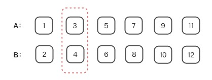
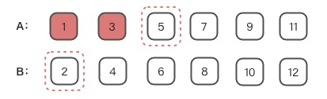
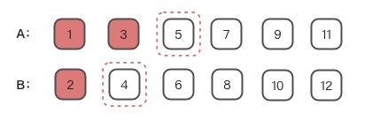

# 寻找两个正序数组的中位数

## 题目描述

给定两个大小为 `m` 和 `n` 的正序（从小到大）数组 `nums1` 和 `nums2`。

请你找出这两个正序数组的中位数，并且要求算法的时间复杂度为`O(log(m + n))`。

你可以假设 `nums1` 和 `nums2` 不会同时为空。

### 示例1

```
nums1 = [1, 3]
nums2 = [2]

则中位数是 2.0
```

### 示例 2

```
nums1 = [1, 2]
nums2 = [3, 4]

则中位数是 (2 + 3)/2 = 2.5
```

## 题解

### 题解一：暴力解法

#### 思路

根据题目描述及示例我们可以知道，用 len 表示合并后数组的长度如果是奇数，我们需要知道第 `（len+1）/2` 个数就可以了，如果遍历的话需要遍历 `Math.floor(len/2 ) + 1`
次。如果是偶数，我们需要知道第 `len/2`和 `len/2+1` 个数的值，也是需要遍历 `len/2+1` 次。所以遍历的话，奇数和偶数都是 `len/2+1` 次。

即：

* 若`len%2===1`中位数就是位于合并后数组`Math.floor(len/2)+1`的数字。
* 若`(m+n)%2===0`中位数就是位于合并后数组`len/2`和`len/2+1`的数字的平均数。

所以我们需要做的就是排序就可以了,这里我们采用指针法排序这样最多只需要移动`len/2+1`就能获得答案。

时间复杂度：遍历 `len/2+1` 次，`len=m+n`，所以时间复杂度是 `O(m+n)`。 空间复杂度：我们申请了常数个变量，也就是`m`，`n`，`len`，`pointer1`，`pointer2`，`newVal`
，`oldVal` 以及 `i`。

总共 8 个变量，所以空间复杂度是 `O(1)`。

但这并不符合题目中要求的时间复杂度`O(log(m + n))`

#### 代码

```javascript
/**
 * @param {number[]} nums1
 * @param {number[]} nums2
 * @return {number}
 */
var findMedianSortedArrays = function (nums1, nums2) {
        let m = nums1.length
        let n = nums2.length
        let len = m + n
        let pointer1 = 0, pointer2 = 0
        let newVal, oldVal
        for (let i = 0; i <= len / 2; i++) {
            oldVal = newVal
            if (pointer1 < m && (nums1[pointer1] <= nums2[pointer2] || pointer2 >= n)) {
                newVal = nums1[pointer1++]
            } else {
                newVal = nums2[pointer2++]
            }
        }
        if ((len % 2) === 0) {
            return (newVal + oldVal) / 2
        } else {
            return newVal
        }
    };
```

### 题解二：二分法

#### 思路

> 该思路源自官方题解加以自己的理解

假设两个有序数组的长度分别为 `m` 和 `n` 。提议中寻找中位数即 当 `(m+n)%2===0` 即为寻找两个数组中 第`(m+n)>>1`小 与 第`((m+n)>>1)+1`小 的平均数， 当`(m+n)%2===1`
时即为寻找两个数组中第`((m+n)>>1)+1`小的值。

那么本题的关键点在于如何取查找两个有序数组第 `k` 小的值，`k`我们可以理解为`(m+n)>>1`或`((m+n)>>1)+1`。

基于题目中的要求复杂度 `O(log(m+n))` 所以采用二分法查找。这里二分法的使用相对难以理解，如果理解透彻相信会对二分法有着更深地理解。

在上述的暴力解法中我们通过双指针逐个对比两个数组中数值的大小来查找第`k`小的值。其实二分法查找的原理与之相类似， 也是通过比较两个数组中数值的大小来查找第`k`小的值来查找第`k`
小的值，只不过二分法查找在双指针查找的基础上多做了一层逻辑来简化时间复杂度。

假设两个有序数组分别是 `A` 和 `B`,要找到第 `k` 个元素。双指针查找则从`A[0]`与`B[0]`开始对比，而二分查找我们直接从`A[(k>>1)-1]`与`B[(k>>1)-1]`开始对比。
那么这样对比有什么优势？为什么可以这么对比？我们举一个🌰。

例子：

* 步骤1：图中 `A` 与 `B` 两个数组假设我们需要查找他第`4`小的数即`k=4`那么`(k>>1)-1===1`那么就是对比`A[1]`与`B[1]`。🌰中`A[1]<B[1]`
  所以`A[0]`~`A[(k>>1)-1]`这`k>>1`个数中不可能包含第`k`小的数。我们理一下`A[0]`~`A[(k>>1)-1]`与`B[0]`~`B[(k>>1)-1]`共有`k`个数。
  `A[(k>>1)-1]<B[(k>>1)-1]`是不是就代表着`A[(k>>1)-1]`最多只有`2*((k>>1)-1)`即`k-2`个元素比他小,那`A[(k>>1)-1]`最多是第`k-1`
  个元素，所以`A[0]`~`A[(k>>1)-1]`这`k>>1`个数中不可能包含第`k`小的数。



* 步骤2：排除了`A[(k>>1)-1]<B[(k>>1)-1]`这`k>>1`个元素后我们应查找剩余元素中第`k-k>>1`小的值。为了方便理解我们假定`l=k-k>>1`即`l=2`
  所以我们需要比较`A[(k>>1)+(l>>1)-1]`与`B[(l>>1)-1]`,即`A[2]`与`B[0]`。`A[2]>B[0]`故`B[0]`~`B[(l>>1)-1]`排除。



* 步骤3：排除了`B[0]`~`B[(l>>1)-1]`这`l>>1`个元素后我们应查找剩余元素中第`k-(k>>1)-(l>>1)`小的值。为了方便理解我们假定`j=k-(k>>1)-(l>>1)`即`j=1`
  所以我们需要比较`A[(k>>1)+(l>>1)+(j>>1)-1]`与`B[(l>>1)+(j>>1)-1]`,即`A[2]`与`B[1]`。由于`j>>1===0`等于`1`且`A[2]>B[1]`故`B[1]`就是我们需要查找的第`5`小数。


