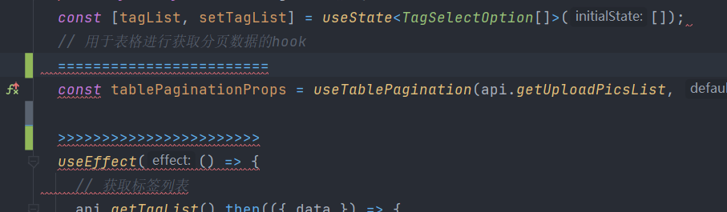
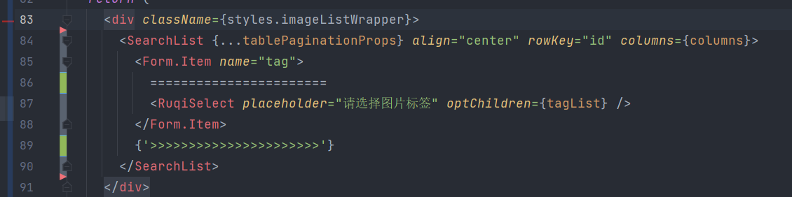
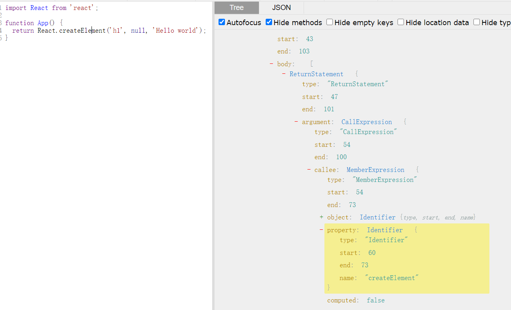
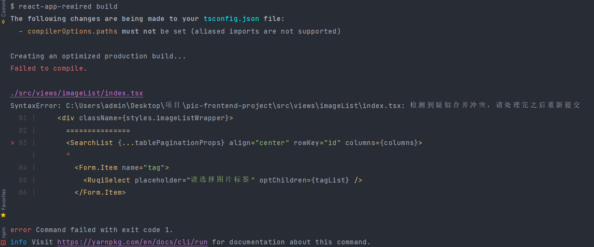
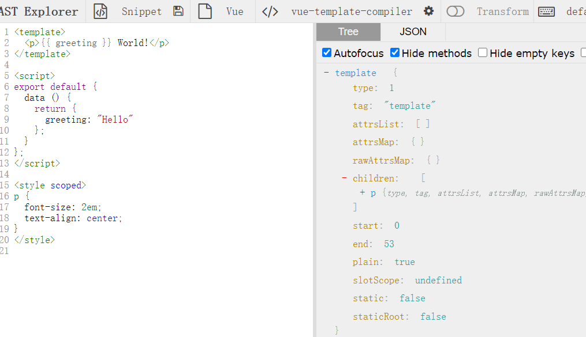

# 使用babel插件监控是否遗留合并冲突代码

## 前言

上个星期隔壁项目组上线的时候发现在合并代码的时候，没有处理完合并冲突直接上线导致线上页面中出现了`============`, `>>>>>>>>>>>`等遗留下来的冲突代码。虽说测试即使发现了并且及时回滚修复了。

但是身为一个合格工程师应该额外思考的是如何规避这种合并冲突的情况，能不能通过某种手段来检测代码中是否存在没有解决完的合并冲突代码。

## 思路

问题出现的原因是在分支合并到master分支时出现的，虽说借助于idea或者一些可视化工具基本能够避免这种问题的发生，但是在gitlab上的手动合并还是十分常见。尤其是我们项目接上了自动部署，代码合并完成之后就会自动进行打包部署。严格上来说代码合并产生冲突不管怎么操作都是会有机会产生的。

我的思路是能不能在项目生产打包阶段，识别出代码中存在类似于`============`, `>>>>>>>>>>>`合并冲突的代码的时候停止打包并且进行相关推送。这样子的话我们只检测生产环境的打包阶段就可以做到上述问题的解决。

我们目前的项目都是基于react或者vue进行开发的，这两者的代码都需要经过babel编译成ast语法树，再经由一些变化操作最后才会生成我们最终打包出来的代码。**因此我们可以在babel编译ast语法树阶段对于ast语法树进行判断是否存在正则相关阶段的判断即可**

### 哪些需要检测

#### js代码混杂合并冲突代码

以react项目为例子分析，对于js中的代码来说出现`============`, `>>>>>>>>>>>`混入这种分支合并冲突的代码必定会打包失败，因为js语法不通过，所以我们并不需要检测项目中的js逻辑代码。



#### 模板混杂合并冲突代码

但是react或者vue模板(template以及render)中的合并冲突代码类似于下面的代码，会直接认为是html模板字符串所以打包编译是可以进行通过的。事实上上面生成出现合并冲突代码就是发生在渲染模板中。**所以本质上我们只需要检测渲染模板中的合并冲突代码即可**



### 如何进行检测

前面说了，我司的项目都是需要经过babel进行编译打包生成最终的源码，因为我们可以在babel生成ast语法树阶段。对语法树进行判断渲染模板中是否出现了类似的合并冲突代码即可。

## AST语法树

### AST是什么

抽象语法树 (Abstract Syntax Tree)，简称 AST，它是源代码语法结构的一种抽象表示。它以树状的形式表现编程语言的语法结构，树上的每个节点都表示源代码中的一种结构。

### 使用场景

1. JS 反编译，语法解析
2. Babel 编译 ES6 语法
3. 代码高亮
4. 关键字匹配
5. 作用域判断
6. 代码压缩

### AST语法树的生成

社区已经有很多文章详细讲述了ast语法树的生成，这边不在进行赘述。其中注意的是有两个网站会大量使用：

1. [可视化生成Ast在线网站astexplorer](https://astexplorer.net/):查看编译之后的js代码
2. [babel代码编译在线网站](https://babeljs.io/repl):查看js代码编译成啥样的ast语法树

## 解决方案

1. 编写webpack插件监听打包阶段的钩子，手动对文件进行ast语法树的构建在进行相关的分析。（方案不可行，强行进行两次ast语法树的生成。打包阶段本身就会使用babel对代码进行一次ast语法树的构建）
2. 编写babel插件（可行，在babel编译阶段通过一些钩子来进行判断，不用写webpack插件不用手动再次生成ast语法树）

## babel插件编写

首先我们应该看我们的 React 元素是怎么创建出来的：

```js
import React from 'react';

function App() {
  return <h1>Hello World</h1>;
}
```

render中jsx代码会被编译成`React.createElement`语法，具体使用方法可以看官网

```js
import React from 'react';

function App() {
  return React.createElement('h1', null, 'Hello world');
}
```

那么这段js代码会生成什么样子的ast代码呢，我们把这段代贴到`https://astexplorer.net/`上:



### 具体思路

1. ast语法树中，我们可以通过visitors的`CallExpression`来访问所有的函数调用（这样子就进入了react.createElement函数）

   ```ts
   export default function ({ types }: typeof BabelCore): PluginObj {
   return {
    visitors: {
      CallExpression(path) {
          //进入所有的函数调用 这样子就进入了react,createElement的访问
      },
    },
   };
   }
   ```

2. 接下来判断调用者对象是`React`，调用者方法是`createElement`

   ```ts
   export default function ({ types }: typeof BabelCore): PluginObj {
   return {
    visitors: {
      CallExpression(path) {
        if (
          !(
            isMemberExpression(callee) &&
            // 调用者是一个对象
            isIdentifier(callee.object) &&
            // 调用者主题为React
            callee.object.name === 'React' &&
            isIdentifier(callee.property) &&
            // 调用方法是createElement
            callee.property.name === 'createElement'
          )
        ) {
          return;
        }
      },
    },
   };
   }
   ```

3. 可以发现`children`模板是这个 CallExpression 的 arguments 属性数组的第三个元素及以上。我们只需要获取argument中的children元素，并且判断是否属于`isStringLiteral`字符串类型，是的话我们只需要判断模板字符串是否存在合并冲突类型的代码即可

```ts
const [, , ...childrenArray] = path.node.arguments;
const stringLiteralChildArray: string[] = childrenArray
    .filter((children) => types.isStringLiteral(children))
    // @ts-ignore
    .map((child) => child.value);
if (stringLiteralChildArray.some((strText) => strText.match(/(={7})|(>{7})|(<{7})/))) {
    // 检测到合并冲突 直接抛出错误
    throw path.buildCodeFrameError('检测到疑似合并冲突，请处理完之后重新提交');
}
```

思路已有，直接上源码：

```ts
// eslint-disable-next-line import/no-extraneous-dependencies
import BabelCore, { PluginObj } from '@babel/core';
import { ObjectProperty } from '@babel/types';

const newReactToken = ['_jsxs', '_jsx'];
export default function ({ types }: typeof BabelCore): PluginObj {
  const {
    isStringLiteral,
    isIdentifier,
    isObjectExpression,
    isMemberExpression,
    isProperty,
    isArrayExpression,
  } = types;
  return {
    name: 'babel-plugin-conflict-react',
    visitor: {
      CallExpression(path) {
        const { callee } = path.node;
        // 新版react17.0 不再使用react.createElement 会被编译成jsxs
        if (isIdentifier(callee) && newReactToken.includes(callee.name)) {
          const [, props] = path.node.arguments;
          if (isObjectExpression(props)) {
            // 遍历属性查找children的节点属性
            const childrenProperties = props.properties.find((property) => {
              if (isProperty(property) && isIdentifier(property.key)) {
                return property.key.name === 'children';
              }
              return false;
            }) as ObjectProperty | undefined;
            if (!childrenProperties) {
              return;
            }

            // 如果统一弄成数组进行处理
            const formatChildren = isArrayExpression(childrenProperties.value)
              ? childrenProperties.value.elements
              : [childrenProperties.value];

            const stringLiteralChildArray: string[] = formatChildren
              // @ts-ignore
              .filter((children: any) => isStringLiteral(children))
              .map((child: any) => child.value);
            if (stringLiteralChildArray.some((strText) => strText.match(/(={7})|(>{7})|(<{7})/))) {
              // 检测到合并冲突 直接抛出错误
              throw path.buildCodeFrameError('检测到疑似合并冲突，请处理完之后重新提交');
            }
          }
        }

        // 旧版react
        if (
          !(
            isMemberExpression(callee) &&
            isIdentifier(callee.object) &&
            callee.object.name === 'React' &&
            isIdentifier(callee.property) &&
            callee.property.name === 'createElement'
          )
        ) {
          return;
        }
        // get the component type name and it's extra props options
        const [, , ...childrenArray] = path.node.arguments;
        const stringLiteralChildArray: string[] = childrenArray
          .filter((children) => types.isStringLiteral(children))
          // @ts-ignore
          .map((child) => child.value);
        if (stringLiteralChildArray.some((strText) => strText.match(/(={7})|(>{7})|(<{7})/))) {
          // 检测到合并冲突 直接抛出错误
          throw path.buildCodeFrameError('检测到疑似合并冲突，请处理完之后重新提交');
        }
      },
    },
  };
}
```

### 兼容新版react的jsx

注意的是在新版的react 17版本及以上默认采用的是新的jsx编译运行时，具体可以查看[官网文章](https://zh-hans.reactjs.org/blog/2020/09/22/introducing-the-new-jsx-transform.html)，默认使用的是新的_jsx而不是react.createElement了，所以上面的代码做了一层兼容。

### 插件的使用

在babel中引入当前编写的插件

```js
const {
  override,
  addBabelPlugins
} = require('customize-cra');
module.exports = {
  webpack: override(
    addBabelPlugins('@carrotwu/check-react-conflict-babel-plugin')
  )
};
```



### vue项目咋做检测

其实思路一样，本质上都是要获取.vue文件会被编译成咋样的ast语法树，astexplorer官网能够直接查看vue文件编译成的ast语法树

