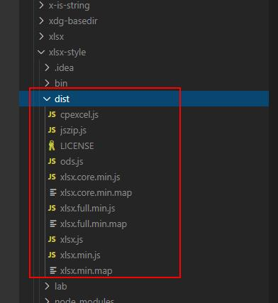
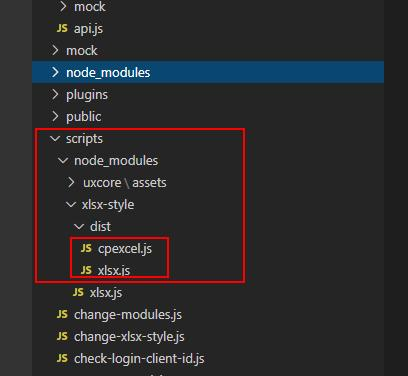
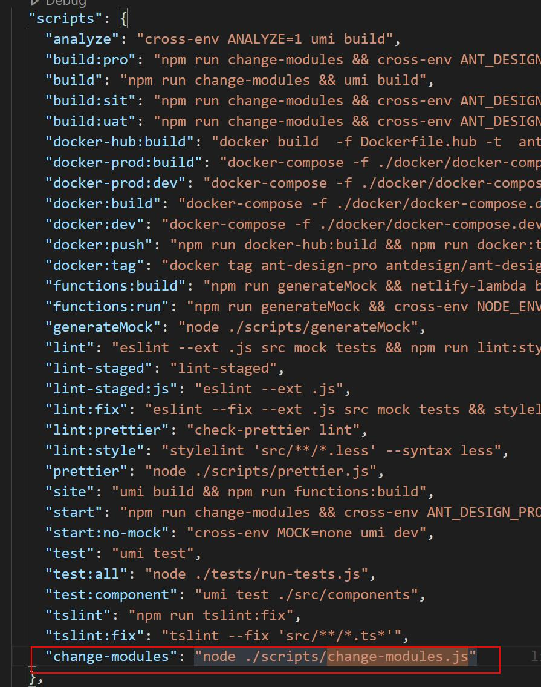

## 基于webpack修改插件源码，使用自定义文件替换node_modules里面的源码文件

基于webpack修改插件源码，使用自定义文件替换node_modules里面的源码文件

需求：插件不满足要求，需要修改源码，但又想永远保留自己修改的这份，不想被重新下载的覆盖

方法：在运行时执行你替换的方法，将你自定义的文件替换依赖包上的

案例：react+umi.js

1、自己写替换源码文件的方法，这个方法我写在change-modules.js上

2、在node_modules里将你需要修改的文件复制一份出来修改，放在静态资源的文件夹里，自定义一个也叫node_modules的文件夹，按照依赖包里的目录结构把复制的文件放进去，目录结构必须一致

依赖包的node_modules结构



自定义的node_modules结构



 

- change-modules.js源码

```javascript
const fs = require('fs');

const path = require('path');

// 解决 node_modules 修改源码，导致重新装包而要手动替换源码的重复操作。

// 将 scripts/node_modules 内的文件 覆盖 真正的 node_modules

const REAL_NODE_MODULES = path.resolve('./node_modules');  // 旧node_modules

const MY_NODE_MODULES = path.resolve('./scripts/node_modules'); // 新node_modules

copy(MY_NODE_MODULES, REAL_NODE_MODULES);

/**

 \* 复制目录中的所有文件包括子目录

 \* @param {string} 需要复制的目录、文件

 \* @param {string} 复制到指定的目录、文件

 \* @param {function} 每次复制前，都会经过一次filterFn，若返回true，则复制。

 */

function copy(oringe, target,filterFn = ()=> true) {

 if (fs.statSync(oringe).isDirectory()) {

  // 来源是个文件夹，那目标也整一个文件夹

  if (!fs.existsSync(target)) {

   fs.mkdirSync(target)

  }

  fs.readdirSync(oringe).forEach(oringeName => {

   const oringeFilePath = path.resolve(oringe, oringeName);

   const targetFilePath = path.resolve(target, oringeName);

   copy(oringeFilePath, targetFilePath, filterFn);

  });

 } else if(filterFn(oringe, target)){

  fs.copyFileSync(oringe, target);

 }

}
```

2、在package.json文件添加指令，路径指向你定义的替换方法，如change-modules.js



3、重新运行项目，你会发现依赖包的文件已经变成你修改的那份