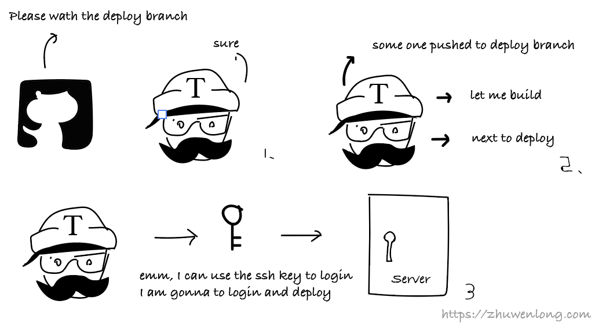

# 使用Travis-ci自动SSH部署vue代码

## 1. 从手动部署到自动部署

在整个代码部署的道路上，我经历了手动部署到`shell`半自动部署再到现在的`Travis`自动部署。

### 1.1 石器时代 - 手动部署

很早很早之前，我采用完全手动的方式部署代码：



这个过程中我需要，先在本地编写并调试代码然后上传到Git服务器上，再手动`SSH`登录机器通过`git pull`下载最新的代码，最后在服务器上进行编译和重启服务。

这种原始的模式往往最傻瓜有效，但意味着需要手动做一些列的工作，每次部署都会变得极其麻烦。

### 1.2 青铜时代 - shell半自动部署

后来我想到了把登录机器、编译、部署的事情交给shell自动执行，于是我就写了个shell脚本，主要的内容是：本地编译完成之后shell脚本自动的把代码打包，然后上传到服务器上，部署并重启服务。


使用了`shell`之后大大的解放了双手，每次决定上线的时候只需要执行`sh deploy.sh`然后坐等结果就好了。但是使用shell也有他的弊端：每次上线都得手动执行部署命令，然后等待代码自动的打包上传以及部署，如果遇到网络抖动或者打包后的文件过大存在着失败的可能性，就有可能还需要再来一次。说是自动化，其实还是需要人工去观察和干预的，于是Mofei就想了，能不能有一种更高效的方式进行部署呢？于是就有了现在的部署方式。

### 1.3 现代 - Travis自动部署

通过配合`Travis`的使用，我们可以实现如下的效果：

* 测试部署：每次`push`代码到`dev`分支，`Travis`会自动进行单元测试，然后自动的通过SSH将代码部署到对应的开发机器上并重启服务，以保持开发机上始终是最新的版本。
* 正式部署：决定上线的时候可以将代码`push`代码到`deploy`分支上，`Travis`会自动将代码部署到正式的开发环境。


当然了这个过程可以根据自己的团队进行适当的调整以决定何时进行部署。
## 2.调教Travis

步入正题，要完成自动部署，首先`Travis`要能监听`Git`的变化，然后`Travis`还需要有权限登录到我们的`SSH服务器`进行部署：


1. 配置`Travis`，让`Travis`能监听`Git`的某个分支。
2. `Git`某个分支提交之后，Travis能自动发现提交并进行编译。
3. `Travis`将编译后的产物通过SSH部署到给我们指定的机器。
### 2.1 初始化Travis

> 开始之前，如果你还没有`Travis`账号，请使用`Github`登录`Traivs`，并关联你的项目。

`Travis`是通过项目中的`.travis.yml`文件来配置任务的，首先我们需要在项目的根目录建立`.travis.yml`文件，我们以该配置为例。

新建`.travis.yml`文件，写上如下代码：

```yml
language: node_js
node_js:
- 8
```

其中`language`指得是项目运行语言，因为这里是`node.js`项目，所以写的是`node_js`，如果你使用的是其他的语言可以参考官方的文档。之后的`-8`指的是使用`v8版本`的`node.js`.当然你也可以指定多个版本来分别执行代码，如：

```yml
node_js:
- stable
- '6'
- '4'
```

那么我们以`vue`项目为例：

如果不用 `travis`，对于一个 `vuejs`项目来说，大概有这两种部署方式：

1. 开发环境打包:在开发机上打包出静态文件，再将`dist` 上传到生产环境。
```bash
npm install
npm run build
rsync ./dist/* <USERNAME>@<HOST>:<TARGET-PATH>
```

1. 生产环境打包:在生产环境中拉取仓库，打包，再拷贝到目标路径。
```bash
npm install
npm run build
cp ./dist/* <TARGET-PATH>
```

所以`vue`项目完整的`.travis.yml`文件如下：

```yml
language: node_js
node_js: stable
branches:
  only:
  - master
addons:
  ssh_known_hosts:
  - <HOST>
install:
- npm install
script:
- npm run build
after_success:
- rsync -az --delete ./dist/* <USERNAME>@<HOST>:<TARGET-PATH>
```

添加好`.travis.yml`文件之后，每次上传到Git中的代码都会自动进行`Travis`的构建，如果通过了可以在对应的`commit`后面看到一个绿色的勾，如果失败了会是一个红色的叉。


但是如果仅仅是像上面那样配置的话，`travis build` 的时候会卡住。因为 `rsync` 工具需要输入`ssh` 登录密码，而在 `travis build` 环境里，我们根本无法输入密码。

### 2.2 Travis添加SSH密钥

通常我们是通过ssh命令加上用户名和密码访问服务器的，虽然理论上我们也可以在`travis`的命令中写上诸如`ssh mofei@zhuwenlong.com -p abc`的脚本，但是这样的代码如果提交到了公开的仓库中会有很大的泄露服务器密码的风险，所以我们需要一个别人无法窃取密码或者密钥的方式让`Travis`登录我们的服务器。

通常的免密登录是基于`SSH`信任关系的，那么如果我们能把密钥以加密的形式保持在`Travis`的服务器中，`Travis`就能登录我们的服务器了。这里我们可以使用`Travis`的文件加密功能，把我们的密钥进行加密保存。


在这个过程中，我们的密钥首先会被被`Travis`加密，解密的密钥被存储在`Travis`中，就是说只有`Travis`可以进行解密。所以我们可以大胆的把这个加密后的文件上传到`github`中，不用担心其他人盗用我们的密钥。

既然我们想要使用`Travis`加密文件，第一件事情就是在本地安装`Travis`。

> 这里有一点一定要注意就是如果你的目标服务器为`linux`系统的话那么你的以下步骤也必须在`linux`系统中执行！！！！

#### 2.2.1 本地安装Travis

```bash
sudo gem install travis
```

由于`Travis`使用的是`ruby`，如果遇到众所周知的原因无发现下载的话，可以将`ruby`更换成国内的源，具体可以参考这里。

```bash
gem sources --add https://gems.ruby-china.com/ --remove https://rubygems.org/
```

然后再次运行安装`Travis`的命令 `sudo gem install travis`

安装好`Travis`之后，我们需要在命令行中登录`Travis`

```bash
travis login --pro
```

一路输入你的`github`账号和密码很快就完成了。

#### 2.2.2 生成并加密SSH密钥

万事俱备只欠东风，我们现在只要生成`SSH`密钥，然后添加信任关系，并用`Travis`加密保存即可。

在命令行中执行如下脚本：

```bash
# 在当前目录生成密钥
ssh-keygen -t rsa -b 4096 -C 'build@travis-ci.org' -f ./deploy_rsa
# 使用Travis加密
travis encrypt-file deploy_rsa --add
# 添加信任关系
ssh-copy-id -i deploy_rsa.pub <ssh-user>@<deploy-host>
# 删除敏感文件
rm -f deploy_rsa deploy_rsa.pub
# 将修改添加到git中
git add deploy_rsa.enc .travis.yml
```

我们详细来看一下代码（如果你理解所有的命令，可以略过这一小段）：

* 在当前目录生成密钥
```bash
ssh-keygen -t rsa -b 4096 -C 'build@travis-ci.org' -f ./deploy_rsa
```

首先，我们使用ssh的命令在当前目录中生成了一个`ssh`密钥，这段代码执行完成之后，会在目录中生成2个文件，私钥`deploy_rsa`和公钥`deploy_rsa.pub`，前者是用来免密登录服务器时候使用的，后者服务器用来鉴定私钥的有效性的。

* 使用Travis加密
```bash
travis encrypt-file deploy_rsa --add
```

因为`Travis`只需要使用到私钥，所以我们这里讲私钥进行加密保存，这句话执行完成之后，你会看到在`.travis.yml`文件中被自动加了下面的代码(`--add`)，同时文件夹中也发现一个加密后的文件`deploy_rsa.enc`。

```yml
before_install:
- openssl aes-256-cbc -K $encrypted_137f45644142_key -iv $encrypted_137f45644142_iv
  -in deploy_rsa.enc -out deploy_rsa -d
```

这几行被自动添加的代码的意思是，在`install`之前执行解开`deploy_rsa.enc`文件的命令并放置到`deploy_rsa`以供使用，其中这里的`$encrypted_137f45644142_key`和`$encrypted_137f45644142_iv`是解开这个文件的两个变量被存储在了`Travis`的服务器上。

* 添加信任关系
```bash
ssh-copy-id -i deploy_rsa.pub <ssh-user>@<deploy-host>
```

这句话的意思是向目标服务器(`<ssh-user>@<deploy-host>`这里的`user`和`host`需要替换成自己服务器的用户名和地址)添加公钥，添加成功之后，所有用该公钥对应的私钥访问服务器都会直接被认证通过。也就是说如果`Travis`保持了私钥的话，就可以免密的通过`ssh`登录我们的服务器了。

* 删除敏感文件并将修改添加到git中
```bash
rm -f deploy_rsa deploy_rsa.pub和git add deploy_rsa.enc .travis.yml
```

私钥`deploy_rsa`和`公钥deploy_rsa.pub`已经完成了他们的使命，我们可以把它删除以免被其他人恶意使用，并把生成的加密文件`deploy_rsa.enc`和修改后的`.travis.yml`添加到`git`中。

### 2.3 Travis部署脚本

所有的一切都准备好之后，我们就可以修改`.travis.yml`文件让`travis`来进行部署了。

首先，我们需要在部署之前解密私钥，并使其生效，所以我们添加如下代码：

```yml
before_install:
- openssl aes-256-cbc -K $encrypted_137f45644142_key -iv $encrypted_137f45644142_iv
  -in deploy_rsa.enc -out /tmp/deploy_rsa -d
- eval "$(ssh-agent -s)"
- chmod 600 /tmp/deploy_rsa
- ssh-add /tmp/deploy_rsa
```

`before_install`字段标明了Travis在部署之前需要执行的命令，其中第一行是解密`ssh`文件，后面的3行是使`ssh`密钥生效。

于是我们最终的`.travis.yml`文件内容如下：

```yml
language: node_js
node_js: stable
branches:
  only:
  - master
addons:
  ssh_known_hosts:
  - <HOST>
before_install:
- openssl aes-256-cbc -K $encrypted_137f45644142_key -iv $encrypted_137f45644142_iv
  -in deploy_rsa.enc -out /tmp/deploy_rsa -d
- eval "$(ssh-agent -s)"
- chmod 600 /tmp/deploy_rsa
- ssh-add /tmp/deploy_rsa
install:
- npm install
script:
- npm run build
after_success:
- rsync -az --delete ./dist/* <USERNAME>@<HOST>:<TARGET-PATH>
```

然后就可以在每次`push`之后玩去了。`Travis-ci`会自动帮我们完成部署。