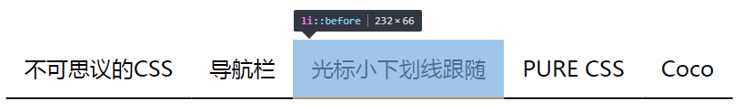
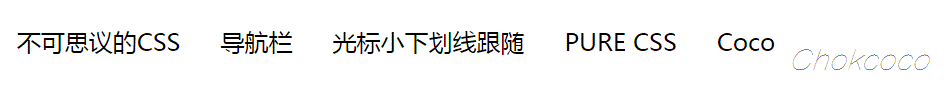
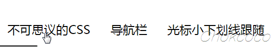
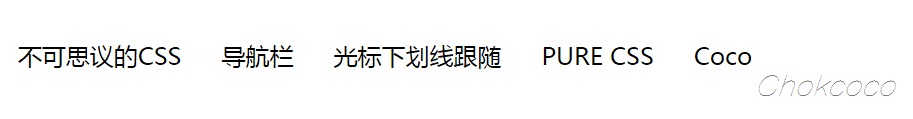

# 不可思议的纯CSS导航栏下划线跟随效果

先上张图，如何使用纯 CSS 制作如下效果？

[](https://user-images.githubusercontent.com/8554143/37917279-8f6fd236-3150-11e8-8b8d-fca96d1d6001.gif)

在继续阅读下文之前，你可以先缓一缓。尝试思考一下上面的效果或者动手尝试一下，不借助 JS ，能否巧妙的实现上述效果。

OK，继续。这个效果是我在业务开发的过程中遇到的一个类似的小问题。其实即便让我借助 Javascript ，我的第一反应也是，感觉很麻烦啊。所以我一直在想，有没有可能只使用 CSS 完成这个效果呢？

 

## 定义需求

我们定义一下简单的规则，要求如下：

- 假设 HTML 结构如下：

```html
<ul>
  <li>不可思议的CSS</li>
  <li>导航栏</li>
  <li>光标小下划线跟随</li>
  <li>PURE CSS</li>
  <li>Nav Underline</li>
</ul>
```

- 导航栏目的 `li` 的宽度是不固定的
- 当从导航的左侧 `li` 移向右侧 `li`，下划线从左往右移动。同理，当从导航的右侧 `li` 移向左侧 `li`，下划线从右往左移动。

 

## 实现需求

第一眼看到这个效果，感觉这个跟随动画，仅靠 CSS 是不可能完成的。

如果想只用 CSS 实现，只能另辟蹊径，使用一些讨巧的方法。

好，下面就借助一些奇技淫巧，使用 CSS 一步一步完成这个效果。分析一下难点：

### 宽度不固定

第一个难点， `li` 的宽度是不固定的。所以，我们可能需要从 `li` 本身的宽度上做文章。

既然每个 `li` 的宽度不一定，那么它对应的下划线的长度，肯定是是要和他本身相适应的。自然而然，我们就会想到使用它的 `border-bottom` 。

```css
li {
    border-bottom: 2px solid #000;
}
```

那么，可能现在是这样子的（li 之间是相连在一起的，li 间的间隙使用 `padding` 产生）：

[](https://user-images.githubusercontent.com/8554143/37945781-6fed50f0-31b4-11e8-9d32-6ea3f455ad6e.png)

### 默认隐藏，动画效果

当然，这里一开始都是没有下划线的，所以我们可能需要把他们给隐藏起来。

```css
li {
    border-bottom: 0px solid #000;
}
```

### 推翻重来，借助伪元素

这样好像不行，因为隐藏之后，hover `li` 的时候，需要下划线动画，而 `li` 本身肯定是不能移动的。所以，我们考虑借助伪元素。将下划线作用到每个 `li` 的伪元素之上。

```css
li::before {
    content: "";
    position: absolute;
    top: 0;
    left: 0;
    width: 100%;
    height: 100%;
    border-bottom: 2px solid #000;
}
```

下面考虑第一步的动画，hover 的时候，下划线要从一侧运动展开。所以，我们利用绝对定位，将 `li` 的伪元素的宽度设置为0，在 hover 的时候，宽度从 `width: 0 -> width: 100%`，CSS 如下：

```css
li::before {
    content: "";
    position: absolute;
    top: 0;
    left: 0;
    width: 0;
    height: 100%;
    border-bottom: 2px solid #000;
}
 
li:hover::before {
    width: 100%;
}
```

得到，如下效果：

[](https://user-images.githubusercontent.com/8554143/37947171-2a52c720-31bc-11e8-8791-dbe95b45cd6c.gif)

## 左移左出，右移右出

OK，感觉离成功近了一步。现在还剩下一个最难的问题：

如何让线条跟随光标的移动动作，实现当从导航的左侧 `li` 移向右侧 `li`，下划线从左往右移动。同理，当从导航的右侧 `li` 移向左侧 `li`，下划线从右往左移动。

我们仔细看看，现在的效果：

[](https://user-images.githubusercontent.com/8554143/37948755-3113c1c4-31c4-11e8-8472-2c85a645d56c.gif)

当从第一个 `li` 切换到第二个 `li` 的时候，第一个 `li` 下划线收回的方向不正确。所以，可以能我们需要将下划线的初始位置位移一下，设置为 `left: 100%`，这样每次下划线收回的时候，第一个 `li` 就正确了：

```css
li::before {
    content: "";
    position: absolute;
    top: 0;
    left: 100%;
    width: 0;
    height: 100%;
    border-bottom: 2px solid #000;
}
 
li:hover::before {
    left: 0;
    width: 100%;
}
```

看看效果：
[](https://user-images.githubusercontent.com/8554143/37949000-421f606c-31c5-11e8-82c1-b200a7d5124f.gif)

额，仔细对比两张图，第二种效果其实是捡了芝麻丢了西瓜。第一个 `li` 的方向是正确了，但是第二个 `li`下划线的移动方向又错误了。[](https://user-images.githubusercontent.com/8554143/37949063-9702bf2a-31c5-11e8-9faf-d2d3a6958833.jpg)

 

## 神奇的 ~ 选择符

所以，我们迫切需要一种方法，能够不改变当前 hover 的 `li` 的下划线移动方式却能改变它下一个 `li` 的下划线的移动方式（好绕口）。

**没错了，这里我们可以借助 `~` 选择符，完成这个艰难的使命，也是这个例子中，最最重要的一环。**

对于当前 hover 的 `li` ，其对应伪元素的下划线的定位是 `left: 100%`，而对于 `li:hover ~ li::before`，它们的定位是 `left: 0`。CSS 代码大致如下：

```
li::before {
    content: "";
    position: absolute;
    top: 0;
    left: 100%;
    width: 0;
    height: 100%;
    border-bottom: 2px solid #000;
    transition: 0.2s all linear;
}
 
li:hover::before {
    width: 100%;
    left: 0;
}
 
li:hover ~ li::before {
    left: 0;
}
```

至此，我们想要的效果就实现拉！撒花。看看：

[](https://user-images.githubusercontent.com/8554143/37949493-802228ac-31c7-11e8-9343-6c1150827cba.gif)

效果不错，就是有点僵硬，我们可以适当改变缓动函数以及加上一个动画延迟，就可以实现上述开头里的那个效果了。当然，这些都是锦上添花的点缀。

完整的DEMO可以戳这里: [CodePen Demo -- 不可思议的CSS光标下划线跟随效果](https://codepen.io/Chokcoco/pen/PRJvLN)