## 站在 CSS 大佬的肩上画图形（合集）


#### 1、边框内圆角

> 有时我们需要一个容器，只在内侧有圆角，而边框或描边的四个角在外部仍然保持直角的形状，最普遍就是用两个元素来实现这个效果，现在介绍一下用一个元素来实现。

```
// HTML
<div class="elemt"></div>

// CSS
.elemt{
  width: 150px;
  height: 150px;
  box-shadow: 0 0 0 12px #655;
  background: tan;
  outline: 6px solid #655;
  border-radius: 6px;
}
复制代码
```

**效果如下：**

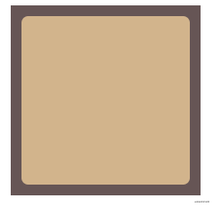WeCom Screenshot_20210602144904.png

#### 2、各种条纹背景

##### 2.1 横向和纵向条纹

```
// HTML
<div class="elemt"></div>

// CSS
/* 横向 */
.elemt {
    width: 300px;
    height: 300px;
    background: linear-gradient(#fb3 50%, #58a 0);
    background-size: 100% 30px;
}

/* 纵向 */
.elemt {
    width: 300px;
    height: 300px;
    background: linear-gradient(90deg, #fb3 50%, #58a 0);
    background-size: 30px 100%;
}
复制代码
```

**效果如下：**

WeCom Screenshot_20210602144904.png

##### 2.2 斜向条纹

```
// HTML
<div class="elemt"></div>

// CSS
/* 斜向 */
.elemt {
    width: 300px;
    height: 300px;
    background: linear-gradient(45deg, #fb3 25%, #58a 0, #58a 50%, #fb3 0, #fb3 75%, #58a 0);
    background-size: 42.4px 42.4px;
}
```

**效果如下：**

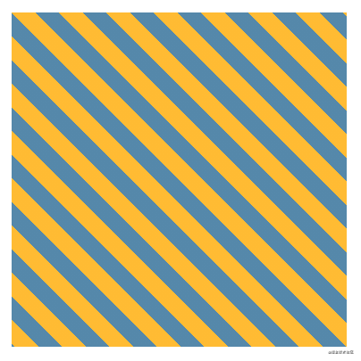WeCom Screenshot_20210602144904.png

##### 2.3 网格背景

```
// HTML
<div class="elemt"></div>

// CSS
.elemt {
    width: 300px;
    height: 300px;
    background: #58a;
    background-image: linear-gradient(white 2px, transparent 0),
      linear-gradient(90deg, white 2px, transparent 0),
      linear-gradient(hsla(0, 0%, 100%, .3) 1px, transparent 0),
      linear-gradient(90deg, hsla(0, 0%, 100%, .3) 1px, transparent 0);
    background-size: 50px 50px, 50px 50px,
      10px 10px, 10px 10px;
}
```

**效果如下：**

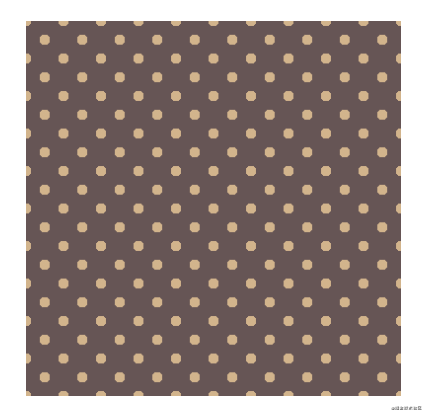WeCom Screenshot_20210602144904.png

##### 2.3 波点背景

```
// HTML
<div class="elemt"></div>

// CSS
.elemt {
    width: 300px;
    height: 300px;
    background: repeating-linear-gradient(60deg, #fb3, #fb3 15px, #58a 0, #58a 30px);
    background: #655;
    background-image: radial-gradient(tan 20%, transparent 0),
      radial-gradient(tan 20%, transparent 0);
    background-size: 30px 30px;
    background-position: 0 0, 15px 15px;
}
```

**效果如下：**

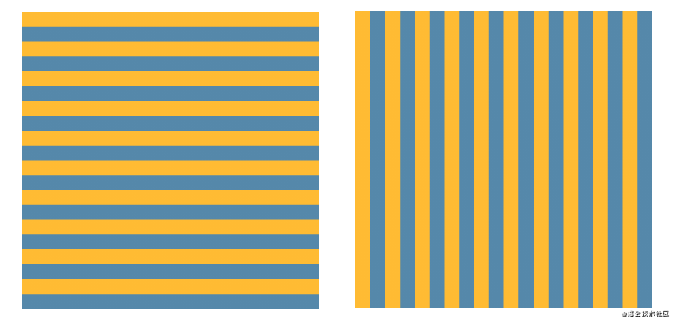WeCom Screenshot_20210602144904.png

##### 2.4 棋盘背景

```
// HTML
<div class="elemt"></div>

// CSS
/* 方案一 */
.elemt {
    width: 300px;
    height: 300px;
    background: #eee;
    background-image: linear-gradient(45deg, rgba(0, 0, 0, .25) 25%, transparent 0, transparent 75%, rgba(0, 0, 0, .25) 0),
      linear-gradient(45deg, rgba(0, 0, 0, .25) 25%, transparent 0, transparent 75%, rgba(0, 0, 0, .25) 0);
    background-position: 0 0, 15px 15px;
    background-size: 30px 30px;
}

/* 方案二 */
.elemt {
    width: 300px;
    height: 300px;
    background: #eee url('data:image/svg+xml,\
            <svg xmlns="http://www.w3.org/2000/svg" width="100" height="100" fill-opacity=".25" >\
            <rect x="50" width="50" height="50" />\
            <rect y="50" width="50" height="50" />\
            </svg>');
    background-size: 30px 30px;
}
```

**效果如下：**

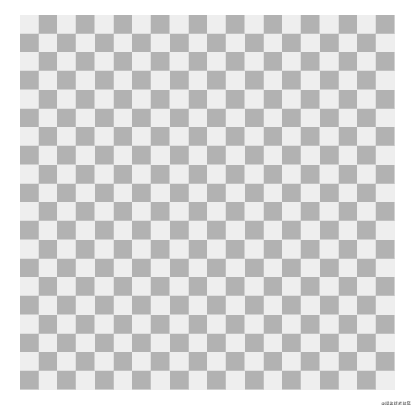WeCom Screenshot_20210602144904.png

#### 3、“老式信封”边框样式

```
// HTML
<div class="elemt"></div>

// CSS
/* 方案一 */
.elemt{
    width: 300px;
    height: 300px;
    border: 1em solid transparent;
    background: linear-gradient(white, white) padding-box,
      repeating-linear-gradient(-45deg, red 0, red 12.5%, transparent 0, transparent 25%,
        #58a 0, #58a 37.5%, transparent 0, transparent 50%) 0 / 6em 6em;
}

/* 方案二 */
.elemt{
    width: 300px;
    height: 300px;
    border: 1em solid transparent;
    border-image: 16 repeating-linear-gradient(-45deg, red 0, red 1em, transparent 0, transparent 2em,
        #58a 0, #58a 3em, transparent 0, transparent 4em);
}
```

**效果如下：**

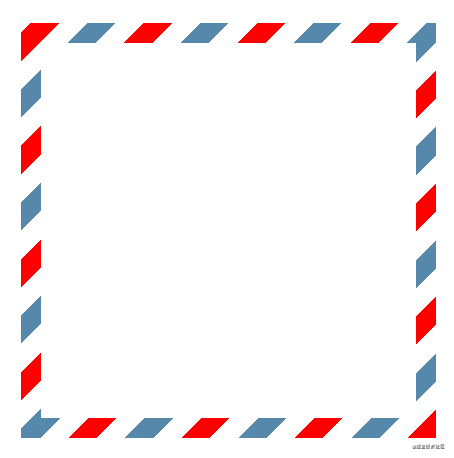WeCom Screenshot_20210602144904.png

#### 4、 圆、椭圆

> 将元素的宽高设置不相等，就会得到椭圆

```
// HTML 
<div class="elemt"></div>

// CSS ------ 圆
.elemt{
    width: 16em;
    height: 16em;
    background: #fb3;
    border-radius: 50%;
}

// CSS ------ 椭圆
.elemt{
    width: 16em;
    height: 10em;
    background: #fb3;
    border-radius: 50%;
}
复制代码
```

**效果如下：**
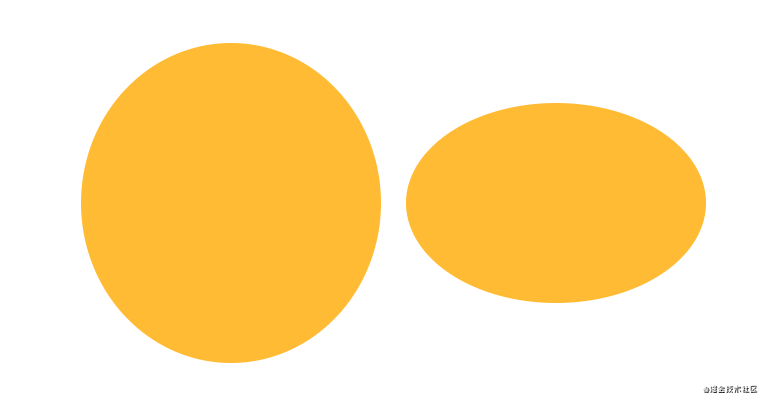

#### 5、 半椭圆

```
// HTML 
<div class="elemt"></div>
<div class="elemt"></div>
<div class="elemt"></div>
<div class="elemt"></div>

// CSS
.elemt{
    width: 16em;
    height: 16em;
    margin: 1em;
    background: #fb3;
    border-radius: 50% / 100% 100% 0 0;
    display: inline-block;
}

.elemt:nth-of-type(2) { border-radius: 50% / 0 0 100% 100%; }
.elemt:nth-of-type(3) { border-radius: 100% 0 0 100% / 50%; }
.elemt:nth-of-type(4) { border-radius: 0 100% 100% 0 / 50%; }
复制代码
```

效果如下：

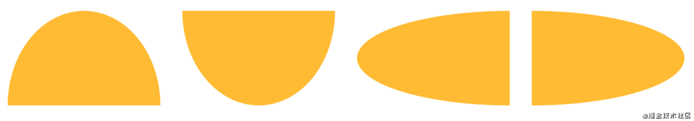WeCom Screenshot_20210525140935.png

#### 6、 四分一椭圆

```
// HTML 
<div class="elemt"></div>
<div class="elemt"></div>
<div class="elemt"></div>
<div class="elemt"></div>

// CSS
.elemt{
    width: 16em;
    height: 16em;
    margin: 1em;
    background: #fb3;
    border-radius: 100% 0 0 0;
    display: inline-block;
}

.elemt:nth-of-type(2) { border-radius: 0 100% 0 0; }
.elemt:nth-of-type(3) { border-radius: 0 0 100% 0; }
.elemt:nth-of-type(4) { border-radius: 0 0 0 100%; }
复制代码
```

**效果如下：**

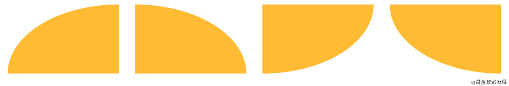WeCom Screenshot_20210525140935.png

#### 7、 平行四边形

> 下面是用伪元素，也可用嵌套元素来实现

```
// HTML
<div class="elemt"></div>

// CSS
.elemt{
    position: relative;
    width: 16em;
    height: 16em;
    background: transparent;
}

.elemt::before{
    content: '';
    position: absolute;
    top: 0;
    left: 0;
    width: 100%;
    height: 100%;
    background: #58a;
    transform: skew(-45deg);
}
复制代码
```

**效果如下：**

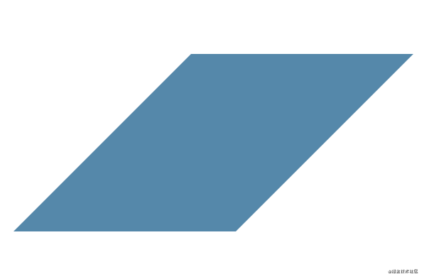WeCom Screenshot_20210525140935.png

#### 8、菱形

> 可以用transform: rotare(45deg)来实现，今天介绍一下更简便的方法，就是应用clip-path这个属性。

```
//HTML
<div class="elemt"></div>

//CSS
.elemt{
    width: 250px;
    height: 250px;
    background: #58a;
    clip-path: polygon(50% 0, 100% 50%, 50% 100%, 0 50%);
}
复制代码
```

**效果如下：**

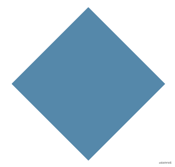WeCom Screenshot_20210525140935.png

#### 9、切角效果

> 面对这个效果，我们首先想到使用三角形盖住元素的顶角来模拟切角效果（当网页背景是纯色时），或者使用一张或多张已经切过角的图片来作为整个元素的背景。但是我们有更简便的方案来实现。

##### 方案一：渐变

```
// HTML
<div class="elemt"></div>

// CSS
.elemt{
    width: 250px;
    height: 250px;
    
    /*直切角*/
    background: linear-gradient(135deg, transparent 15px, #58a 0) top left,
      linear-gradient(-135deg, transparent 15px, #58a 0) top right,
      linear-gradient(45deg, transparent 15px, #58a 0) bottom left,
      linear-gradient(-45deg, transparent 15px, #58a 0) bottom right;
      
    /*圆切角*/
    background: radial-gradient(circle at top left, transparent 15px, #58a 0) top left,
    radial-gradient(circle at top right, transparent 15px, #58a 0) top right,
    radial-gradient(circle at bottom right, transparent 15px, #58a 0) bottom right,
    radial-gradient(circle at bottom left, transparent 15px, #58a 0) bottom left;
    
    background-size: 50% 50%;
    background-repeat: no-repeat;
}
复制代码
```

##### 方案二：裁剪（clip-path）

```
// HTML
<div class="elemt"></div>

// CSS
.elemt{
    width: 250px;
    height: 250px;
    background: #58a;
    clip-path: polygon(20px 0, calc(100% - 20px) 0, 100% 20px, 100% calc(100% - 20px), calc(100% - 20px) 100%, 0px 100%, 0 calc(100% - 20px), 0 20px);
}
复制代码
```

**效果如下：**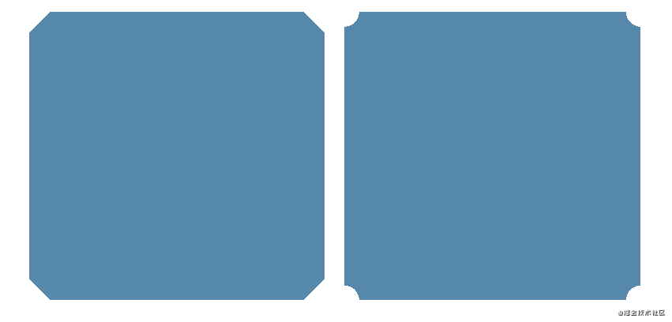

#### 10、梯形

```
// HTML
<div class="elemt"></div>

// CSS
.elemt{
    position: relative;
    width: 300px;
    height: 300px;
}

.elemt::before{
    content: '';
    position: absolute;
    top: 0;
    left: 0;
    width: 100%;
    height: 100%;
    background: #58a;
    transform: scaleY(1.3) perspective(.5em) rotateX(5deg);
    transform-origin: bottom;
}
复制代码
```

**效果如下：**

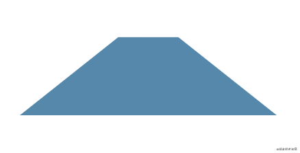WeCom Screenshot_20210526113257.png

#### 11、用SVG画一个饼状图

```
// HTML
<svg viewBox="0 0 32 32">
  <circle r="16" cx="16" cy="16">
</svg>

// CSS
svg{
  width: 100px;
  height: 100px;
  transform: rotate(-90deg);
  background: yellowgreen;
  border-radius: 50%;
}

circle{
  fill: yellowgreen;
  stroke: #655;
  stroke-width: 32;
  stroke-dasharray: 0 100;
  animation: fillup 5s linear infinite;
}

@keyframes fillup {
  to{
    stroke-dasharray: 100 100;
  }
}
复制代码
```

**效果如下：**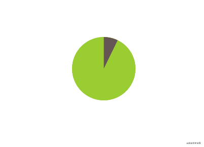

#### 12、折角效果

```
// HTML
<div class="elemt"></div>

// CSS
.elemt{
    position: relative;
    width: 250px;
    height: 250px;
    margin: 50px;
    background: #58a;
    border-radius: .5em;
    background: linear-gradient(-150deg, transparent 1.5em, #58a 0);
}

.elemt::before {
    content: '';
    position: absolute;
    top: 0;
    right: 0;
    width: 1.73em;
    height: 3em;
    background: linear-gradient(to left bottom, transparent 50%, rgba(0, 0, 0, .2) 0, rgba(0, 0, 0, .4)) 100% 0 no-repeat;
    transform: translateY(-1.3em) rotate(-30deg);
    transform-origin: bottom right;
    border-bottom-left-radius: .5em;
    box-shadow: -.2em .2em .3em -.1em rgba(0, 0, 0, .15);
  }
复制代码
```

> 但是上面这个方案如果要修改折页的角度的话，则需要修改五处地方，如要更灵活的方案，请点这里，用的是CSS处理器。

**效果如下：**

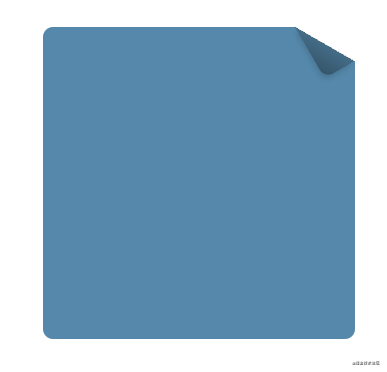WeCom Screenshot_20210528113117.png

#### 13、紧贴底部的页脚

> 有一个具有块级样式的页脚（比如它设置了背景或阴影），当页面内容足够长时它一切正常，而当页面较短时（比如错误信息页面）就会出现问题。此时的问题在于，页脚不能像我们期望中那样“紧贴”在视口的最底部，而是紧跟在内容的下方。

```
// HTMl
<header></header>
<main><main>
<footer></footer>

// CSS
body {
    display: flex;
    flex-direction: column;
    min-height: 100vh;
}

main {
    flex: 1;
}
复制代码
```

**具体效果请参考这里**

#### 14、打字动画

```
// HTML
<h1>CSS is so awesome!</h1>

// CSS
h1{
  width: 15ch;
  white-space: nowrap;
  overflow: hidden;
  border-right: .05em solid;
  font: bold 200% Consolas, Monaco, monospace;
  animation: typing 8s steps(15),
             caret 1s steps(1) infinite;
}

@keyframes typing{
  from{
    width: 0;
  }
}

@keyframes caret{
  50%{
    border-right-color: transparent;
  }
}

// JS
let text = document.getElementsByTagName('h1');
text[0].style.width = text[0].outerText.length + 'ch';
text[0].style.animationTimingFunction = "steps("+ text[0].outerText.length +"), steps(1)";
复制代码
```

**效果如下：**

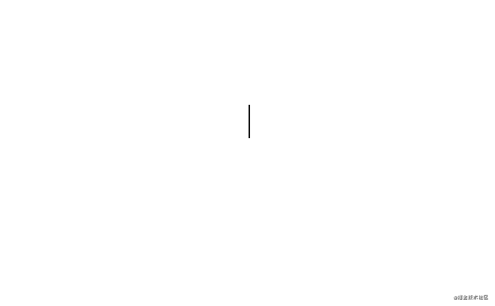typing.gif

**最后啰嗦一下，最近在看《css揭秘》这本书，顺便总结一下个人觉得不错的地方，方便自己在开发的时候可以偷一下懒，节约一下时间成本。如文中有不正确的地方，请留言提醒一下（请轻喷），如果jio得不错，请xdjmm点个赞鼓励一下，支持一下，感谢各位掘友！书中更多功能效果，请点击这里!：http://play.csssecrets.io/**

**关于本文：**

**来源：Leeon**

**https://juejin.cn/post/6969441630289920008**

## 最后

欢迎关注【前端瓶子君】✿✿ヽ(°▽°)ノ✿

回复「算法」，加入前端编程源码算法群，每日一道面试题（工作日），第二天瓶子君都会很认真的解答哟！

回复「交流」，吹吹水、聊聊技术、吐吐槽！

回复「阅读」，每日刷刷高质量好文！

如果这篇文章对你有帮助，「在看」是最大的支持

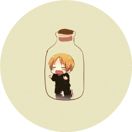

**前端瓶子君** 

瓶子君，2021致力于帮助前端开启技术专项+算法之路！

39篇原创内容


公众号

[ 》》面试官也在看的算法资料《《](https://mp.weixin.qq.com/s?__biz=MzUzNjk5MTE1OQ==&mid=2247505199&idx=2&sn=3a59580b622ca1b1e060a77f0585f419&chksm=faef51f7cd98d8e15dc7e3c84eb26eaf0b1de5828293702c5c4a8ac42445f7b5fa344346b363&mpshare=1&scene=1&srcid=0616sFaAL6cDavBRHdJjHFE5&sharer_sharetime=1623849873567&sharer_shareid=4f8559b638a00ade6b7580d0c1aeb4aa&key=647b3f218ff636cdfef3db592d0668feca879ebe8ebdffac03c1a4c25c25f32c22b9c4ec49365b81b3f8238752a8c7f5af2eba15c9d54c3c35cd35ddaf101be6a9cb87618452dadc0957442093a0fa4319aa13939e34986aef0a7a1bfda2d59f5d8185b3f23c68ca9593b048e8f73de7edd365af11d2c234757a83834c324239&ascene=1&uin=MjUyMzE1MjE2MA%3D%3D&devicetype=iMac+MacBookPro16%2C1+OSX+OSX+10.16+build(20D91)&version=13000310&nettype=WIFI&lang=zh_CN&fontScale=100&exportkey=ARf3OCl%2Bn4FHB8JDT7Pi9wE%3D&pass_ticket=PTTr4L75GtIV8Ozct5ynxM1Vrt18ogzyPrXid5mb59JEFo6n4v21OQjzYMAp1B%2BU&wx_header=0&fontgear=2.000000)

“在看和转发”就是最大的支持

阅读 1011

赞11在看11