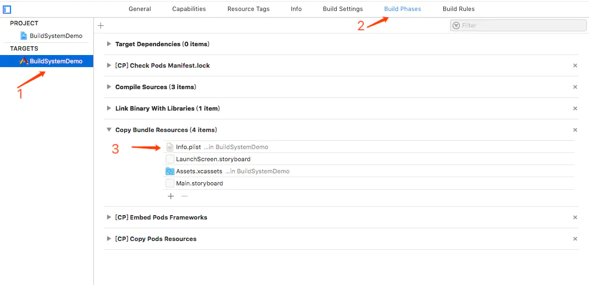
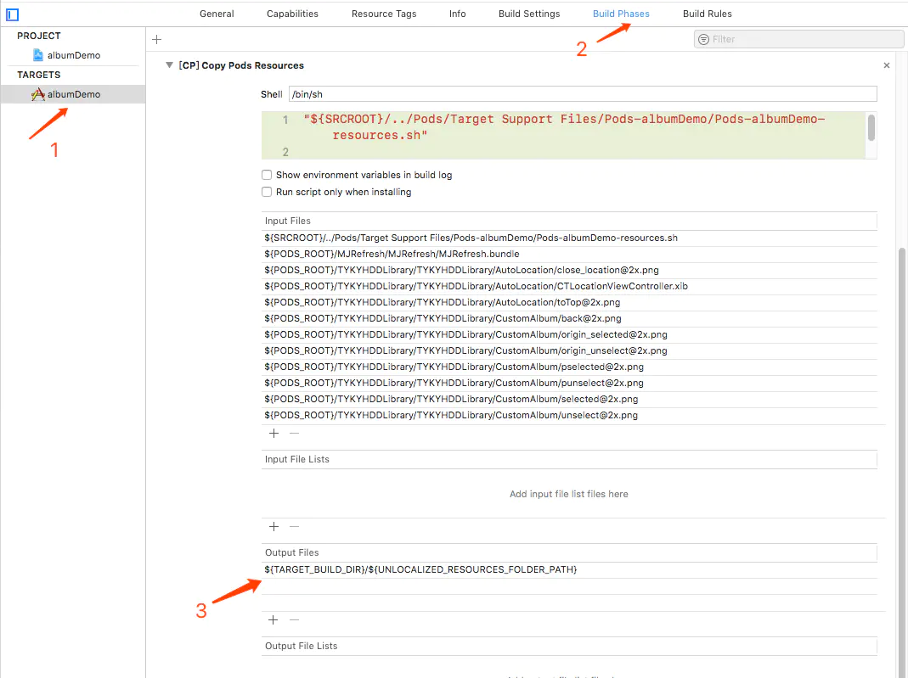
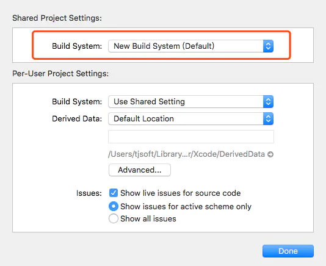

# Xcode 10 中关于 Error: Multiple commands produce

更新`Xcode 10`，自然开始第一时间运行老项目，踩坑填坑

### 这边记录下基本出现的问题

> `Error: Multiple commands produce`

Xcode 10 与本问题相关的一个更新点。

> Build System
> 
> 
> Again, Xcode 10 uses a new build system. The new build system provides improved reliability and build performance, and it catches project configuration problems that the legacy build system does not.
> 
> 
> The legacy build system is still available in Xcode 10. To use the legacy build system, select it in the File > Project/Workspace Settings sheet. Projects configured to use the legacy build system will display an orange hammer icon in the Activity View.

简单而言，`Xcode10`使用了一个的新创建系统，比之前的提供更好的可靠性与创建性能，而且可以获取项目配置问题（默认设置新创建系统）

在苹果文档中，提及`Xcode10`中的关于旧项目`New Build System`更改适配中提及到以下两点

* The new build system has stricter checks for cycles between elements in the build in order to prevent unnecessary rebuilds.

* It is an error for any individual file in the build to be produced by more than one build command. For example, if two targets each declare the same output file from a shell script phase, factor out the declaration of the output file into a single target.
`New Build System`会对构建中的元素循环进行严格的检查，避免不必要的重建，这个也是错误出现的原因。

### 错误发生的两种普遍形式：

#### 1. `info.plist`

> 错误信息

```
Multiple commands produce '/Users/tjsoft/Library/Developer/Xcode/DerivedData/TYKYTwoLearnOneDo-amcfzswumxdotlgjwdslugmywxch/Build/Products/Debug-iphoneos/TYKYTwoLearnOneDo.app/Info.plist':
1) Target 'TYKYTwoLearnOneDo' (project 'TYKYTwoLearnOneDo') has copy command from '/Users/tjsoft/TYKY /党建/黔纪/QianJiDangJian_iOS/TYKYTwoLearnOneDo/Info.plist' to '/Users/tjsoft/Library/Developer/Xcode/DerivedData/TYKYTwoLearnOneDo-amcfzswumxdotlgjwdslugmywxch/Build/Products/Debug-iphoneos/TYKYTwoLearnOneDo.app/Info.plist'
2) Target 'TYKYTwoLearnOneDo' (project 'TYKYTwoLearnOneDo') has process command with output '/Users/tjsoft/Library/Developer/Xcode/DerivedData/TYKYTwoLearnOneDo-amcfzswumxdotlgjwdslugmywxch/Build/Products/Debug-iphoneos/TYKYTwoLearnOneDo.app/Info.plist'
```

#### 2. `Copy Pods Resources`

> 错误信息

```
Multiple commands produce '/Users/tjsoft/Library/Developer/Xcode/DerivedData/TYKYTwoLearnOneDo-amcfzswumxdotlgjwdslugmywxch/Build/Products/Debug-iphoneos/TYKYTwoLearnOneDo.app':
1) Target 'TYKYTwoLearnOneDo' has create directory command with output '/Users/tjsoft/Library/Developer/Xcode/DerivedData/TYKYTwoLearnOneDo-amcfzswumxdotlgjwdslugmywxch/Build/Products/Debug-iphoneos/TYKYTwoLearnOneDo.app'
2) That command depends on command in Target 'TYKYTwoLearnOneDo': script phase “[CP] Copy Pods Resources”
```

### 解决方法可以有两种:

#### 1. 一种是不使用`New Build System`，在`File` > `Project/Workspace Settings`中的`Share Project/Workspace Settings`里`build system`将`New Build System(Default)`切换成`Legacy build system`。



#### 其次是根据出错信息，在新创建系统模式下，去除多余的引用重建。

##### 1. Info.plist

在 `target` -> `Build phase` > `Copy Bundle Resource` 中找到`info.plist`，移除



##### 2. Copy Pods Resources

在 `target` -> `Build phase` -> `Copy Pods Resources` -> `Output Files`，移除`${TARGET_BUILD_DIR}/${UNLOCALIZED_RESOURCES_FOLDER_PATH}`



%E6%9B%B4%E6%96%B0%60Xcode%2010%60%EF%BC%8C%E8%87%AA%E7%84%B6%E5%BC%80%E5%A7%8B%E7%AC%AC%E4%B8%80%E6%97%B6%E9%97%B4%E8%BF%90%E8%A1%8C%E8%80%81%E9%A1%B9%E7%9B%AE%EF%BC%8C%E8%B8%A9%E5%9D%91%E5%A1%AB%E5%9D%91%0A%0A%23%23%23%20%E8%BF%99%E8%BE%B9%E8%AE%B0%E5%BD%95%E4%B8%8B%E5%9F%BA%E6%9C%AC%E5%87%BA%E7%8E%B0%E7%9A%84%E9%97%AE%E9%A2%98%0A%0A%3E%20%60Error%3A%20Multiple%20commands%20produce%60%0A%0AXcode%2010%20%E4%B8%8E%E6%9C%AC%E9%97%AE%E9%A2%98%E7%9B%B8%E5%85%B3%E7%9A%84%E4%B8%80%E4%B8%AA%E6%9B%B4%E6%96%B0%E7%82%B9%E3%80%82%0A%0A%3EBuild%20System%0AAgain%2C%20Xcode%2010%20uses%20a%20new%20build%20system.%20The%20new%20build%20system%20provides%20improved%20reliability%20and%20build%20performance%2C%20and%20it%20catches%20project%20configuration%20problems%20that%20the%20legacy%20build%20system%20does%20not.%0AThe%20legacy%20build%20system%20is%20still%20available%20in%20Xcode%2010.%20To%20use%20the%20legacy%20build%20system%2C%20select%20it%20in%20the%20File%20%3E%20Project%2FWorkspace%20Settings%20sheet.%20Projects%20configured%20to%20use%20the%20legacy%20build%20system%20will%20display%20an%20orange%20hammer%20icon%20in%20the%20Activity%20View.%0A%0A%E7%AE%80%E5%8D%95%E8%80%8C%E8%A8%80%EF%BC%8C%60Xcode10%60%E4%BD%BF%E7%94%A8%E4%BA%86%E4%B8%80%E4%B8%AA%E7%9A%84%E6%96%B0%E5%88%9B%E5%BB%BA%E7%B3%BB%E7%BB%9F%EF%BC%8C%E6%AF%94%E4%B9%8B%E5%89%8D%E7%9A%84%E6%8F%90%E4%BE%9B%E6%9B%B4%E5%A5%BD%E7%9A%84%E5%8F%AF%E9%9D%A0%E6%80%A7%E4%B8%8E%E5%88%9B%E5%BB%BA%E6%80%A7%E8%83%BD%EF%BC%8C%E8%80%8C%E4%B8%94%E5%8F%AF%E4%BB%A5%E8%8E%B7%E5%8F%96%E9%A1%B9%E7%9B%AE%E9%85%8D%E7%BD%AE%E9%97%AE%E9%A2%98%EF%BC%88%E9%BB%98%E8%AE%A4%E8%AE%BE%E7%BD%AE%E6%96%B0%E5%88%9B%E5%BB%BA%E7%B3%BB%E7%BB%9F%EF%BC%89%0A%0A%E5%9C%A8%E8%8B%B9%E6%9E%9C%E6%96%87%E6%A1%A3%E4%B8%AD%EF%BC%8C%E6%8F%90%E5%8F%8A%60Xcode10%60%E4%B8%AD%E7%9A%84%E5%85%B3%E4%BA%8E%E6%97%A7%E9%A1%B9%E7%9B%AE%60New%20Build%20System%60%E6%9B%B4%E6%94%B9%E9%80%82%E9%85%8D%E4%B8%AD%E6%8F%90%E5%8F%8A%E5%88%B0%E4%BB%A5%E4%B8%8B%E4%B8%A4%E7%82%B9%0A%0A*%20The%20new%20build%20system%20has%20stricter%20checks%20for%20cycles%20between%20elements%20in%20the%20build%20in%20order%20to%20prevent%20unnecessary%20rebuilds.%0A%0A*%20It%20is%20an%20error%20for%20any%20individual%20file%20in%20the%20build%20to%20be%20produced%20by%20more%20than%20one%20build%20command.%20For%20example%2C%20if%20two%20targets%20each%20declare%20the%20same%20output%20file%20from%20a%20shell%20script%20phase%2C%20factor%20out%20the%20declaration%20of%20the%20output%20file%20into%20a%20single%20target.%0A%0A%60New%20Build%20System%60%E4%BC%9A%E5%AF%B9%E6%9E%84%E5%BB%BA%E4%B8%AD%E7%9A%84%E5%85%83%E7%B4%A0%E5%BE%AA%E7%8E%AF%E8%BF%9B%E8%A1%8C%E4%B8%A5%E6%A0%BC%E7%9A%84%E6%A3%80%E6%9F%A5%EF%BC%8C%E9%81%BF%E5%85%8D%E4%B8%8D%E5%BF%85%E8%A6%81%E7%9A%84%E9%87%8D%E5%BB%BA%EF%BC%8C%E8%BF%99%E4%B8%AA%E4%B9%9F%E6%98%AF%E9%94%99%E8%AF%AF%E5%87%BA%E7%8E%B0%E7%9A%84%E5%8E%9F%E5%9B%A0%E3%80%82%0A%0A%23%23%23%20%E9%94%99%E8%AF%AF%E5%8F%91%E7%94%9F%E7%9A%84%E4%B8%A4%E7%A7%8D%E6%99%AE%E9%81%8D%E5%BD%A2%E5%BC%8F%EF%BC%9A%0A%0A%23%23%23%23%201.%20%60info.plist%60%0A%0A%3E%20%E9%94%99%E8%AF%AF%E4%BF%A1%E6%81%AF%0A%0A%60%60%60%0AMultiple%20commands%20produce%20'%2FUsers%2Ftjsoft%2FLibrary%2FDeveloper%2FXcode%2FDerivedData%2FTYKYTwoLearnOneDo-amcfzswumxdotlgjwdslugmywxch%2FBuild%2FProducts%2FDebug-iphoneos%2FTYKYTwoLearnOneDo.app%2FInfo.plist'%3A%0A1)%20Target%20'TYKYTwoLearnOneDo'%20(project%20'TYKYTwoLearnOneDo')%20has%20copy%20command%20from%20'%2FUsers%2Ftjsoft%2FTYKY%20%2F%E5%85%9A%E5%BB%BA%2F%E9%BB%94%E7%BA%AA%2FQianJiDangJian_iOS%2FTYKYTwoLearnOneDo%2FInfo.plist'%20to%20'%2FUsers%2Ftjsoft%2FLibrary%2FDeveloper%2FXcode%2FDerivedData%2FTYKYTwoLearnOneDo-amcfzswumxdotlgjwdslugmywxch%2FBuild%2FProducts%2FDebug-iphoneos%2FTYKYTwoLearnOneDo.app%2FInfo.plist'%0A2)%20Target%20'TYKYTwoLearnOneDo'%20(project%20'TYKYTwoLearnOneDo')%20has%20process%20command%20with%20output%20'%2FUsers%2Ftjsoft%2FLibrary%2FDeveloper%2FXcode%2FDerivedData%2FTYKYTwoLearnOneDo-amcfzswumxdotlgjwdslugmywxch%2FBuild%2FProducts%2FDebug-iphoneos%2FTYKYTwoLearnOneDo.app%2FInfo.plist'%0A%60%60%60%0A%0A%23%23%23%23%202.%20%60Copy%20Pods%20Resources%60%0A%0A%3E%20%E9%94%99%E8%AF%AF%E4%BF%A1%E6%81%AF%0A%0A%60%60%60%0AMultiple%20commands%20produce%20'%2FUsers%2Ftjsoft%2FLibrary%2FDeveloper%2FXcode%2FDerivedData%2FTYKYTwoLearnOneDo-amcfzswumxdotlgjwdslugmywxch%2FBuild%2FProducts%2FDebug-iphoneos%2FTYKYTwoLearnOneDo.app'%3A%0A1)%20Target%20'TYKYTwoLearnOneDo'%20has%20create%20directory%20command%20with%20output%20'%2FUsers%2Ftjsoft%2FLibrary%2FDeveloper%2FXcode%2FDerivedData%2FTYKYTwoLearnOneDo-amcfzswumxdotlgjwdslugmywxch%2FBuild%2FProducts%2FDebug-iphoneos%2FTYKYTwoLearnOneDo.app'%0A2)%20That%20command%20depends%20on%20command%20in%20Target%20'TYKYTwoLearnOneDo'%3A%20script%20phase%20%E2%80%9C%5BCP%5D%20Copy%20Pods%20Resources%E2%80%9D%0A%60%60%60%0A%0A%0A%23%23%23%20%E8%A7%A3%E5%86%B3%E6%96%B9%E6%B3%95%E5%8F%AF%E4%BB%A5%E6%9C%89%E4%B8%A4%E7%A7%8D%3A%0A%0A%23%23%23%23%201.%20%E4%B8%80%E7%A7%8D%E6%98%AF%E4%B8%8D%E4%BD%BF%E7%94%A8%60New%20Build%20System%60%EF%BC%8C%E5%9C%A8%60File%60%20%3E%20%60Project%2FWorkspace%20Settings%60%E4%B8%AD%E7%9A%84%60Share%20Project%2FWorkspace%20Settings%20%60%E9%87%8C%60build%20system%20%60%E5%B0%86%60New%20Build%20System(Default)%60%E5%88%87%E6%8D%A2%E6%88%90%60Legacy%20build%20system%60%E3%80%82%0A%0A%0A!%5Ba65d4371850f27072032a9115cbbecbd.png%5D(evernotecid%3A%2F%2FBA936014-CAFA-4899-8277-AF3B3F2FA668%2Fappyinxiangcom%2F13794041%2FENResource%2Fp10)%0A%0A%23%23%23%23%20%E5%85%B6%E6%AC%A1%E6%98%AF%E6%A0%B9%E6%8D%AE%E5%87%BA%E9%94%99%E4%BF%A1%E6%81%AF%EF%BC%8C%E5%9C%A8%E6%96%B0%E5%88%9B%E5%BB%BA%E7%B3%BB%E7%BB%9F%E6%A8%A1%E5%BC%8F%E4%B8%8B%EF%BC%8C%E5%8E%BB%E9%99%A4%E5%A4%9A%E4%BD%99%E7%9A%84%E5%BC%95%E7%94%A8%E9%87%8D%E5%BB%BA%E3%80%82%0A%0A%23%23%23%23%23%201.%20Info.plist%0A%0A%E5%9C%A8%20%60target%60%20-%3E%20%60Build%20phase%60%20%3E%20%60Copy%20Bundle%20Resource%60%20%E4%B8%AD%E6%89%BE%E5%88%B0%60info.plist%60%EF%BC%8C%E7%A7%BB%E9%99%A4%0A%0A!%5B16efc5f5422ad39c3eb0e78c58f08171.png%5D(evernotecid%3A%2F%2FBA936014-CAFA-4899-8277-AF3B3F2FA668%2Fappyinxiangcom%2F13794041%2FENResource%2Fp12)%0A%0A%0A%23%23%23%23%23%202.%20Copy%20Pods%20Resources%0A%0A%E5%9C%A8%20%60target%60%20-%3E%20%60Build%20phase%60%20-%3E%20%60Copy%20Pods%20Resources%60%20-%3E%20%60Output%20Files%60%EF%BC%8C%E7%A7%BB%E9%99%A4%60%24%7BTARGET_BUILD_DIR%7D%2F%24%7BUNLOCALIZED_RESOURCES_FOLDER_PATH%7D%60%0A%0A!%5Bc1db82cc131c68e15a6c639cf3dcea56.png%5D(evernotecid%3A%2F%2FBA936014-CAFA-4899-8277-AF3B3F2FA668%2Fappyinxiangcom%2F13794041%2FENResource%2Fp11)%0A
