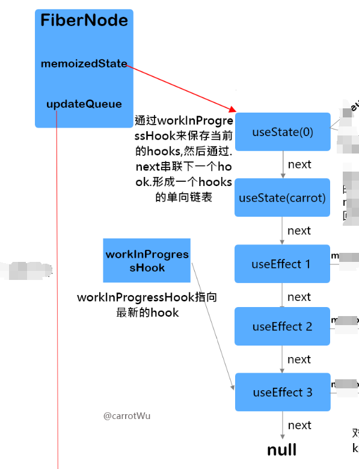
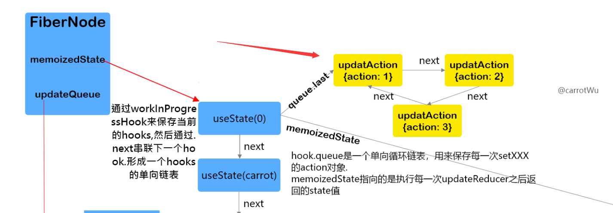
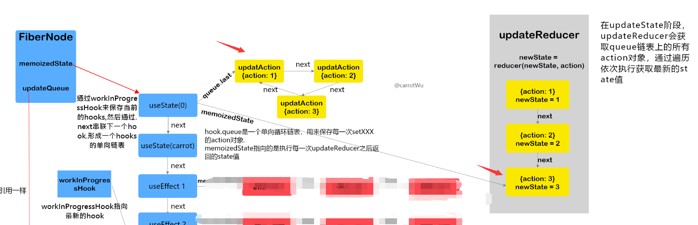
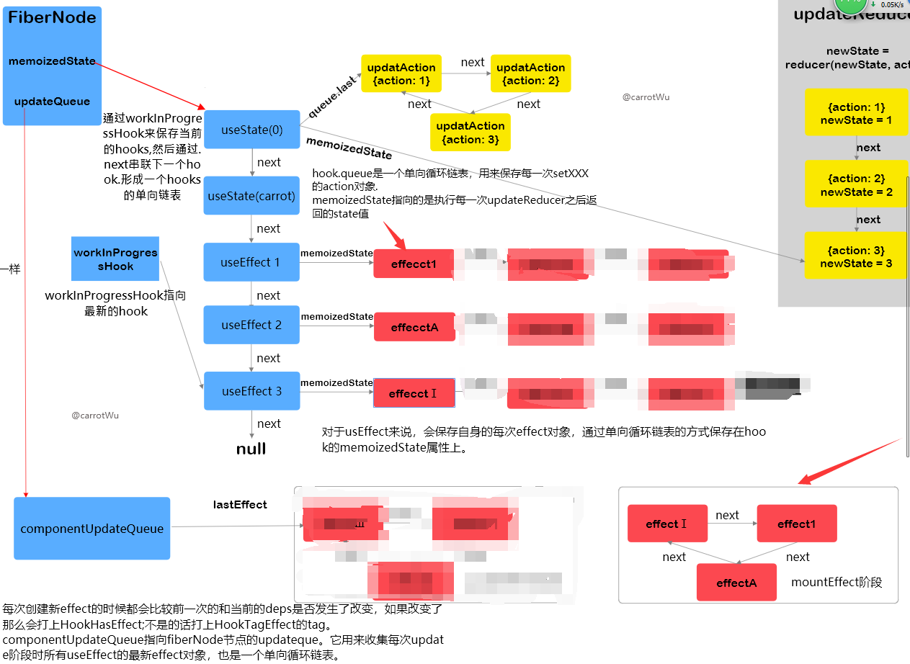
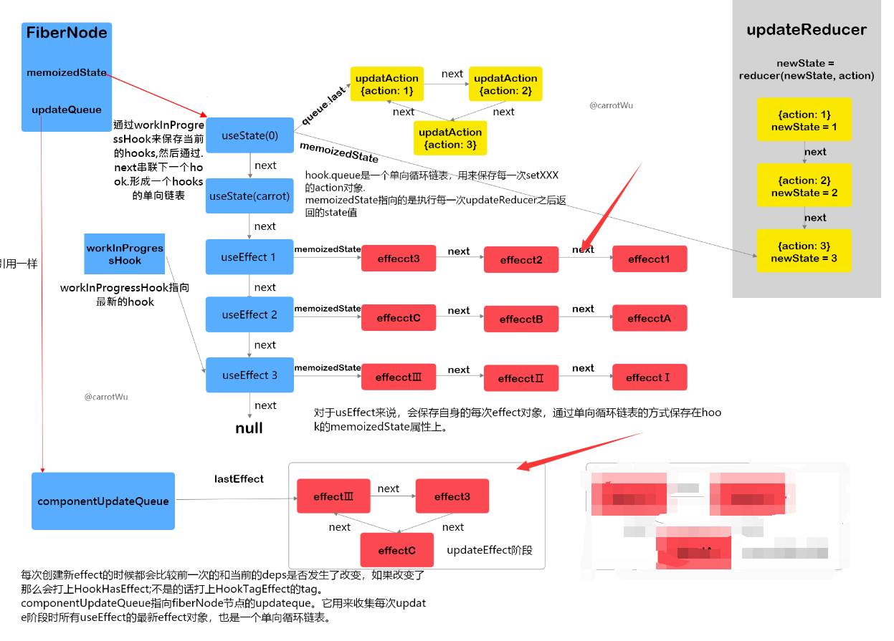
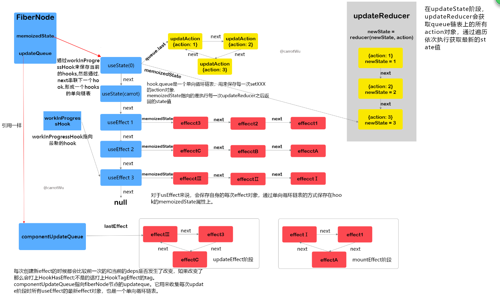

## react hooks源码剖析

1. React是内部是怎么调用hooks的
2. React是如何在每次重新渲染之后都能返回最新的状态
3. 状态究竟存放在哪？为什么只能在函数顶层使用Hooks而不能在条件语句等里面使用Hooks

## hooks的两种调用阶段mount和update

> hooks的源码是放在https://github.com/facebook/react/blob/master/packages/react-reconciler/src/ReactFiberHooks.js这里

从源码可以看出，react把所有的hooks分成了两个阶段的hooks

1. mount阶段对应第一次渲染初始化时候调用的hooks方法,分别对应了`mountState`,`mountEffect`,`mountReducer`, `mountLayoutEffect`以及其他hooks。
2. update阶段对应setXXX函数触发更新重新渲染的更新阶段,分别对应了`updateEffect`,`updateReducer`,`updateState`, `updateLayoutEffect`以及其他hooks

```ts
// react-reconciler/src/ReactFiberHooks.js
// Mount 阶段Hooks的定义
const HooksDispatcherOnMount: Dispatcher = {
  useEffect: mountEffect,
  useReducer: mountReducer,
  useState: mountState,
  useLayoutEffect: mountLayoutEffect,
 // 其他Hooks
};

// Update阶段Hooks的定义
const HooksDispatcherOnUpdate: Dispatcher = {
  useEffect: updateEffect,
  useReducer: updateReducer,
  useState: updateState,
  useLayoutEffect: updateLayoutEffect,
  // 其他Hooks
};
```

hooks在mount阶段和update阶段所调用的逻辑是不一样的，接下来我们将首先截杀mount阶段时的hooks逻辑

## 第一次mount阶段

### 创建hook链表保存在fiberNode.memoizedState

1. 在第一次mount阶段时，会调用`mountWorkInProgressHook`方法生成一个新的hooks对象（具体的hook属性可以看下面的注释），如果当前没有hooks的话会把当前hooks作为第一个hooks，有的话之后把当前hooks通过链表串联在上一个hooks的后面。同时，全局有一个`workInProgressHook`的变量指向当前hook链表中最新的hook对象，并且把当前hooks返回出来。
2. `currentlyRenderingFiber.memoizedState = workInProgressHook = hook;`从这里可以看出hook链表是保存在fiberNode的`memoizedState`属性上的,并且第一个值作为链的表头。
3. 最后通过.next来进行链表的串联。其中`workInProgressHook`指向的是当前创建的hook对象，最后会返回出去。

```ts
// [react-reconciler/src/ReactFiberHooks.js](https://github.com/facebook/react/blob/730389b9d3865cb6d5c85e94b9b66f96e391718e/packages/react-reconciler/src/ReactFiberHooks.js#L562)
function mountWorkInProgressHook(): Hook {
  const hook: Hook = {
    // hooks的当前值 对于useState来说就是最新的值
    // 对于useEffect等副作用函数就是一个链表，保存的是一个个effect对象
    memoizedState: null,
    baseState: null,
    baseQueue: null,
    // 用于useState进行更新数据的queue单向新欢链表，里面保存的是每一次setXXX的updateAction对象
    queue: null,
    // 指向下一个hooks
    next: null,
  };

  if (workInProgressHook === null) {
    // This is the first hook in the list
    // 从这里可以清晰看到 hook链表是保存在fiberNode的memoizedState属性上的
    // 第一个hook当做表头
    currentlyRenderingFiber.memoizedState = workInProgressHook = hook;
  } else {
    // Append to the end of the list
    // 因为memoizedState保留的是workInProgressHook的引用 所以这里.next其实是设置memoizedState的链表
    // 最后返回的workInProgressHook为当前创建的hook对象
    workInProgressHook = workInProgressHook.next = hook;
  }
  return workInProgressHook;
}
```



### hook内创建一个queue链表

1. 同时呢会在当前hooks里通过initialState保存当前值在

   ```
   memoizedState
   ```

   。并且会创建一个

   ```
   queue
   ```

   链表，这是一个单向循环链表（环）。因为mount阶段时是第一次渲染，没有action对象所以返回出去的是初始值，以及一个

   ```
   dispatchAction
   ```

   方法这个后面说。这个queue链表跟上面的hooks链表有点像，不过有两个不同点。

   1. queue的链表有个last属性永远指向最新的updateAction对象，这个属性是为了方便拿到最新`updateAction`对象（因为多次setXXX都会需要一直拿到最新的updateAction对象，跟上面的hooks不太一样）。
   2. queue是一个单向循环链表(环)，什么意思呢？就是queue的最后一个`updateAction`对象.next指向的是第一个updateAction对象，形成一个环。所以呢他们可以通过`queue.last`获取最新的updateAction对象,`queue.last.next`获取第一个updateAction对象。

```ts
//首次render时执行mountState
function mountState(initialState) {
  // 从当前Fiber生成一个新的hook对象，将此hook挂载到Fiber的hook链尾，并返回这个hook
  var hook = mountWorkInProgressHook();

  hook.memoizedState = hook.baseState = initialState;

  var queue = hook.queue = {
    last: null,
    dispatch: null,
    lastRenderedReducer: (state, action) => isFn(state) ? action(state) : action,
    lastRenderedState: initialState
  };
  // currentlyRenderingFiber$1保存当前正在渲染的Fiber节点
  // 将返回的dispatch和调用hook的节点建立起了连接，同时在dispatch里边可以访问queue对象
  var dispatch = queue.dispatch = dispatchAction.bind(null, currentlyRenderingFiber$1, queue);
  return [hook.memoizedState, dispatch];
}
```



简单说就是mount的时候通过`workInProgressHook`来保存当前的hooks，然后通过.next来保存hooks，形成一个hooks的单向链表。同时呢，在每一个hooks的内部会维护一个queue的单向循环链表。并且hooks的单向链表保存在相对应的fiberNode的`memoizedState`，这样子在update阶段的时候我们就可以直接通过fiberNode的`memoizedState`属性获取hook链表了

## updateState阶段

> updateState阶段指的是setXXX之后触发重新渲染的阶段

### setXXX函数做的事情

1. 执行setXXX函数的时候，其实就是执行上文的`dispatchAction`函数

```ts
  // currentlyRenderingFiber$1保存当前正在渲染的Fiber节点
  // 将返回的dispatch和调用hook的节点建立起了连接，同时在dispatch里边可以访问queue对象
  var dispatch = queue.dispatch = dispatchAction.bind(null, currentlyRenderingFiber$1, queue);
  return [hook.memoizedState, dispatch];
```

1. `dispatchAction`其实就是生成一个新的updateAction对象，其中action就是传入的值。如果`queue.last`没有值说明queue链表为空，把当前updateAction对象当做表头。并且下一个.next指向自己，同时queue.last指向当前最新的updateAction对象。最后会调用react的`scheduleWork`更新调度。

```ts
//// 功能相当于setState！
function dispatchAction(fiber, queue, action) {
  ...
  var update = {
    action, // 接受普通值，也可以是函数
    next: null,
  };
  var last = queue.last;

  //如果last为空 说明该hook是第一次setXXX 直接把当前updateAction对象当成表头
  if (last === null) {
    update.next = update;
  } else {
    // 不是的话拼接在最新action的末尾
    last.next = update;
  }

  // 略去计算update的state过程
  queue.last = update;
  ...
  // 触发React的更新调度，scheduleWork是schedule阶段的起点
  scheduleWork(fiber, expirationTime);
}
```


### update阶段（state改变、父组件re-render等都会引起组件状态更新）useState()更新状态：

1. 在updateState的过程中会判断传入的action，如果是函数那么执行返回（setState也可以是一个函数）。

```ts
function updateState(initialState) {
  return updateReducer(basicStateReducer, initialState);
}

function basicStateReducer(state, action){
  return typeof action === 'function' ? action(state) : action;
}
```

1. update的时候如何获取当前的hooks链表呢，因为我们知道hooks链表是保存在fiberNode上的`memoizedState`属性上。如果是`currentHook`为null说明是第一次拿hook链表那么直接返回fiberNode的`memoizedState`即可，第二个hooks通过.next获取就可以了。最终会把解构一个新的newHook拼接在`workInProgressHook`链表上即可。这样子就能拿到更新时的hooks了。

```ts
// react-reconciler/src/ReactFiberHooks.js
function updateWorkInProgressHook() {
  let nextCurrentHook: null | Hook;
  // 当前hook链表为空 那么久直接拿fiberNode上的memoizedState属性
  if (currentHook === null) {
     // 获取fiberNode节点
    let current = currentlyRenderingFiber.alternate;
    if (current !== null) {
      nextCurrentHook = current.memoizedState;
    } else {
      nextCurrentHook = null;
    }
  } else {
    // 不为空 那么下一个hook就是 currentHook.next的下一个hook
    nextCurrentHook = currentHook.next;
  }


  currentHook = nextCurrentHook;

   // 创建一个新的hooks链表 结构
  const newHook: Hook = {
    memoizedState: currentHook.memoizedState,

    baseState: currentHook.baseState,
    baseQueue: currentHook.baseQueue,
    queue: currentHook.queue,

    next: null,
  };
  if (workInProgressHook === null) {
    // This is the first hook in the list.
      // 老的hooks对象直接抛弃 解构一个新的hooks对象返回给当前的memoizedState上 不复用之前的hooks对象了
    currentlyRenderingFiber.memoizedState = workInProgressHook = newHook;
  } else {
    // Append to the end of the list.
    workInProgressHook = workInProgressHook.next = newHook;
  }
  return workInProgressHook;
}
```

1. 接下来呢通过`updateWorkInProgressHook`获取当前的hooks，然后获取queue链表，其中`queue.last`为最新的action, `queue.last.next`为第一个action。这样子我们就可以获取setXXX函数传的所有updateAction对象了
2. 从第一个action开始，循环到最新的action位置。调用reducer函数获取最新的state值，最后进行返回即可。

```ts
function updateReducer(reducer,initialArg,init) {
  const hook = updateWorkInProgressHook();
  const queue = hook.queue;

  // 拿到更新列表的表头
  const last = queue.last;

  // 获取最早的那个update对象
  first = last !== null ? last.next : null;

  if (first !== null) {
    let newState;
    let update = first;
    do {
      // 执行每一次更新，去更新状态
      const action = update.action;
      newState = reducer(newState, action);
      update = update.next;
    } while (update !== null && update !== first);

    hook.memoizedState = newState;
  }
  const dispatch = queue.dispatch;
  // 返回最新的状态和修改状态的方法
  return [hook.memoizedState, dispatch];
}
```



## useEffect

> useEffect其实前面跟useState类似，都是创建hooks，拼接hooks链表，不同的是effect的回调而已 useEffect其实跟useState一样，分成了`mountEffect`和`updateEffect`

```ts
function mountEffect(
  create: () => (() => void) | void,
  deps: Array<mixed> | void | null,
): void {
  return mountEffectImpl(
    UpdateEffect | PassiveEffect,
    HookPassive,
    create,
    deps,
  );
}

function updateEffect(
  create: () => (() => void) | void,
  deps: Array<mixed> | void | null,
): void {
  return updateEffectImpl(
    UpdateEffect | PassiveEffect,
    HookPassive,
    create,
    deps,
  );
}
```

### mountEffect

1. 跟useState一样，通过`mountWorkInProgressHook`创建一个新的hooks，拼接在fiberNode的`memoizedState`链表上
2. 通过`pushEffect`方法生成一个effect的单向链表保存在`hooks.memoizedState`属性上，这个是每一次的effect链表。`hooks.memoizedStated`的保存的是每一个useEffect自身的effect对象。
3. 但是有时候**一个组件中会有多个useEffect**，所以需要一个`componentUpdateQueue`单向循环链表来收集所有的useEffect的effect的对象。
4. `componentUpdateQueue`的引用指向的是fiberNode的`updateQueue`属性，后续对`componentUpdateQueue`的修改其实就是修改fiberNode的`updateQueue`属性
5. `componentUpdateQueue`收集的是当前fiberNode所有的effect节点。
6. 因为mount阶段的useEffect都会执行，所以mount阶段的effect都会被打上`HookHasEffect`的tag标记。
7. `HookHasEffect`指的是后续需要执行的effect，其中`hookEffectTag`标记的是不需要执行的effect（update阶段会解释）

```ts
function mountEffectImpl(fiberEffectTag, hookEffectTag, create, deps): void {
  //创建新的hooks进行拼接
  const hook = mountWorkInProgressHook();
  const nextDeps = deps === undefined ? null : deps;
  currentlyRenderingFiber.effectTag |= fiberEffectTag;
  // 创建一个effect链表 跟useState的queue链表差不多。是一个单向链表，hook.memoizedState保存的都是自身useEffect的effect对象
  //不过属性不一样具体effect可以看pushEffect
  hook.memoizedState = pushEffect(
    HookHasEffect | hookEffectTag,
    create,
    // mount阶段没有需要先执行的destory函数
    undefined,
    nextDeps,
  );
}
function pushEffect(tag, create, destroy, deps) {
  // effect会保存在
  const effect: Effect = {
    tag,
    // 渲染后执行的回调 对应useEffect的回调函数
    create,
    // 下一次渲染前执行的回调 对应useEffect的return的函数
    destroy,
    // 依赖
    deps,
    // Circular
    next: (null: any),
  };

  // 获取当前fiberNode的updateQueue链表  currentlyRenderingFiber.updateQueue
  let componentUpdateQueue: null | FunctionComponentUpdateQueue = (currentlyRenderingFiber.updateQueue: any);

  // 有时候**一个组件中会有多个useEffect**，所以componentUpdateQueue收集的是当前fiberNode所有的effect节点

  // componentUpdateQueue为空 说明是第一个useEffect
  if (componentUpdateQueue === null) {
    // 收集第一个useEffect的第一个effect对象
    componentUpdateQueue = createFunctionComponentUpdateQueue();
    // 这里把componentUpdateQueue的引用指向updateQueue 下次就可以通过fiberNode的updateQueue属性拿到了
    currentlyRenderingFiber.updateQueue = (componentUpdateQueue: any);
    // lastEffect指向最新的effect 单向循环链表
    componentUpdateQueue.lastEffect = effect.next = effect;
  } else {
    // 不是第一个useEffect了
    const lastEffect = componentUpdateQueue.lastEffect;
    if (lastEffect === null) {
      componentUpdateQueue.lastEffect = effect.next = effect;
    } else {
     // 末尾设置最新的effect对象
      const firstEffect = lastEffect.next;
      // lastEffec为上一次最新的effect， 把当前最新的effect拼接到末尾
      lastEffect.next = effect;
      // 末尾最新的effect又指向到第一个effect形成环
      effect.next = firstEffect;
      componentUpdateQueue.lastEffect = effect;
    }
  }
  return effect;
}

// 创建新的ComponentUpdateQueue单向循环链表
function createFunctionComponentUpdateQueue(): FunctionComponentUpdateQueue {
  return {
    lastEffect: null,
  };
}
```



### updateEffect

> updateEffect最重要的就是会给那些deps没有发生改变的effect搭上hookEffectTag标记，后续的循环执行回调时会跳过执行。

1. 通过`areHookInputsEqual`函数判断deps是否有改变，没改变的话打上`hookEffectTag`的tag，后续的循环不会执行回调
2. 如果deps改变那么就会打上`HookHasEffect`的tag ，并且更新当前hooks的`memoizedState`属性为effect新的链表

```ts
function updateEffectImpl(fiberEffectTag, hookEffectTag, create, deps): void {
  // 跟useState一样获取当前的hook对象
  const hook = updateWorkInProgressHook();
  const nextDeps = deps === undefined ? null : deps;
  let destroy = undefined;

  if (currentHook !== null) {
    const prevEffect = currentHook.memoizedState;
         // 获取上一次effect的destroy回调
    destroy = prevEffect.destroy;
    if (nextDeps !== null) {
     // 获取上一次effect的deps
      const prevDeps = prevEffect.deps;
      // 如果deps相同 打上hookEffectTag标记 后续循环的时候不会执行
      if (areHookInputsEqual(nextDeps, prevDeps)) {
        pushEffect(hookEffectTag, create, destroy, nextDeps);
        return;
      }
    }
  }

  currentlyRenderingFiber.effectTag |= fiberEffectTag;

// 如果deps不想同 打上HookHasEffect标记 下次会执行
// 同时 会更新当前hooks的memoizedState树形
  hook.memoizedState = pushEffect(
    HookHasEffect | hookEffectTag,
    create,
    destroy,
    nextDeps,
  );
}

// 浅比较dep的函数
function areHookInputsEqual(
  nextDeps: Array<mixed>,
  prevDeps: Array<mixed> | null,
) {
  if (prevDeps === null) {
    return false;
  }

  // 浅比较
  for (let i = 0; i < prevDeps.length && i < nextDeps.length; i++) {
    if (is(nextDeps[i], prevDeps[i])) {
      continue;
    }
    return false;
  }
  return true;
}
```



给fiberNode.updateQueue添加完相对应的effect之后，最后我们就需要循环执行相应的effect副作用函数。

1. 在`commitHookEffectListUnmount`和`commitHookEffectListMount`中遍历执行相应的`destory`或者`create`副作用方法。
2. 获取fiberNode节点上的`updateQueue`，其实就是获取之前保存的`componentUpdateQueue`(同一个引用)，
3. 可以发现只有当**if ((effect.tag & tag) === tag)**的时候才会执行相应的回调函数，发现tag是传进来的参数具体是什么值呢。
4. 从上面可以知道的是：1 初次渲染传的tag是`HookHasEffect`，deps发生改变传的也是`HookHasEffect`。deps没发生改变传的是`HooktagEffect`

```ts
// 组件卸载时执行的副作用函数
function commitHookEffectListUnmount(tag: number, finishedWork: Fiber) {
  const updateQueue: FunctionComponentUpdateQueue | null = (finishedWork.updateQueue: any);
  // 取fiberNode节点上的updateQueue
  let lastEffect = updateQueue !== null ? updateQueue.lastEffect : null;
  if (lastEffect !== null) {
    // 记得上面说的循环链表吗
    const firstEffect = lastEffect.next;
    let effect = firstEffect;
    // 从第一个effect开始执行直到最后一个effect
    do {
      // effect.tag就是我们赋值的tag 从上面可以知道的是
      if ((effect.tag & tag) === tag) {
        // Unmount
        // 获取destory方法并且执行
        const destroy = effect.destroy;
        effect.destroy = undefined;
        if (destroy !== undefined) {
          destroy();
        }
      }
      effect = effect.next;
    } while (effect !== firstEffect);
  }
}

//组件渲染是执行的副作用函数 其实就是执行create
function commitHookEffectListMount(tag: number, finishedWork: Fiber) {
  const updateQueue: FunctionComponentUpdateQueue | null = (finishedWork.updateQueue: any);
  let lastEffect = updateQueue !== null ? updateQueue.lastEffect : null;
  if (lastEffect !== null) {
    const firstEffect = lastEffect.next;
    let effect = firstEffect;
    do {
      if ((effect.tag & tag) === tag) {
        // Mount
        const create = effect.create;
        // create方法执行后return的函数就是卸载的方法
        effect.destroy = create();
      }
      effect = effect.next;
    } while (effect !== firstEffect);
  }
}
```

### commitWork中调用的commitHookEffectListUnmount方法

> 这段代码的出处https://github.com/facebook/react/blob/master/packages/react-reconciler/src/ReactFiberCommitWork.js#L1564

1. 最终我们在commitWork中发现了传入的tag值 `commitHookEffectListUnmount(HookLayout | HookHasEffect, finishedWork)`
2. 以及` commitHookEffectListUnmount(HookLayout | HookHasEffect, finishedWork)`这两个调用函数接收`HookHasEffect`以及`HookLayout`，对应我们上面deps发生改变时候的tag
3. `HookLayout`值的是useLayoutEffect，`HookHasEffect`指的是useEffect的tag，这就解释了我们上面deps没改变传入的HookTagEffect并不会进行执行。

```ts
function commitWork(current: Fiber | null, finishedWork: Fiber): void {
  if (!supportsMutation) {
    switch (finishedWork.tag) {
      case FunctionComponent:
      case ForwardRef:
      case MemoComponent:
      case SimpleMemoComponent:
      case Block: {
        if (
          enableProfilerTimer &&
          enableProfilerCommitHooks &&
          finishedWork.mode & ProfileMode
        ) {
          try {
            startLayoutEffectTimer();
            commitHookEffectListUnmount(
              HookLayout | HookHasEffect,
              finishedWork,
            );
          } finally {
            recordLayoutEffectDuration(finishedWork);
          }
        } else {
          commitHookEffectListUnmount(HookLayout | HookHasEffect, finishedWork);
        }
        return;
      }
    }

    commitContainer(finishedWork);
    return;
  }

  switch (finishedWork.tag) {
    case FunctionComponent:
    case ForwardRef:
    case MemoComponent:
    case SimpleMemoComponent:
    case Block: {
      if (
        enableProfilerTimer &&
        enableProfilerCommitHooks &&
        finishedWork.mode & ProfileMode
      ) {
        try {
          startLayoutEffectTimer();
          commitHookEffectListUnmount(HookLayout | HookHasEffect, finishedWork);
        } finally {
          recordLayoutEffectDuration(finishedWork);
        }
      } else {
        commitHookEffectListUnmount(HookLayout | HookHasEffect, finishedWork);
      }
      return;
    }

}
```

## useLayoutEffect

useLayoutEffect其实跟useEffect流程一样，不同的地方在于打上的tag标记。useLayoutEffect的是HookLayout，useEffect的tag标记是HookHasEffect。

## 完整流程图

