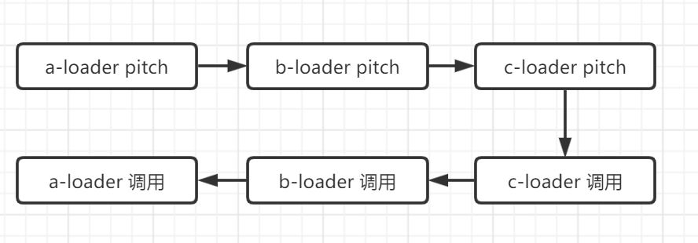
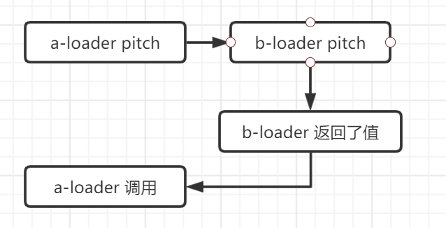

# Webpack - 手把手教你写一个 loader / plugin


## 一、Loader

### 1.1 loader 干啥的？

> webpack 只能理解 JavaScript 和 JSON 文件，这是 webpack 开箱可用的自带能力。**loader **让 webpack 能够去处理其他类型的文件，并将它们转换为有效[模块](https://webpack.docschina.org/concepts/modules)，以供应用程序使用，以及被添加到依赖图中。

也就是说，webpack 把任何文件都看做模块，loader 能 import 任何类型的模块，但是 webpack 原生不支持譬如 css 文件等的解析，这时候就需要用到我们的 loader 机制了。 我们的 loader 主要通过两个属性来让我们的 webpack 进行联动识别：

1. **test** 属性，识别出哪些文件会被转换。
2. **use** 属性，定义出在进行转换时，应该使用哪个 loader。

那么问题来了，大家一定想知道自己要定制一个 loader 的话需要怎么做呢？

### 1.2 开发准则

俗话说的好，**没有规矩不成方圆**，编写我们的 loader 时，官方也给了我们一套**用法准则**（Guidelines），在编写的时候应该按照这套准则来使我们的 loader 标准化：

- **简单易用**。
- 使用**链式**传递。（由于 loader 是可以被链式调用的，所以请保证每一个 loader 的单一职责）
- **模块化**的输出。
- 确保**无状态**。（不要让 loader 的转化中保留之前的状态，每次运行都应该独立于其他编译模块以及相同模块之前的编译结果）
- 充分使用官方提供的 [**loader utilities**](https://github.com/webpack/loader-utils)。
- 记录 loader 的依赖。
- 解析模块依赖关系。

> 根据模块类型，可能会有不同的模式指定依赖关系。例如在 CSS 中，使用@import 和 url(...)语句来声明依赖。这些依赖关系应该由模块系统解析。

可以通过以下两种方式中的一种来实现：

> - 通过把它们转化成 require 语句。
> - 使用 this.resolve 函数解析路径。

- 提取通用代码。
- 避免绝对路径。
- 使用 peer dependencies。如果你的 loader 简单包裹另外一个包，你应该把这个包作为一个 peerDependency 引入。

### 1.3 上手

一个 loader 就是一个 nodejs 模块，他导出的是一个函数，这个函数只有一个入参，这个参数就是一个包含资源文件内容的**字符串**，而函数的返回值就是处理后的内容。也就是说，一个最简单的 loader 长这样：

```javascript
module.exports = function (content) {
	// content 就是传入的源内容字符串
  return content
}
复制代码
```

当一个 loader 被使用的时候，他只可以接收一个入参，这个参数是一个包含包含资源文件内容的字符串。 是的，到这里为止，一个最简单 loader 就已经完成了！接下来我们来看看怎么给他加上丰富的功能。

### 1.4 四种 loader

我们基本可以把常见的 loader 分为四种：

1. 同步 loader
2. 异步 loader
3. "Raw" Loader
4. Pitching loader

#### ① 同步 loader 与 异步 loader

一般的 loader 转换都是同步的，我们可以采用上面说的直接 return 结果的方式，返回我们的处理结果：

```javascript
module.exports = function (content) {
	// 对 content 进行一些处理
  const res = dosth(content)
  return res
}
复制代码
```

也可以直接使用 `this.callback()` 这个 api，然后在最后直接 **return undefined **的方式告诉 webpack 去 `this.callback()` 寻找他要的结果，这个 api 接受这些参数：

```
this.callback(
  err: Error | null, // 一个无法正常编译时的 Error 或者 直接给个 null
  content: string | Buffer,// 我们处理后返回的内容 可以是 string 或者 Buffer（）
  sourceMap?: SourceMap, // 可选 可以是一个被正常解析的 source map
  meta?: any // 可选 可以是任何东西，比如一个公用的 AST 语法树
);
复制代码
```

接下来举个例子：  这里注意`[this.getOptions()](https://webpack.docschina.org/api/loaders/#thisgetoptionsschema)` 可以用来获取配置的参数

> 从 webpack 5 开始，this.getOptions 可以获取到 loader 上下文对象。它用来替代来自[loader-utils](https://github.com/webpack/loader-utils#getoptions)中的 getOptions 方法。

```javascript
module.exports = function (content) {
  // 获取到用户传给当前 loader 的参数
  const options = this.getOptions()
  const res = someSyncOperation(content, options)
  this.callback(null, res, sourceMaps);
  // 注意这里由于使用了 this.callback 直接 return 就行
  return
}
复制代码
```

这样一个同步的 loader 就完成了！

再来说说**异步**： 同步与异步的区别很好理解，一般我们的转换流程都是同步的，但是当我们遇到譬如需要网络请求等场景，那么为了避免阻塞构建步骤，我们会采取异步构建的方式，对于异步 loader 我们主要需要使用 `this.async()` 来告知 webpack 这次构建操作是异步的，不多废话，看代码就懂了：

```javascript
module.exports = function (content) {
  var callback = this.async()
  someAsyncOperation(content, function (err, result) {
    if (err) return callback(err)
    callback(null, result, sourceMaps, meta)
  })
}
复制代码
```

#### ② "Raw" loader

默认情况下，资源文件会被转化为 UTF-8 字符串，然后传给 loader。通过设置 raw 为 true，loader 可以接收原始的 Buffer。每一个 loader 都可以用 String 或者 Buffer 的形式传递它的处理结果。complier 将会把它们在 loader 之间相互转换。大家熟悉的 file-loader 就是用了这个。 **简而言之**：你加上 `module.exports.raw = true;` 传给你的就是 Buffer 了，处理返回的类型也并非一定要是 Buffer，webpack 并没有限制。

```javascript
module.exports = function (content) {
  console.log(content instanceof Buffer); // true
  return doSomeOperation(content)
}
// 划重点↓
module.exports.raw = true;
复制代码
```

#### ③ Pitching loader

我们每一个 loader 都可以有一个 `pitch` 方法，大家都知道，loader 是按照从右往左的顺序被调用的，但是实际上，在此之前会有一个按照**从左往右执行每一个 loader 的 pitch 方法**的过程。 pitch 方法共有三个参数：

1. **remainingRequest**：loader 链中排在自己后面的 loader 以及资源文件的**绝对路径**以`!`作为连接符组成的字符串。
2. **precedingRequest**：loader 链中排在自己前面的 loader 的**绝对路径**以`!`作为连接符组成的字符串。
3. **data**：每个 loader 中存放在上下文中的固定字段，可用于 pitch 给 loader 传递数据。

在 pitch 中传给 data 的数据，在后续的调用执行阶段，是可以在 `this.data` 中获取到的：

```javascript
module.exports = function (content) {
  return someSyncOperation(content, this.data.value);// 这里的 this.data.value === 42
};

module.exports.pitch = function (remainingRequest, precedingRequest, data) {
  data.value = 42;
};
复制代码
```

**注意！** 如果某一个 loader 的 pitch 方法中返回了值，那么他会直接“**往回走**”，跳过后续的步骤，来举个例子：  假设我们现在是这样：`use: ['a-loader', 'b-loader', 'c-loader'],` 那么正常的调用顺序是这样：  现在 b-loader 的 pitch 改为了有返回值：

```javascript
// b-loader.js
module.exports = function (content) {
  return someSyncOperation(content);
};

module.exports.pitch = function (remainingRequest, precedingRequest, data) {
  return "诶，我直接返回，就是玩儿~"
};
复制代码
```

那么现在的调用就会变成这样，直接“回头”，跳过了原来的其他三个步骤： 

### 1.5 其他 API

- this.addDependency：加入一个文件进行监听，一旦文件产生变化就会重新调用这个 loader 进行处理
- this.cacheable：默认情况下 loader 的处理结果会有缓存效果，给这个方法传入 false 可以关闭这个效果
- this.clearDependencies：清除 loader 的所有依赖
- this.context：文件所在的目录（不包含文件名）
- this.data：pitch 阶段和正常调用阶段共享的对象
- this.getOptions(schema)：用来获取配置的 loader 参数选项
- this.resolve：像 require 表达式一样解析一个 request。`resolve(context: string, request: string, callback: function(err, result: string))`
- this.loaders：所有 loader 组成的数组。它在 pitch 阶段的时候是可以写入的。
- this.resource：获取当前请求路径，包含参数：`'/abc/resource.js?rrr'`
- this.resourcePath：不包含参数的路径：`'/abc/resource.js'`
- this.sourceMap：bool 类型，是否应该生成一个 sourceMap

官方还提供了很多实用 Api ，这边值列举一些可能常用的，更多可以戳链接👇 [更多详见官方链接](https://webpack.js.org/api/loaders/#the-loader-context)

### 1.6 来个简单实践

#### 功能实现

接下来我们简单实践制作两个 loader ，功能分别是在编译出的代码中加上 `/** 公司@年份 */` 格式的注释和简单做一下去除代码中的 `console.log` ，并且我们链式调用他们：

**company-loader.js**

```javascript
module.exports = function (source) {
  const options = this.getOptions() // 获取 webpack 配置中传来的 option
  this.callback(null, addSign(source, options.sign))
  return
}

function addSign(content, sign) {
  return `/** ${sign} */\n${content}`
}
复制代码
```

**console-loader.js**

```javascript
module.exports = function (content) {
  return handleConsole(content)
}

function handleConsole(content) {
  return content.replace(/console.log\(['|"](.*?)['|"]\)/, '')
}
复制代码
```

#### 调用测试方式

功能就简单的进行了一下实现，这里我们主要说一下**如何测试调用我们的本地的 loader**，方式有两种，一种是通过 **Npm link** 的方式进行测试，这个方式的具体使用就不细说了，大家可以简单查阅一下。 另外一种就是直接在项目中通过**路径配置**的方式，有两种情况：

1. 匹配(test)单个 loader，你可以简单通过在 rule 对象设置 path.resolve 指向这个本地文件

**webpack.config.js**

```javascript
{
  test: /\.js$/
  use: [
    {
      loader: path.resolve('path/to/loader.js'),
      options: {/* ... */}
    }
  ]
}
复制代码
```

1. 匹配(test)多个 loaders，你可以使用 resolveLoader.modules 配置，webpack 将会从这些目录中搜索这些 loaders。例如，如果你的项目中有一个 /loaders 本地目录：

**webpack.config.js**

```javascript
resolveLoader: {
  // 这里就是说先去找 node_modules 目录中，如果没有的话再去 loaders 目录查找
  modules: [
    'node_modules',
    path.resolve(__dirname, 'loaders')
  ]
}
复制代码
```

#### 配置使用

我们这里的 **webpack 配置**如下所示：

```javascript
module: {
    rules: [
      {
        test: /\.js$/,
        use: [
          'console-loader',
          {
            loader: 'company-loader',
            options: {
              sign: 'we-doctor@2021',
            },
          },
        ],
      },
    ],
  },
复制代码
```

**项目中的 index.js**：

```javascript
function fn() {
  console.log("this is a message")
  return "1234"
}
复制代码
```

**执行编译后的 bundle.js**： 可以看到，两个 loader 的功能都体现到了编译后的文件内。

```javascript
/******/ (() => { // webpackBootstrap
var __webpack_exports__ = {};
/*!**********************!*\
  !*** ./src/index.js ***!
  \**********************/
/** we-doctor@2021 */
function fn() {
  
  return "1234"
}
/******/ })()
;
复制代码
```

## 二、Plugin

### 为什么要有 plugin

plugin 提供了很多比 loader 中更完备的功能，他使用阶段式的构建回调，webpack 给我们提供了非常多的 hooks 用来在构建的阶段让开发者自由的去引入自己的行为。

### 基本结构

一个最基本的 plugin 需要包含这些部分：

- 一个 JavaScript 类
- 一个 `apply` 方法，`apply` 方法在 webpack 装载这个插件的时候被调用，并且会传入 `compiler` 对象。
- 使用不同的 hooks 来指定自己需要发生的处理行为
- 在异步调用时最后需要调用 webpack 提供给我们的 `callback` 或者通过 `Promise` 的方式（后续**异步编译部分**会详细说）

```javascript
class HelloPlugin{
  apply(compiler){
    compiler.hooks.<hookName>.tap(PluginName,(params)=>{
      /** do some thing */
    })
  }
}
module.exports = HelloPlugin
复制代码
```

### Compiler and Compilation

Compiler 和 Compilation 是整个编写插件的过程中的**重！中！之！重！**因为我们几乎所有的操作都会围绕他们。

`compiler` 对象可以理解为一个和 webpack 环境整体绑定的一个对象，它包含了所有的环境配置，包括 options，loader 和 plugin，当 webpack **启动**时，这个对象会被实例化，并且他是**全局唯一**的，上面我们说到的 `apply` 方法传入的参数就是它。

`compilation` 在每次构建资源的过程中都会被创建出来，一个 compilation 对象表现了当前的模块资源、编译生成资源、变化的文件、以及被跟踪依赖的状态信息。它同样也提供了很多的 hook 。

Compiler 和 Compilation 提供了非常多的钩子供我们使用，这些方法的组合可以让我们在构建过程的不同时间获取不同的内容，具体详情可参见[官网直达](https://webpack.js.org/api/compiler-hooks/)。

上面的链接中我们会发现钩子会有不同的类型，比如 `SyncHook`、`SyncBailHook`、`AsyncParallelHook`、`AsyncSeriesHook` ，这些不同的钩子类型都是由 `tapable` 提供给我们的，关于 `tapable` 的详细用法与解析可以参考我们[前端构建工具系列专栏](https://juejin.cn/user/4089838988440024/columns)中的 [`tapable`](https://juejin.cn/post/6974573181356998669) 专题讲解。

基本的使用方式是：

```javascript
compiler/compilation.hooks.<hookName>.tap/tapAsync/tapPromise(pluginName,(xxx)=>{/**dosth*/})
复制代码
```

> **Tip**： 以前的写法是 `compiler.plugin` ，但是在最新的 webpack@5 可能会引起问题，参见 [webpack-4-migration-notes](https://medium.com/@sheng_di/webpack-4-migration-notes-65f2f4b79b8f)

### 同步与异步

plugin 的 hooks 是有同步和异步区分的，在同步的情况下，我们使用 `<hookName>.tap` 的方式进行调用，而在异步 hook 内我们可以进行一些异步操作，并且有异步操作的情况下，请使用 `tapAsync` 或者 `tapPromise` 方法来告知 webpack 这里的内容是异步的，当然，如果内部没有异步操作的话，你也可以正常使用 `tap` 。

#### tapAsync

使用 `tapAsync` 的时候，我们需要多传入一个 `callback` 回调，并且在结束的时候一定要调用这个回调告知 webpack 这段异步操作结束了。👇 比如：

```javascript
class HelloPlugin {
  apply(compiler) {
    compiler.hooks.emit.tapAsync(HelloPlugin, (compilation, callback) => {
      setTimeout(() => {
        console.log('async')
        callback()
      }, 1000)
    })
  }
}
module.exports = HelloPlugin
复制代码
```

#### tapPromise

当使用 `tapPromise` 来处理异步的时候，我们需要返回一个 `Promise` 对象并且让它在结束的时候 `resolve` 👇

```javascript
class HelloPlugin {
  apply(compiler) {
    compiler.hooks.emit.tapPromise(HelloPlugin, (compilation) => {
      return new Promise((resolve) => {
        setTimeout(() => {
          console.log('async')
          resolve()
        }, 1000)
      })
    })
  }
}
module.exports = HelloPlugin
复制代码
```

### 做个实践

接下来我们通过实际来做一个插件梳理一遍整体的流程和零散的功能点，这个插件实现的功能是在打包后输出的文件夹内多增加一个 markdown 文件，文件内记录打包的时间点、文件以及文件大小的输出。

首先我们根据需求确定我们需要的 hook ，由于需要输出文件，我们需要使用 compilation 的 [emitAsset ](https://webpack.js.org/api/compilation-object/#emitasset)方法。 其次由于需要对 assets 进行处理，所以我们使用 `compilation.hooks.processAssets` ，因为 processAssets 是负责 asset 处理的钩子。

这样我们插件结构就出来了👇 **OutLogPlugin.js**

```javascript
class OutLogPlugin {
  constructor(options) {
    this.outFileName = options.outFileName
  }
  apply(compiler) {
    // 可以从编译器对象访问 webpack 模块实例
    // 并且可以保证 webpack 版本正确
    const { webpack } = compiler
    // 获取 Compilation 后续会用到 Compilation 提供的 stage
    const { Compilation } = webpack
    const { RawSource } = webpack.sources
    /** compiler.hooks.<hoonkName>.tap/tapAsync/tapPromise */
    compiler.hooks.compilation.tap('OutLogPlugin', (compilation) => {
      compilation.hooks.processAssets.tap(
        {
          name: 'OutLogPlugin',
          // 选择适当的 stage，具体参见：
          // https://webpack.js.org/api/compilation-hooks/#list-of-asset-processing-stages
          stage: Compilation.PROCESS_ASSETS_STAGE_SUMMARIZE,
        },
        (assets) => {
          let resOutput = `buildTime: ${new Date().toLocaleString()}\n\n`
          resOutput += `| fileName  | fileSize  |\n| --------- | --------- |\n`
          Object.entries(assets).forEach(([pathname, source]) => {
            resOutput += `| ${pathname} | ${source.size()} bytes |\n`
          })
          compilation.emitAsset(
            `${this.outFileName}.md`,
            new RawSource(resOutput),
          )
        },
      )
    })
  }
}
module.exports = OutLogPlugin
复制代码
```

对插件进行配置： **webpack.config.js**

```javascript
const OutLogPlugin = require('./plugins/OutLogPlugin')

module.exports = {
  plugins: [
    new OutLogPlugin({outFileName:"buildInfo"})
  ],
}
复制代码
```

打包后的目录结构：

```
dist
├─ buildInfo.md
├─ bundle.js
└─ bundle.js.map
复制代码
```

**buildInfo.md**  可以看到按照我们希望的格式准确输出了内容，这样一个简单的功能插件就完成了！


作者：微医前端团队
链接：https://juejin.cn/post/6976052326947618853
来源：掘金
著作权归作者所有。商业转载请联系作者获得授权，非商业转载请注明出处。