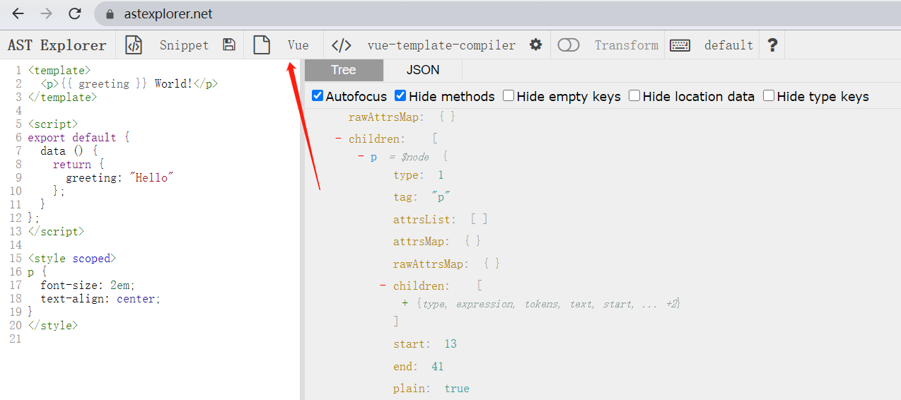
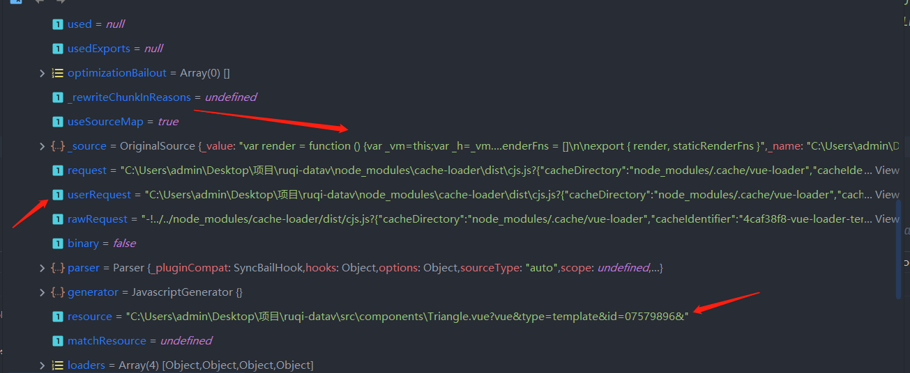
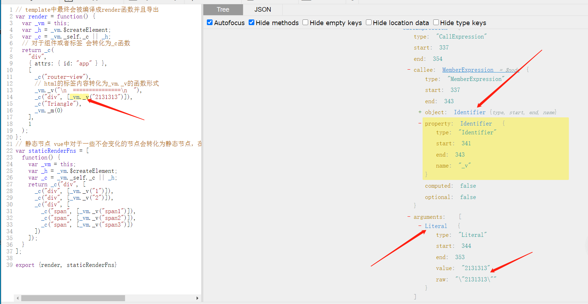
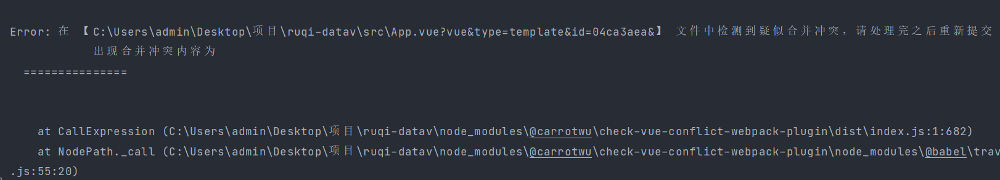

# 手把手写一个检测vue单文件template是否有合并冲突的webpack插件

前面react的文章实现了如何在打包模式下检测render模板中是否有遗留的合并冲突代码。vue也可以吗？

答案是肯定的！只是实现的思路以及方法从babel插件变为了webpack插件。

## 为啥之前的babel插件实现不行了

上偏文章说过了，react中的jsx其实最终都是会被babel编译成`react.createElement`的形式，因此我们可以通过babel插件的形式对react的渲染模板进行ast语法树的分析。

那么vue呢？在[astexplore](https://astexplorer.net/)网站中我们选择编译的文件类型是vue就可以看到vue单文件编译成的ast语法树结构。



那么我们也可以利用这种形式来编写一个babel插件的形式来对vue中的template进行ast语法树的分析？事实上并不行，经由webpack进行打包的vue项目类似于`vue-cli`，webpack并不能识别.vue文件结尾的单文件。所以vue中的.vue单文件首先要经过`vue-loader`进行处理，在`vue-loader`中，会通过官方的`vue-template-compilre`进行编译静态分析优化等操作。其中的script代码任然会交给babel进行处理编译，**但是template渲染模板会由vue-template-compilre进行编译优化生成成最终的字符串模板**。

啥意思呢，就是.vue文件中的template变异之后的代码并不会再交给babel进行处理，`vue-template-compilre`已经干完了这些事情了。所以想通过babel插件的形式获取到template编译后的代码是拿不到的。

## 换个思路-webpack插件

既然babel插件的方式行不通那就要换个思路了: 我们知道的是**不管template中的代码怎么折腾，最终渲染模板代码都会被webpack打包成一个module模块，再交由webpack拼装组合优化等操作输出成js文件**。

所以，我们可以通过webpack插件监听特定的生命周期钩子，获取到打包时候生成的module模块。经过一些筛选比对这样子就能获取到`vue-template-compilre`编译之后的渲染模板代码。

> 本文并不是来教你怎么写一个wenpack插件的，webpack插件的相关还是可以移步去webpack官网恶补一下。

为了获取到被webpack生成的完整module，我们监听compilation的seal钩子即可：

### 从webpack生成的modules中查找template模块

```ts
class CheckVueConflictPlugin {
  private readonly options: CheckVueConflictPluginOptions;

  constructor(options?: CheckVueConflictPluginOptions) {
    this.options = options || {};
  }

  apply(compiler: Compiler) {
    const { force = false } = this.options;
    const pluginName = this.constructor.name;
    const { options } = compiler;
    const { mode } = options;
    // 非生产模式并且不需要强制执行直接退出即可
    if (mode !== 'production' && !force) {
      return;
    }
    // 注册实例化compilation之后的钩子
    compiler.hooks.compilation.tap(pluginName, (compilation) => {
      compilation.hooks.seal.tap(pluginName, () => {
        const newModule = Array.from(compilation.modules) as VueTemplateModule[];
        // 筛选出type为template的渲染模板module
        const templateModulesArray = newModule.filter(
          (module) => module.resource && isVueTemplate(module.resource) && module.resource !== module.userRequest,
        );
      });
    });
  }
}
```

.vue单文件经过`vue-template-compilre`编译后会被拆分成三个文件，通过type来区分：

1. `source.vue?vue&type=template` 表示渲染函数模板
2. `source.vue?vue&type=script` 表示script中的js逻辑
3. `source.vue?vue&type=style` 表示样式文件

看一下webpack打包的template渲染函数模块：



不难写出筛选出template渲染函数的代码:

```ts
// 判断是否vue模板 注意的是 mac的路径为相对路径 所以不能实例化的URL方法形式
// 改用正则
function isVueTemplate (url) {
  if (/\.vue\?vue&type=template/.test(url)) {
    return true
  }
}
class CheckVueConflictPlugin {
  private readonly options: CheckVueConflictPluginOptions;

  constructor(options?: CheckVueConflictPluginOptions) {
    this.options = options || {};
  }

  apply(compiler: Compiler) {
    const { force = false } = this.options;
    const pluginName = this.constructor.name;
    const { options } = compiler;
    const { mode } = options;
    // 非生产模式并且不需要强制执行直接退出即可
    if (mode !== 'production' && !force) {
      return;
    }
    // 注册实例化compilation之后的钩子
    compiler.hooks.compilation.tap(pluginName, (compilation) => {
      compilation.hooks.seal.tap(pluginName, () => {
        const newModule = Array.from(compilation.modules) as VueTemplateModule[];
        const templateModulesArray = newModule.filter(
          (module) => module.resource && isVueTemplate(module.resource) && module.resource !== module.userRequest,
        );
        // template模板有两种 一种是经过vue-loader模板处理的 template文件 这时候的request或者userRequest 引用路径其实就是vue-loader
        // 一种是经过vue-loader编译之后导出的
        // 我们要的是第儿2种即 经过vue-loader处理过后的 这时候的request与resource路径是不一样的
        if (templateModulesArray.length) {
          // 此时获取到的module模块内容就是经过vue-loader经过静态分析优化完的模板字符串内容
          for (let i = 0; i < templateModulesArray.length; i++) {
            if (templateModulesArray[i]._source._value) {
              checkIsConflict(templateModulesArray[i]);
            }
          }
        }
      });
    });
  }
}
```

### 引入babel对template渲染函数进行ast语法树分析

从上面的步骤中我们获取到了经由`vue-template-compilre`编译优化过后的渲染字符串，假设原template的代码是这样子的:

```html
<template>
  <div id="app">
    <router-view />
    ===============
    <div>2131313</div>
    <Triangle/>
    <div>
      <div>1</div>
      <div>2</div>
      <div>
        <span>span1</span>
        <span>span2</span>
        <span>span3</span>
      </div>
    </div>
  </div>
</template>
```

经过`vue-tempalte-compilre`编译优化之后就会生成如下的渲染函数字符串(为了方便理解代码做了格式化以及注释)：

```js
// template中最终会被编译成render函数并且导出
var render = function() {
  var _vm = this;
  var _h = _vm.$createElement;
  var _c = _vm._self._c || _h;
  // 对于组件或者标签 会转化为_c函数
  return _c(
    "div",
    { attrs: { id: "app" } },
    [
      _c("router-view"),
      // html的标签内容转化为_vm._v的函数形式
      _vm._v("\n  ===============\n  "),
      _c("div", [_vm._v("2131313")]),
      _c("Triangle"),
      _vm._m(0)
    ],
    1
  );
};
// 静态节点 vue中对于一些不会变化的节点会转化为静态节点，在diff的时候会跳过这些节点用于性能优化。
var staticRenderFns = [
  function() {
    var _vm = this;
    var _h = _vm.$createElement;
    var _c = _vm._self._c || _h;
    return _c("div", [
      _c("div", [_vm._v("1")]),
      _c("div", [_vm._v("2")]),
      _c("div", [
        _c("span", [_vm._v("span1")]),
        _c("span", [_vm._v("span2")]),
        _c("span", [_vm._v("span3")])
      ])
    ]);
  }
];

export {render, staticRenderFns}
```

不难看出，为了检验模板中是否有遗留的合并冲突代码，我们只需要`_vm._v`中的字符串是进行正则匹配即可。我们把这段代码丢到[astexplore](https://astexplorer.net/)中。



获取到相对应的ast语法树之后，通过babel插件把上面获取到的模板源文件转为为ast语法树，通过访问者模式判断特定的节点即可。

```ts
import { Compiler, Module } from 'webpack';
import { parse } from '@babel/parser';
import traverse from '@babel/traverse';
import * as babelTypes from '@babel/types';
import { StringLiteral } from '@babel/types';

interface VueTemplateModule extends Module {
  resource?: string;
  _source: {
    _value: string;
  };
  userRequest?: string;
}
const newVueToken = ['_vm'];
const vuePropertyKey = ['_v'];

function checkIsConflict(module: VueTemplateModule) {
  const { _source, resource } = module;
  const vueTemplateAst = parse(_source._value, {
    sourceType: 'module',
  });
  traverse(vueTemplateAst, {
    CallExpression(path) {
      const { callee } = path.node;
      if (
        !(
          babelTypes.isMemberExpression(callee) &&
          babelTypes.isIdentifier(callee.object) &&
          newVueToken.includes(callee.object.name) &&
          babelTypes.isIdentifier(callee.property) &&
          vuePropertyKey.includes(callee.property.name)
        )
      ) {
        return;
      }
      // get the component type name and it's extra props options
      const childrenArray = path.node.arguments;
      const stringLiteralChildArray = childrenArray.filter((children) =>
        babelTypes.isStringLiteral(children),
      ) as StringLiteral[];

      const stringLiteralValArray = stringLiteralChildArray.map((child) => child.value);

      const conflictText = stringLiteralValArray.find((strText) => strText.match(/(={7})|(>{7})|(<{7})/));
      if (conflictText) {
        // 检测到合并冲突 直接抛出错误
        throw new Error(
          `在 【${resource}】 文件中检测到疑似合并冲突，请处理完之后重新提交
            出现合并冲突内容为${conflictText}
          `,
        );
      }
    },
  });
}
```

至此，一个检测vue渲染模板中是否有合并冲突代码的webpack插件就完成了，全部实现源码如下:

```ts
import { URL } from 'url';
import { Compiler, Module } from 'webpack';
import { parse } from '@babel/parser';
import traverse from '@babel/traverse';
import * as babelTypes from '@babel/types';
import { StringLiteral } from '@babel/types';

interface VueTemplateModule extends Module {
  resource?: string;
  _source: {
    _value: string;
  };
  userRequest?: string;
}

interface CheckVueConflictPluginOptions {
  // 是否强制开启进行模板冲突检测
  force?: boolean;
}
const newVueToken = ['_vm'];
const vuePropertyKey = ['_v'];

// 判断是否vue模板 注意的是 mac的路径为相对路径 所以不能实例化的URL方法形式
// 改用正则
function isVueTemplate (url) {
  if (/\.vue\?vue&type=template/.test(url)) {
    return true
  }
}
function checkIsConflict(module: VueTemplateModule) {
  const { _source, resource } = module;
  const vueTemplateAst = parse(_source._value, {
    sourceType: 'module',
  });
  traverse(vueTemplateAst, {
    CallExpression(path) {
      const { callee } = path.node;
      if (
        !(
          babelTypes.isMemberExpression(callee) &&
          babelTypes.isIdentifier(callee.object) &&
          newVueToken.includes(callee.object.name) &&
          babelTypes.isIdentifier(callee.property) &&
          vuePropertyKey.includes(callee.property.name)
        )
      ) {
        return;
      }
      // get the component type name and it's extra props options
      const childrenArray = path.node.arguments;
      const stringLiteralChildArray = childrenArray.filter((children) =>
        babelTypes.isStringLiteral(children),
      ) as StringLiteral[];

      const stringLiteralValArray = stringLiteralChildArray.map((child) => child.value);

      const conflictText = stringLiteralValArray.find((strText) => strText.match(/(={7})|(>{7})|(<{7})/));
      if (conflictText) {
        // 检测到合并冲突 直接抛出错误
        throw new Error(
          `在 【${resource}】 文件中检测到疑似合并冲突，请处理完之后重新提交
            出现合并冲突内容为${conflictText}
          `,
        );
      }
    },
  });
}

class CheckVueConflictPlugin {
  private readonly options: CheckVueConflictPluginOptions;

  constructor(options?: CheckVueConflictPluginOptions) {
    this.options = options || {};
  }

  apply(compiler: Compiler) {
    const { force = false } = this.options;
    const pluginName = this.constructor.name;
    const { options } = compiler;
    const { mode } = options;
    // 非生产模式并且不需要强制执行直接退出即可
    if (mode !== 'production' && !force) {
      return;
    }
    // 注册实例化compilation之后的钩子
    compiler.hooks.compilation.tap(pluginName, (compilation) => {
      compilation.hooks.seal.tap(pluginName, () => {
        const newModule = Array.from(compilation.modules) as VueTemplateModule[];
        const templateModulesArray = newModule.filter(
          (module) => module.resource && isVueTemplate(module.resource) && module.resource !== module.userRequest,
        );
        // template模板有两种 一种是经过vue-loader模板处理的 template文件 这时候的request或者userRequest 引用路径其实就是vue-loader
        // 一种是经过vue-loader编译之后导出的
        // 我们要的是第儿2种即 经过vue-loader处理过后的 这时候的request与resource路径是不一样的
        if (templateModulesArray.length) {
          // 此时获取到的module模块内容就是经过vue-loader经过静态分析优化完的模板字符串内容
          for (let i = 0; i < templateModulesArray.length; i++) {
            if (templateModulesArray[i]._source._value) {
              checkIsConflict(templateModulesArray[i]);
            }
          }
        }
      });
    });
  }
}

export default CheckVueConflictPlugin;
```

## 加餐：vue3的兼容

vue3的单文件模板依然会分离成三个文件，通过type来区分（跟vue2一毛一样）

1. `source.vue?vue&type=template` 表示渲染函数模板
2. `source.vue?vue&type=script` 表示script中的js逻辑
3. `source.vue?vue&type=style` 表示样式文件

只是编译的渲染模板发生了变化，如下面的template模板：

```html
<template>
  <header class="header">
    <div class="logo">
      <i class="back" />
    </div>
    <span>123456</span>
    <div class="tabs">
      <div class="tab-item" v-for="item in tabList" :key="item.name">
        <RouterLink :to="item.link">{{ item.name }}</RouterLink>
      </div>
    </div>
    ==================
    <RouterLink class="user" to="/user">
      <i class="iconfont icon-user" />
      >>>>>>>>>>>>sss
      <span>测试环境数据</span>
    </RouterLink>
  </header>
</template>
```

会编译优化为如下的js代码:

```js
import { createVNode as _createVNode, renderList as _renderList, Fragment as _Fragment, openBlock as _openBlock, createBlock as _createBlock, toDisplayString as _toDisplayString, createTextVNode as _createTextVNode, resolveComponent as _resolveComponent, withCtx as _withCtx, withScopeId as _withScopeId, pushScopeId as _pushScopeId, popScopeId as _popScopeId } from "vue"
const _withId = /*#__PURE__*/_withScopeId("data-v-77d8155b")

_pushScopeId("data-v-77d8155b")
const _hoisted_1 = { class: "header" }
const _hoisted_2 = /*#__PURE__*/_createVNode("div", { class: "logo" }, [
  /*#__PURE__*/_createVNode("i", { class: "back" })
], -1)
const _hoisted_3 = /*#__PURE__*/_createVNode("span", null, "123456", -1)
const _hoisted_4 = { class: "tabs" }
const _hoisted_5 = /*#__PURE__*/_createTextVNode(" ================== ")
const _hoisted_6 = /*#__PURE__*/_createVNode("i", { class: "iconfont icon-user" }, null, -1)
const _hoisted_7 = /*#__PURE__*/_createTextVNode(" >>>>>>>>>>>>sss ")
const _hoisted_8 = /*#__PURE__*/_createVNode("span", null, "测试环境数据", -1)
_popScopeId()

export const render = /*#__PURE__*/_withId(function render(_ctx, _cache) {
  const _component_RouterLink = _resolveComponent("RouterLink")

  return (_openBlock(), _createBlock("header", _hoisted_1, [
    _hoisted_2,
    _hoisted_3,
    _createVNode("div", _hoisted_4, [
      (_openBlock(true), _createBlock(_Fragment, null, _renderList(_ctx.tabList, (item) => {
        return (_openBlock(), _createBlock("div", {
          class: "tab-item",
          key: item.name
        }, [
          _createVNode(_component_RouterLink, {
            to: item.link
          }, {
            default: _withId(() => [
              _createTextVNode(_toDisplayString(item.name), 1 /* TEXT */)
            ]),
            _: 2
          }, 1032, ["to"])
        ]))
      }), 128 /* KEYED_FRAGMENT */))
    ]),
    _hoisted_5,
    _createVNode(_component_RouterLink, {
      class: "user",
      to: "/user"
    }, {
      default: _withId(() => [
        _hoisted_6,
        _hoisted_7,
        _hoisted_8
      ]),
      _: 1
    })
  ]))
})
```

不难看出，获取静态文本的方法集中在`_createVNode`以及`_createTextVNode`这两个核心方法之中。根据相对应的ast语法树进行判断即可：

```ts
export function checkVue3IsConflict(module: VueTemplateModule) {
  const { _source, resource } = module;
  const vueTemplateAst = parse(_source._value, {
    sourceType: 'module',
  });
  traverse(vueTemplateAst, {
    CallExpression(path) {
      // @ts-ignore
      const { callee } = path.node;
      const nodeArguments = path.node.arguments;
      const isCreateVNode =
        babelTypes.isIdentifier(callee) &&
        callee.name === '_createVNode' &&
        babelTypes.isStringLiteral(nodeArguments[2]);
      const isCreateTextVNode =
        babelTypes.isIdentifier(callee) &&
        callee.name === '_createTextVNode' &&
        babelTypes.isStringLiteral(nodeArguments[0]);
      if (!(isCreateVNode || isCreateTextVNode)) {
        return;
      }
      const pendingCheckStr = nodeArguments[isCreateVNode ? 2 : 0] as StringLiteral;

      const conflictText = pendingCheckStr.value.match(/(={7})|(>{7})|(<{7})/);
      if (conflictText) {
        // 检测到合并冲突 直接抛出错误
        throw new Error(
          `在 【${resource}】 文件中检测到疑似合并冲突，请处理完之后重新提交
            出现合并冲突内容为${pendingCheckStr.value}
          `,
        );
      }
    },
  });
}
```

## 效果

