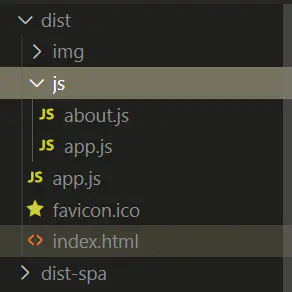
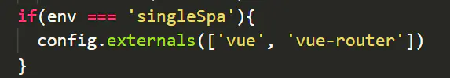
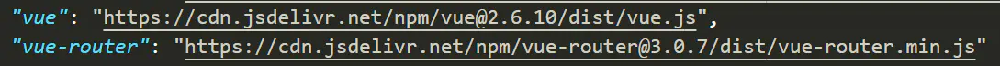
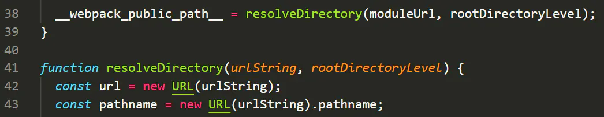
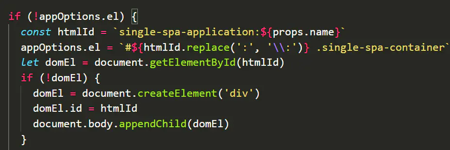
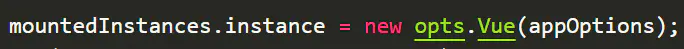
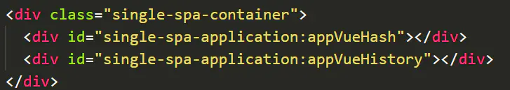
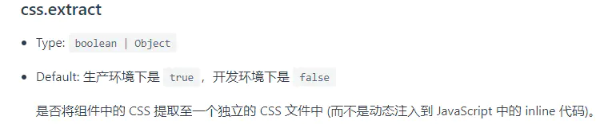
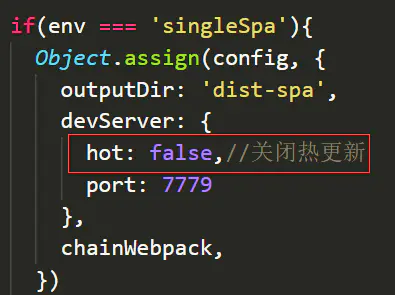
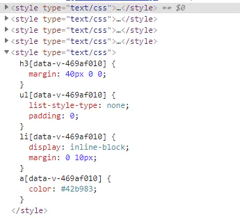

## 预备知识

上一篇文章：[从0实现一个前端微服务（上）](../从0实现一个前端微服务（上）/从0实现一个前端微服务（上）.md)中讲到，`single-spa`的原理就是，将子项目中的`link/script`标签和`<div id="app"></div>`插入到主项目，而这个操作的核心就是动态加载`js`和`css`。

动态加载`js`我们使用的是`system.js`,借助这个插件，我们只需要将子项目的`app.js`暴露给它即可。

本文章基于[GitHub上一个single-spa的demo](https://github.com/joeldenning/coexisting-vue-microfrontends)修改，所以最好有研究过这个`demo`，另外本文的基于最新的`vue-cli4`开发。

## single-spa-vue实现步骤

要实现的效果就是子项目独立开发部署，顺便还能被主项目集成。

### 新建导航主项目

1. `vue-cli4`直接使用`vue create nav`命令生成一个`vue`项目。

>  需要注意的是，导航项目路由必须用 history 模式

1. 修改`index.html`文件

```
<!DOCTYPE html>
<html lang="en">
  <head>
    <meta charset="utf-8">
    <meta http-equiv="X-UA-Compatible" content="IE=edge">
    <meta name="viewport" content="width=device-width,initial-scale=1.0">
    <link rel="icon" href="<%= BASE_URL %>favicon.ico">
    <title>home-nav</title>
   <!-- 配置文件注意写成绝对路径：/开头，否则访问子项目的时候重定向的index.html，相对目录会出错 -->
   <script type="systemjs-importmap" src="/config/importmap.json"></script>
   <!-- 预请求single-spa,vue,vue-router文件 -->
   <link rel="preload" href="https://cdnjs.cloudflare.com/ajax/libs/single-spa/4.3.7/system/single-spa.min.js" as="script" crossorigin="anonymous" />
   <link rel="preload" href="https://cdn.jsdelivr.net/npm/vue@2.6.10/dist/vue.js" as="script" crossorigin="anonymous" />
   <link rel="preload" href="https://cdn.jsdelivr.net/npm/vue-router@3.0.7/dist/vue-router.min.js" as="script" crossorigin="anonymous" />
   <!-- 引入system.js相关文件 -->
   <script src="https://cdnjs.cloudflare.com/ajax/libs/systemjs/6.1.1/system.min.js"></script>
   <script src="https://cdnjs.cloudflare.com/ajax/libs/systemjs/6.1.1/extras/amd.min.js"></script>
   <script src="https://cdnjs.cloudflare.com/ajax/libs/systemjs/6.1.1/extras/named-exports.js"></script>
   <script src="https://cdnjs.cloudflare.com/ajax/libs/systemjs/6.1.1/extras/use-default.min.js"></script>
  </head>
  <body>
    <script>
      (function() {
        System.import('single-spa').then(singleSpa => {
          singleSpa.registerApplication(
            'appVueHistory',
            () => System.import('appVueHistory'),
            location => location.pathname.startsWith('/app-vue-history/')
          )
          singleSpa.registerApplication(
            'appVueHash',
            () => System.import('appVueHash'),
            location => location.pathname.startsWith('/app-vue-hash/')
          )
          singleSpa.start();
        })
      })()
    </script>
    <div class="wrap">
      <div class="nav-wrap">
        <div id="app"></div>
      </div>
      <div class="single-spa-container">
        <div id="single-spa-application:appVueHash"></div>
        <div id="single-spa-application:appVueHistory"></div>
      </div>
    </div>
    <style>
    .wrap{
      display: flex;
    }
    .nav-wrap{
      flex: 0 0 200px;
    }
    .single-spa-container{
      width: 200px;
      flex-grow: 1;
    }
    </style>
  </body>
</html>

```

1. 子项目和公共文件url的配置文件`config/importmap.json`:

```
{
  "imports": {
    "appVue": "http://localhost:7778/app.js",
    "appVueHistory": "http://localhost:7779/app.js",
    "single-spa": "https://cdnjs.cloudflare.com/ajax/libs/single-spa/4.3.7/system/single-spa.min.js",
    "vue": "https://cdn.jsdelivr.net/npm/vue@2.6.10/dist/vue.js",
    "vue-router": "https://cdn.jsdelivr.net/npm/vue-router@3.0.7/dist/vue-router.min.js"
  }
}

```

## 子项目改造

### hash模式路由的vue项目

如果是新开发的项目，可以先用`vue-cli4`生成一个`vue`项目，路由使用的是`hash`模式。

#### 1. 安装插件(稍后会介绍其作用)：

如果是老项目，需要分别安装一下三个插件：

```
npm install systemjs-webpack-interop -S

npm install single-spa-vue -S

npm install vue-cli-plugin-single-spa -D

```

如果是新项目，则可以使用以下命令：

```
vue add single-spa

```

> 注意：该命令会改写你的 main.js，老项目不要用这个命令

该命令做了四事件：

- (1) 安装 `single-spa-vue` 插件
- (2) 安装 `systemjs-webpack-interop` 插件，并生成 `set-public-path.js`
- (3) 修改`main.js`
- (4) 修改`webpack`配置（允许跨域，关闭热更新，去掉`splitChunks`等）

#### 2. 新增两个环境变量

由于`single-spa`模式也有开发和生产环境，所以有4种环境：正常开发，`single-spa`开发，正常打包，`single-spa`打包。但是我们只需要两个环境变量文件即可区分开，分别在在根目录下新建环境变量文件：

`.env.devSingleSpa`文件(区分正常开发和`single-spa`模式开发)：

```
NODE_ENV = development
VUE_APP__ENV = singleSpa

```

`.env.singleSpa`文件(区分正常打包和`single-spa`模式打包)：

```
NODE_ENV = production
VUE_APP__ENV = singleSpa

```

#### 3. 修改入口文件

`single-spa`和正常开发模式不一样的地方仅仅在入口文件。其中入口文件中需要引入的插件(`vuex`,`vue-router`,`axios`,`element-ui`等)完全一样，不一样的地方在于，正常开发是`new Vue(options)`，`single-spa`则是调用`singleSpaVue(Vue,options)`函数，并且将三个生命周期`export`。

所以我将两种模式下公共的部分任然写在`main.js`，并导出两种模式所需的配置对象:

```
import store from "./store";
import Vue from 'vue';
import App from './App.vue';
import router from './router';

const appOptions = {
  render: (h) => h(App),
  router,
  store,
}

Vue.config.productionTip = false;

export default appOptions;

```

新增`index.js`（正常模式入口文件） :

```
import appOptions from './main';
import './main';
import Vue from 'vue';

new Vue(appOptions).$mount('#app');

```

新增`index.spa.js`（`single-spa`模式入口文件） :

```
import './set-public-path'
import singleSpaVue from 'single-spa-vue';
import appOptions from './main';
import './main';
import Vue from 'vue';

const vueLifecycles = singleSpaVue({
  Vue,
  appOptions
});

const { bootstrap, mount, unmount } = vueLifecycles;

export { bootstrap, mount, unmount };

```

其中`index.spa.js`里面的`set-public-path.js`:

```
import { setPublicPath } from 'systemjs-webpack-interop'
//模块的名称必须和system.js的配置文件(importmap.json)中的模块名称保持一致
setPublicPath('appVueHash')

```

#### 4. 修改打包配置（`vue.config.js`）

`single-spa`模式和正常模式只有入口文件不同，其他的都一样。也就是说打包之后，只有`app.js`文件不同，那么其他的文件是否可以复用，能否实现一次打包，即可部署两种模式？

答案是可以的：打包的时候我先执行`sing-spa`的打包，然后执行正常模式打包，最后将`single-spa`打包生成的`app.js`文件拷贝到正常打包的文件根目录下。这样只需要拿着`dist`目录部署即可，`single-spa`不需要做任何修改即可同步更新。

> 需要注意的是文件不能带有hash值了，文件没了hash值就需要服务器自己生成hash值来设置缓存了。

```
const CopyPlugin = require('copy-webpack-plugin');

const env = process.env.VUE_APP__ENV; // 是否是single-spa
const modeEnv = process.env.NODE_ENV; // 开发环境还是生产环境

const config = {
  productionSourceMap: false,//去掉sourceMap
  filenameHashing: false,//去掉文件名的hash值
};

const enteyFile = env === 'singleSpa' ? './src/index.spa.js' : './src/index.js';
//正常打包的app.js在js目录下，而single-spa模式则需要在根目录下。
//打包时会从dist-spa/js目录将app.js拷贝到正常打包的根目录下，所以不用管，只需要判断single-spa的开发模式即可
const filename = modeEnv === 'development' ? '[name].js' : 'js/[name].js';

chainWebpack = config => {
  config.entry('app')
    .add(enteyFile)
    .end()
    .output
      .filename(filename);
  if(env === 'singleSpa'){
    //vue,vue-router不打包进app.js，使用外链
    config.externals(['vue', 'vue-router'])
  }
}

if(env === 'singleSpa'){
  Object.assign(config, {
    outputDir: 'dist-spa',
    devServer: {
      hot: false,//关闭热更新
      port: 7778
    },
    chainWebpack,
  })
}else{
  Object.assign(config, {
    chainWebpack,
    configureWebpack: modeEnv === 'production' ? {
      plugins: [
        //将single-spa模式下打包生成的app.js拷贝到正常模式打包的主目录
        new CopyPlugin([{ 
          from: 'dist-spa/js/app.js',
          to: '' 
        }])
      ],
    } : {},
  })
}

module.exports = config;

```

打包后的文件效果：





其中`js/app.js`是正常模式生成的，而与`index.html`同目录的`app.js`是`dist-spa/js/app.js`拷贝过来的，是`single-spa`模式的入口文件，其他的文件复用。

#### 5. 修改打包命令（`package.json`）

`single-spa`模式下开发/打包都需要改动环境变量，将正常的`build`命令修改成：按顺序打包两次，就可以实现和原来一样打包部署流程。

```
"scripts": {
    "spa-serve": "vue-cli-service serve --mode devSingleSpa",
    "serve": "vue-cli-service serve",
    "spa-build": "vue-cli-service build --mode singleSpa",
    "usual-build": "vue-cli-service build",
    "build": "npm run spa-build && npm run usual-build",
    "lint": "vue-cli-service lint"
},

```

`single-spa`开发使用`npm run spa-serve`，正常开发不变。

打包任然使用`npm run build`，然后将`dist`目录下的文件部署到子项目服务器即可。

### history模式路由的vue项目

由于我们给子项目路由强行加了不同前缀（`/app-vue-history`），在`hash`模式是没问题的，因为`hash`模式下路由跳转只会修改`url`的`hash`值，不会修改`path`值。`history`模式则需要告诉`vue-router`，`/app-vue-history/`是项目路由前缀，跳转只需要修改这后面的部分，否则路由跳转会直接覆盖全部路径。那么这个配置项就是`base`属性：

```
const router = new VueRouter({
  mode: "history",
  base: '/',//默认是base
  routes,
});

```

办法也很简单，判断下环境变量，`single-spa`模式下`base`属性是`/app-vue-history`，正常模式则不变。

但是由于我们打包后复用了除`app.js`以外的文件，所以只有入口文件才能区分开环境，解决办法是：

`router/index.js`路由文件不导出实例化的路由对象，而导出一个函数：

```
const router = base => new VueRouter({
  mode: "history",
  base,
  routes,
});

```

并且`main.js`不再引入路由文件，改成在入口文件分别引入。

正常模式的入口文件`index.js`:

```
import router from './router';

const baseUrl = '/';
appOptions.router = router(baseUrl);

```

`single-spa`模式的入口文件`index.spa.js`:

```
import router from './router';

const baseUrl = '/app-vue-history';
appOptions.router = router(baseUrl);

```

## 部分原理浅析

### sysyem.js的作用及好处

`system.js`的作用就是动态按需加载模块。假如我们子项目都使用了`vue`,`vuex`,`vue-router`，每个项目都打包一次，就会很浪费。`system.js`可以配合`webpack`的`externals`属性，将这些模块配置成外链，然后实现按需加载：








当然了，你也可以直接用`script`标签将这些公共的`js`全部引入，但是这样会造成浪费，比如说子项目A用到了`vue-router`和`axios`，但是没用到`vuex`，子项目A刷新，则还是会请求`vuex`，就很浪费，`system.js`则会按需加载。

同时，子项目打包成`umd`格式，`system.js`可以实现按需加载子项目。

### systemjs-webpack-interop 插件有什么作用（[GitHub地址](https://github.com/joeldenning/systemjs-webpack-interop)）

[上一篇文章](https://juejin.im/post/6844904046822686733)中讲到，直接引入子项目的`js/css`可以呈现出子系统，但是动态生成的`HTML`中，`img/video/audio`等文件的路径是相对的，导致加载不出来。而解决办法1是：修改`vue-cli4`的 `publicPath` 设置为完整的绝对路径`http://localhost:8080/`即可。

这个插件作用就是将子项目的`publicPath`暴露出来给`system.js`，`system.js`根据项目名称匹配到配置文件（`importmap.json`），然后解析配置的`url`，将前缀赋给`publicPath`。

那么`publicPath`如何动态设置呢？[webpack官网](https://webpack.docschina.org/guides/public-path/)中给出的办法是：`webpack` 暴露了一个名为 `__webpack_public_path__` 的全局变量，直接修改这个值即可。

`systemjs-webpack-interop`部分源码截图（`public-path-system-resolve.js`）：





所以这也是为什么`single-spa`的入口文件`app.js`要和`index.html`目录一致，因为他直接截取了`app.js`的路径作为了`publicPath`。

### single-spa-vue 插件有什么作用 （[GitHub地址](https://github.com/CanopyTax/single-spa-vue)）

这个插件的主要作用是帮我们写了`single-spa`所需要的三个周期事件：`bootstrap`，`mount`，`unmount`。

在`mount`周期做的事情就是生成我们需要的`<div id="app"></div>`，当然了，id的名称它是根据项目名取得：





然后就是在这个`div`里面实例化`vue`:





所以如果我们想让子项目内容在我们自定义的区域（默认插入到`body`），其中一个办法是将`div`写好：

`home-nav/public/index.html`:





另一个办法就是修改这部分代码，让他插入到我们想要插入的地方，而不是`body`。

`unmount`周期它卸载了实例化的`vue`并且清空了`DOM`，想要实现`keep-alive`效果我们得修改这部分代码（后面有介绍）

### vue-cli-plugin-single-spa 插件的作用（[GitHub地址](https://github.com/CanopyTax/vue-cli-plugin-single-spa)）

这个插件主要是用于命令`vue add single-spa`执行时，覆盖你的`main.js`并且生成`set-public-path.js`，同时修改你的`webpack`配置。但是执行`npm install vue-cli-plugin-single-spa -D`命令时，它只会覆盖你的`webpack`配置。

其修改`webpack`配置的源码：

```
module.exports = (api, options) => {
  options.css.extract = false
  api.chainWebpack(webpackConfig => {
    webpackConfig
      .devServer
      .headers({
        'Access-Control-Allow-Origin': '*',
      })
      .set('disableHostCheck', true)
    
    webpackConfig.optimization.delete('splitChunks')
    webpackConfig.output.libraryTarget('umd')
    webpackConfig.set('devtool', 'sourcemap')
  })
}

```

回到最初的起点，我们实现`single-spa`最重要的事：动态引入子项目的`js/css`，但是你发现没有，全程都只看到`js`的引入，丝毫没有提及`css`，那么`css`文件咋办？答案就是`options.css.extract = false`。





`vue-cli3`官网中介绍，这个值为`false`，就是不单独生成`css`文件，和`js`文件打包到一起，这让我们只需要关心`js`文件的引入即可，但是也为`css`污染问题埋下了坑。

另一个配置就是允许跨域，同时还有文章开头提及的`system.js`要求子项目打包成`umd`形式，也是它配置的。

还有一个比较关键的配置：`webpackConfig.optimization.delete('splitChunks')`，正常情况下，我们打包之后的文件除了入口文件`app.js`,还有一个文件是`chunk-vendors.js`，这个文件里面包含了一些公共的第三方插件，这样一来，子项目就有两个入口文件（或者说得同时加载这两个文件），所以只能去掉`splitChunks`。

## 注意事项及其他细节

1. 环境变量

部署的时候除入口文件（`app.js`）外，其他的路由文件都复用了正常打包的文件，所以环境变量需要由入口文件注入到全局使用。

`index.spa.js`文件：

```
appOptions.store.commit('setSingleSpa',true);

```

1. 子项目开发最好设置固定端口

避免频繁修改配置文件，设置一个固定的特殊端口，尽量避免端口冲突。

1. single-spa 关闭热更新

开发模式仍正常开发，但是`single-spa`联调需要关闭热更新，否则本地`websocket`会一直报`failed`。





`single-spa`开发中我发现热更新正常生效。

1. index.html里面的外部文件引入url需要写成绝对路径

配置文件注意写成绝对路径，否则访问子项目的时候路由重定向回主项目的`index.html`，里面的url相对目录会出错。

`home-nav/public/index.html`:

```
<script type="systemjs-importmap" src="/config/importmap.json"></script>

```

1. 如何实现“keep-alive”

查看`single-spa-vue`源码可以发现，在`unmount`生命周期，它将`vue`实例`destroy`（销毁了）并且清空了`DOM`。要想实现`keep-alive`,我们只需要去掉`destroy`并且不清空`DOM`，然后自己使用`display:none`来隐藏和显示子项目的`DOM`即可。

```
function unmount(opts, mountedInstances) {
  return Promise
    .resolve()
    .then(() => {
      mountedInstances.instance.$destroy();
      mountedInstances.instance.$el.innerHTML = '';
      delete mountedInstances.instance;

      if (mountedInstances.domEl) {
        mountedInstances.domEl.innerHTML = ''
        delete mountedInstances.domEl
      }
    })
}

```

1. 如何避免css污染

我们使用配置`css.extract = true`之后，`css`不再单独生成文件，而是打包到`js`里面，生成的样式包裹在`style`标签里面，子项目卸载之后，样式文件并没有删除，样式多了就可能造成样式污染。





解决办法：

办法1：命名规范 + `css-scope` + 去掉全局样式

办法2：卸载应用的时候去掉样式的`style`标签（待研究）

如果一定要写全局变量，可以用类似“换肤”的办法解决：在子项目给`body/html`加一个唯一的id（正常开发部署用），然后这个全局的样式前面加上这个id，而`single-spa`模式则需要修改`single-spa-vue`，在`mount`周期给`body/html`加上这个唯一的id，在`unmount`周期去掉，这样就可以保证这个全局css只对这个项目生效了。

1. 如何避免js冲突

首先得规范开发：在组件的`destroy`生命周期去掉全局的属性/事件，其次还有个办法就是在子项目加载之前对`window`对象做一个快照，然后在卸载的时候恢复之前的状态。

1. 子项目如何通信

可以借助`localstorage`和自定义事件通信。`localstorage`一般用来共享用户的登陆信息等，而自定义事件一般用于共享实时数据，例如消息数量等。

```
//1、子组件A 创建事件并携带数据
const myCustom = new CustomEvent("custom",{ detail: { data: 'test' } });
//2、子组件B 注册事件监听器
window.addEventListener("custom",function(e){
  //接收到数据
})
//3、子组件A触发事件
window.dispatchEvent(myCustom);

```

1. 如何控制子系统的权限

其中一个办法就是没权限的系统直接隐藏入口导航，然后就是直接输入`url`进入，还是会加载子项目，但是子项目判断无权限之后显示一个403页面即可。可以看到子系统对应的入口文件是写在一个`json`文件里面的，那么总不能所有人都能读取到这个`json`吧，或者说想实现不同权限的用户的`json`配置不同。

我们可以动态生成`script`标签：

```
//在加载模块之前先生成配置json
function insertNewImportMap(newMapJSON) {
  const newScript = document.createElement('script')
  newScript.type = 'systemjs-importmap';
  newScript.innerText = JSON.stringify(newMapJSON);
  const test = document.querySelector('#test')
  test.insertAdjacentElement('beforebegin',newScript);
}
//内容从接口获取
const devDependencies = {
  imports: {
    "navbar": "http://localhost:8083/app.js",
    "app1": "http://localhost:8082/app.js",
    "app2": "http://localhost/app.js",
    "single-spa": "https://cdnjs.cloudflare.com/ajax/libs/single-spa/4.3.7/system/single-spa.min.js",
    "vue": "https://cdn.jsdelivr.net/npm/vue@2.6.10/dist/vue.js",
    "vue-router": "https://cdn.jsdelivr.net/npm/vue-router@3.0.7/dist/vue-router.min.js"
  }
}
insertNewImportMap(devDependencies);

```

## 总结

如果不想自己搭建node静态文件服务器，给大家推荐一个软件：XAMPP

文章中的完整`demo`文件地址：[github.com/gongshun/si…](https://github.com/gongshun/single-spa-vue-demo)

1. 目前存在的问题
   - 子项目之间路由跳转没法去掉`url`的`hash`值，例如从`'/app1/#/home'`跳转到`'/app2/'`时，hash值仍会被带上：`'/app2/#/'`，目前看无影响，但是有可能会影响到子项目的路由判断。
   - 子项目之间即使是同一技术栈也没法统一框架版本，虽然目前是有将公共框架抽离出来的操作，但是实际工作中可能比较难控制。
   - 项目整体开发调试的时候，如果A项目是开发环境，而B项目是打包环境，路由来回切换则会报错，两个都是开发环境，或者两个都是生产环境则不会。（原因未知）
2. 下一步计划
   - 研究阿里的`qiankun`框架
   - `react`项目改造和`angular`项目改造，虽然原理类似，但是细节还是会不同

最后，感谢大家阅读，祝大家新年快乐！

有什么问题欢迎指出，下一篇文章已更新：[从0实现一个single-spa的前端微服务（下）](../从0实现一个single-spa的前端微服务（下）/从0实现一个single-spa的前端微服务（下）.md)