# 可视化拖拽组件库一些技术要点原理分析（一）

本文主要对以下技术要点进行分析：

1. 编辑器
2. 自定义组件
3. 拖拽
4. 删除组件、调整图层层级
5. 放大缩小
6. 撤消、重做
7. 组件属性设置
8. 吸附
9. 预览、保存代码
10. 绑定事件
11. 绑定动画
12. 导入 PSD
13. 手机模式

为了让本文更加容易理解，我将以上技术要点结合在一起写了一个可视化拖拽组件库 DEMO：

- [github 项目地址](https://github.com/woai3c/visual-drag-demo)
- [在线预览](https://woai3c.github.io/visual-drag-demo)

建议结合源码一起阅读，效果更好（这个 DEMO 使用的是 Vue 技术栈）。

## 1. 编辑器

先来看一下页面的整体结构。

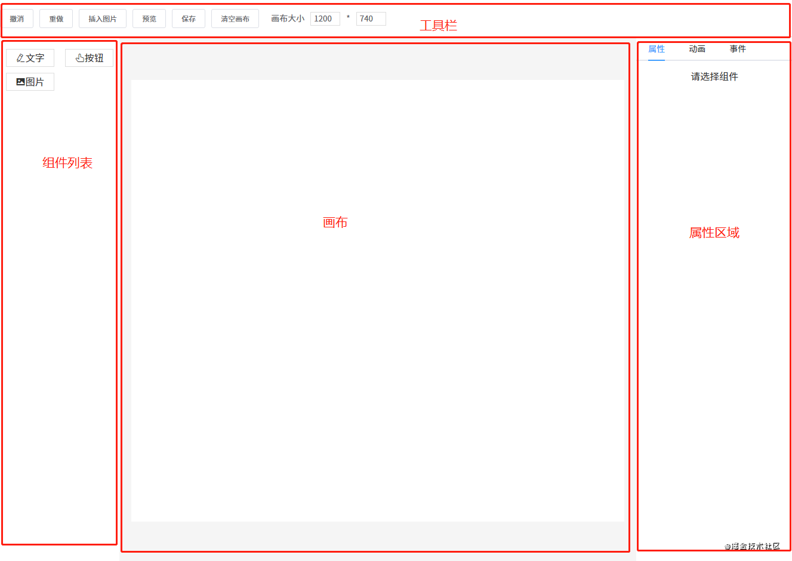

这一节要讲的编辑器其实就是中间的画布。它的作用是：当从左边组件列表拖拽出一个组件放到画布中时，画布要把这个组件渲染出来。

这个编辑器的实现思路是：

1. 用一个数组 `componentData` 维护编辑器中的数据。
2. 把组件拖拽到画布中时，使用 `push()` 方法将新的组件数据添加到 `componentData`。
3. 编辑器使用 `v-for` 指令遍历 `componentData`，将每个组件逐个渲染到画布（也可以使用 JSX 语法结合 `render()` 方法代替）。

编辑器渲染的核心代码如下所示：

```js
<component 
  v-for="item in componentData"
  :key="item.id"
  :is="item.component"
  :style="item.style"
  :propValue="item.propValue"
/>

```

每个组件数据大概是这样：

```js
{
    component: 'v-text', // 组件名称，需要提前注册到 Vue
    label: '文字', // 左侧组件列表中显示的名字
    propValue: '文字', // 组件所使用的值
    icon: 'el-icon-edit', // 左侧组件列表中显示的名字
    animations: [], // 动画列表
    events: {}, // 事件列表
    style: { // 组件样式
        width: 200,
        height: 33,
        fontSize: 14,
        fontWeight: 500,
        lineHeight: '',
        letterSpacing: 0,
        textAlign: '',
        color: '',
    },
}

```

在遍历 `componentData` 组件数据时，主要靠 `is` 属性来识别出真正要渲染的是哪个组件。

例如要渲染的组件数据是 `{ component: 'v-text' }`，则 `<component :is="item.component" />` 会被转换为 `<v-text />`。当然，你这个组件也要提前注册到 Vue 中。

如果你想了解更多 `is` 属性的资料，请查看[官方文档](https://cn.vuejs.org/v2/api/#is)。

## 2. 自定义组件

原则上使用第三方组件也是可以的，但建议你最好封装一下。不管是第三方组件还是自定义组件，每个组件所需的属性可能都不一样，所以每个组件数据可以暴露出一个属性 `propValue` 用于传递值。

例如 a 组件只需要一个属性，你的 `propValue` 可以这样写：`propValue: 'aaa'`。如果需要多个属性，`propValue` 则可以是一个对象：

```js
propValue: {
  a: 1,
  b: 'text'
}

```

在这个 DEMO 组件库中我定义了三个组件。

图片组件 `Picture`：

```html
<template>
    <div style="overflow: hidden">
        
    </div>
</template>

<script>
export default {
    props: {
        propValue: {
            type: String,
            require: true,
        },
    },
}
</script>

```

按钮组件 `VButton`:

```html
<template>
    <button class="v-button">{{ propValue }}</button>
</template>

<script>
export default {
    props: {
        propValue: {
            type: String,
            default: '',
        },
    },
}
</script>

```

文本组件 `VText`:

```js
<template>
    <textarea 
        v-if="editMode == 'edit'"
        :value="propValue"
        class="text textarea"
        @input="handleInput"
        ref="v-text"
    ></textarea>
    <div v-else class="text disabled">
        <div v-for="(text, index) in propValue.split('\n')" :key="index">{{ text }}</div>
    </div>
</template>

<script>
import { mapState } from 'vuex'

export default {
    props: {
        propValue: {
            type: String,
        },
        element: {
            type: Object,
        },
    },
    computed: mapState([
        'editMode',
    ]),
    methods: {
        handleInput(e) {
            this.$emit('input', this.element, e.target.value)
        },
    },
}
</script>

```

## 3. 拖拽

### 从组件列表到画布

一个元素如果要设为可拖拽，必须给它添加一个 `draggable` 属性。另外，在将组件列表中的组件拖拽到画布中，还有两个事件是起到关键作用的：

1. `dragstart` 事件，在拖拽刚开始时触发。它主要用于将拖拽的组件信息传递给画布。
2. `drop` 事件，在拖拽结束时触发。主要用于接收拖拽的组件信息。

先来看一下左侧组件列表的代码：

```html
<div @dragstart="handleDragStart" class="component-list">
    <div v-for="(item, index) in componentList" :key="index" class="list" draggable :data-index="index">
        <i :class="item.icon"></i>
        <span>{{ item.label }}</span>
    </div>
</div>

handleDragStart(e) {
    e.dataTransfer.setData('index', e.target.dataset.index)
}

```

可以看到给列表中的每一个组件都设置了 `draggable` 属性。另外，在触发 `dragstart` 事件时，使用 `dataTransfer.setData()` 传输数据。再来看一下接收数据的代码：

```html
<div class="content" @drop="handleDrop" @dragover="handleDragOver" @click="deselectCurComponent">
    <Editor />
</div>

handleDrop(e) {
    e.preventDefault()
    e.stopPropagation()
    const component = deepCopy(componentList[e.dataTransfer.getData('index')])
    this.$store.commit('addComponent', component)
}

```

触发 `drop` 事件时，使用 `dataTransfer.getData()` 接收传输过来的索引数据，然后根据索引找到对应的组件数据，再添加到画布，从而渲染组件。

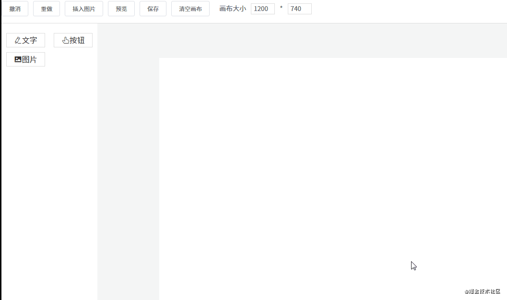

### 组件在画布中移动

首先需要将画布设为相对定位 `position: relative`，然后将每个组件设为绝对定位 `position: absolute`。除了这一点外，还要通过监听三个事件来进行移动：

1. `mousedown` 事件，在组件上按下鼠标时，记录组件当前的位置，即 xy 坐标（为了方便讲解，这里使用的坐标轴，实际上 xy 对应的是 css 中的 `left` 和 `top`。
2. `mousemove` 事件，每次鼠标移动时，都用当前最新的 xy 坐标减去最开始的 xy 坐标，从而计算出移动距离，再改变组件位置。
3. `mouseup` 事件，鼠标抬起时结束移动。

```js
handleMouseDown(e) {
    e.stopPropagation()
    this.$store.commit('setCurComponent', { component: this.element, zIndex: this.zIndex })

    const pos = { ...this.defaultStyle }
    const startY = e.clientY
    const startX = e.clientX
    // 如果直接修改属性，值的类型会变为字符串，所以要转为数值型
    const startTop = Number(pos.top)
    const startLeft = Number(pos.left)

    const move = (moveEvent) => {
        const currX = moveEvent.clientX
        const currY = moveEvent.clientY
        pos.top = currY - startY + startTop
        pos.left = currX - startX + startLeft
        // 修改当前组件样式
        this.$store.commit('setShapeStyle', pos)
    }

    const up = () => {
        document.removeEventListener('mousemove', move)
        document.removeEventListener('mouseup', up)
    }

    document.addEventListener('mousemove', move)
    document.addEventListener('mouseup', up)
}

```

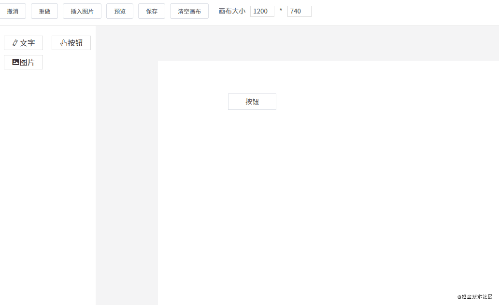

## 4. 删除组件、调整图层层级

### 改变图层层级

由于拖拽组件到画布中是有先后顺序的，所以可以按照数据顺序来分配图层层级。

例如画布新增了五个组件 abcde，那它们在画布数据中的顺序为 `[a, b, c, d, e]`，图层层级和索引一一对应，即它们的 `z-index` 属性值是 01234（后来居上）。用代码表示如下：

```html
<div v-for="(item, index) in componentData" :zIndex="index"></div>

```

如果不了解 `z-index` 属性的，请看一下 [MDN 文档](https://developer.mozilla.org/zh-CN/docs/Web/CSS/z-index)。

理解了这一点之后，改变图层层级就很容易做到了。改变图层层级，即是改变组件数据在 `componentData` 数组中的顺序。例如有 `[a, b, c]` 三个组件，它们的图层层级从低到高顺序为 abc（索引越大，层级越高）。

如果要将 b 组件上移，只需将它和 c 调换顺序即可：

```js
const temp = componentData[1]
componentData[1] = componentData[2]
componentData[2] = temp

```

同理，置顶置底也是一样，例如我要将 a 组件置顶，只需将 a 和最后一个组件调换顺序即可：

```js
const temp = componentData[0]
componentData[0] = componentData[componentData.lenght - 1]
componentData[componentData.lenght - 1] = temp

```


### 删除组件

删除组件非常简单，一行代码搞定：`componentData.splice(index, 1)`。

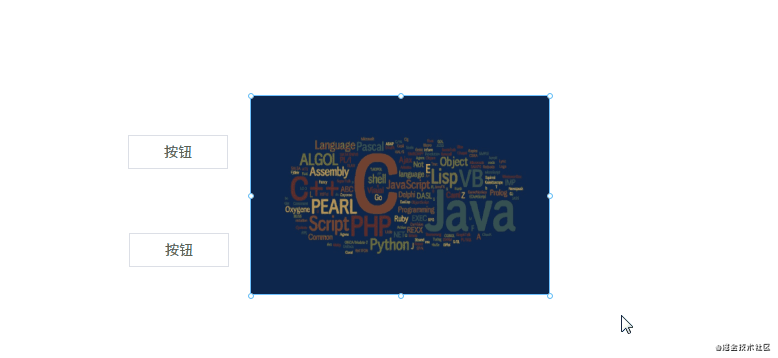

## 5. 放大缩小

细心的网友可能会发现，点击画布上的组件时，组件上会出现 8 个小圆点。这 8 个小圆点就是用来放大缩小用的。实现原理如下：

#### 1. 在每个组件外面包一层 `Shape` 组件，`Shape` 组件里包含 8 个小圆点和一个 `<slot>` 插槽，用于放置组件。

```html
<!--页面组件列表展示-->
<Shape v-for="(item, index) in componentData"
    :defaultStyle="item.style"
    :style="getShapeStyle(item.style, index)"
    :key="item.id"
    :active="item === curComponent"
    :element="item"
    :zIndex="index"
>
    <component
        class="component"
        :is="item.component"
        :style="getComponentStyle(item.style)"
        :propValue="item.propValue"
    />
</Shape>

```

`Shape` 组件内部结构：

```html
<template>
    <div class="shape" :class="{ active: this.active }" @click="selectCurComponent" @mousedown="handleMouseDown"
    @contextmenu="handleContextMenu">
        <div
            class="shape-point"
            v-for="(item, index) in (active? pointList : [])"
            @mousedown="handleMouseDownOnPoint(item)"
            :key="index"
            :style="getPointStyle(item)">
        </div>
        <slot></slot>
    </div>
</template>

```

#### 2. 点击组件时，将 8 个小圆点显示出来。

起作用的是这行代码 `:active="item === curComponent"`。

#### 3. 计算每个小圆点的位置。

先来看一下计算小圆点位置的代码：

```js
const pointList = ['t', 'r', 'b', 'l', 'lt', 'rt', 'lb', 'rb']

getPointStyle(point) {
    const { width, height } = this.defaultStyle
    const hasT = /t/.test(point)
    const hasB = /b/.test(point)
    const hasL = /l/.test(point)
    const hasR = /r/.test(point)
    let newLeft = 0
    let newTop = 0

    // 四个角的点
    if (point.length === 2) {
        newLeft = hasL? 0 : width
        newTop = hasT? 0 : height
    } else {
        // 上下两点的点，宽度居中
        if (hasT || hasB) {
            newLeft = width / 2
            newTop = hasT? 0 : height
        }

        // 左右两边的点，高度居中
        if (hasL || hasR) {
            newLeft = hasL? 0 : width
            newTop = Math.floor(height / 2)
        }
    }

    const style = {
        marginLeft: hasR? '-4px' : '-3px',
        marginTop: '-3px',
        left: `${newLeft}px`,
        top: `${newTop}px`,
        cursor: point.split('').reverse().map(m => this.directionKey[m]).join('') + '-resize',
    }

    return style
}

```

计算小圆点的位置需要获取一些信息：

- 组件的高度 `height`、宽度 `width`

注意，小圆点也是绝对定位的，相对于 `Shape` 组件。所以有四个小圆点的位置很好确定：

1. 左上角的小圆点，坐标 `left: 0, top: 0`
2. 右上角的小圆点，坐标 `left: width, top: 0`
3. 左下角的小圆点，坐标 `left: 0, top: height`
4. 右下角的小圆点，坐标 `left: width, top: height`

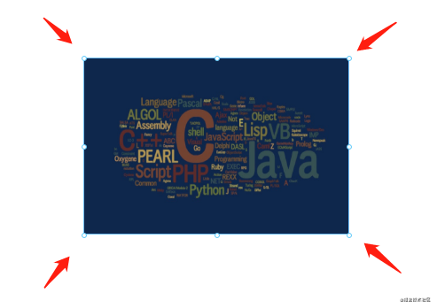

另外的四个小圆点需要通过计算间接算出来。例如左边中间的小圆点，计算公式为 `left: 0, top: height / 2`，其他小圆点同理。


#### 4. 点击小圆点时，可以进行放大缩小操作。

```js
handleMouseDownOnPoint(point) {
    const downEvent = window.event
    downEvent.stopPropagation()
    downEvent.preventDefault()

    const pos = { ...this.defaultStyle }
    const height = Number(pos.height)
    const width = Number(pos.width)
    const top = Number(pos.top)
    const left = Number(pos.left)
    const startX = downEvent.clientX
    const startY = downEvent.clientY

    // 是否需要保存快照
    let needSave = false
    const move = (moveEvent) => {
        needSave = true
        const currX = moveEvent.clientX
        const currY = moveEvent.clientY
        const disY = currY - startY
        const disX = currX - startX
        const hasT = /t/.test(point)
        const hasB = /b/.test(point)
        const hasL = /l/.test(point)
        const hasR = /r/.test(point)
        const newHeight = height + (hasT? -disY : hasB? disY : 0)
        const newWidth = width + (hasL? -disX : hasR? disX : 0)
        pos.height = newHeight > 0? newHeight : 0
        pos.width = newWidth > 0? newWidth : 0
        pos.left = left + (hasL? disX : 0)
        pos.top = top + (hasT? disY : 0)
        this.$store.commit('setShapeStyle', pos)
    }

    const up = () => {
        document.removeEventListener('mousemove', move)
        document.removeEventListener('mouseup', up)
        needSave && this.$store.commit('recordSnapshot')
    }

    document.addEventListener('mousemove', move)
    document.addEventListener('mouseup', up)
}

```

它的原理是这样的：

1. 点击小圆点时，记录点击的坐标 xy。
2. 假设我们现在向下拖动，那么 y 坐标就会增大。
3. 用新的 y 坐标减去原来的 y 坐标，就可以知道在纵轴方向的移动距离是多少。
4. 最后再将移动距离加上原来组件的高度，就可以得出新的组件高度。
5. 如果是正数，说明是往下拉，组件的高度在增加。如果是负数，说明是往上拉，组件的高度在减少。


## 6. 撤消、重做

撤销重做的实现原理其实挺简单的，先看一下代码：

```js
snapshotData: [], // 编辑器快照数据
snapshotIndex: -1, // 快照索引
        
undo(state) {
    if (state.snapshotIndex >= 0) {
        state.snapshotIndex--
        store.commit('setComponentData', deepCopy(state.snapshotData[state.snapshotIndex]))
    }
},

redo(state) {
    if (state.snapshotIndex < state.snapshotData.length - 1) {
        state.snapshotIndex++
        store.commit('setComponentData', deepCopy(state.snapshotData[state.snapshotIndex]))
    }
},

setComponentData(state, componentData = []) {
    Vue.set(state, 'componentData', componentData)
},

recordSnapshot(state) {
    // 添加新的快照
    state.snapshotData[++state.snapshotIndex] = deepCopy(state.componentData)
    // 在 undo 过程中，添加新的快照时，要将它后面的快照清理掉
    if (state.snapshotIndex < state.snapshotData.length - 1) {
        state.snapshotData = state.snapshotData.slice(0, state.snapshotIndex + 1)
    }
},

```

用一个数组来保存编辑器的快照数据。保存快照就是不停地执行 `push()` 操作，将当前的编辑器数据推入 `snapshotData` 数组，并增加快照索引 `snapshotIndex`。目前以下几个动作会触发保存快照操作：

- 新增组件
- 删除组件
- 改变图层层级
- 拖动组件结束时

...

#### 撤销

假设现在 `snapshotData` 保存了 4 个快照。即 `[a, b, c, d]`，对应的快照索引为 3。如果这时进行了撤销操作，我们需要将快照索引减 1，然后将对应的快照数据赋值给画布。

例如当前画布数据是 d，进行撤销后，索引 -1，现在画布的数据是 c。

#### 重做

明白了撤销，那重做就很好理解了，就是将快照索引加 1，然后将对应的快照数据赋值给画布。

不过还有一点要注意，就是在撤销操作中进行了新的操作，要怎么办呢？有两种解决方案：

1. 新操作替换当前快照索引后面所有的数据。还是用刚才的数据 `[a, b, c, d]` 举例，假设现在进行了两次撤销操作，快照索引变为 1，对应的快照数据为 b，如果这时进行了新的操作，对应的快照数据为 e。那 e 会把 cd 顶掉，现在的快照数据为 `[a, b, e]`。
2. 不顶掉数据，在原来的快照中新增一条记录。用刚才的例子举例，e 不会把 cd 顶掉，而是在 cd 之前插入，即快照数据变为 `[a, b, e, c, d]`。

我采用的是第一种方案。

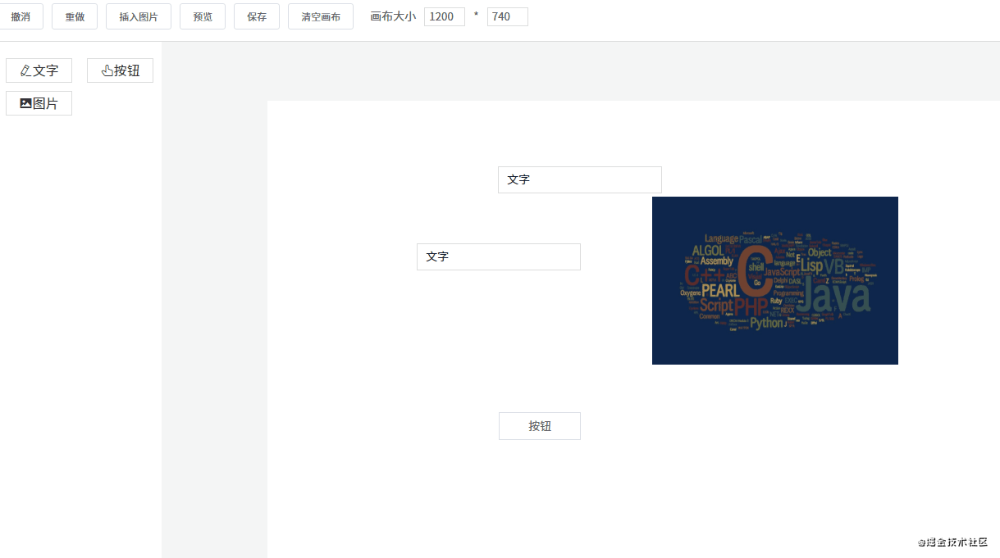

## 7. 吸附

什么是吸附？就是在拖拽组件时，如果它和另一个组件的距离比较接近，就会自动吸附在一起。

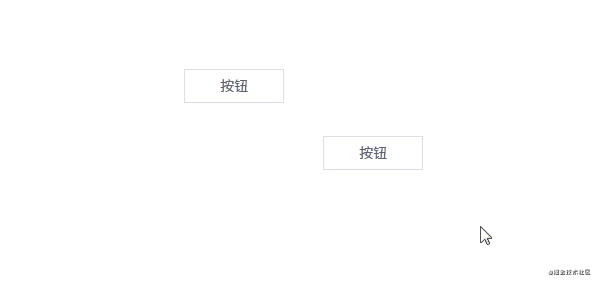

吸附的代码大概在 300 行左右，建议自己打开源码文件看（文件路径：`src\components\Editor\MarkLine.vue`）。这里不贴代码了，主要说说原理是怎么实现的。

### 标线

在页面上创建 6 条线，分别是三横三竖。这 6 条线的作用是对齐，它们什么时候会出现呢？

1. 上下方向的两个组件左边、中间、右边对齐时会出现竖线
2. 左右方向的两个组件上边、中间、下边对齐时会出现横线

具体的计算公式主要是根据每个组件的 xy 坐标和宽度高度进行计算的。例如要判断 ab 两个组件的左边是否对齐，则要知道它们每个组件的 x 坐标；如果要知道它们右边是否对齐，除了要知道 x 坐标，还要知道它们各自的宽度。

```js
// 左对齐的条件
a.x == b.x

// 右对齐的条件
a.x + a.width == b.x + b.width

```

在对齐的时候，显示标线。

另外还要判断 ab 两个组件是否“足够”近。如果足够近，就吸附在一起。是否足够近要靠一个变量来判断：

```js
diff: 3, // 相距 dff 像素将自动吸附

```

小于等于 `diff` 像素则自动吸附。

### 吸附

**吸附效果是怎么实现的呢？**

假设现在有 ab 组件，a 组件坐标 xy 都是 0，宽高都是 100。现在假设 a 组件不动，我们正在拖拽 b 组件。当把 b 组件拖到坐标为 `x: 0, y: 103` 时，由于 `103 - 100 <= 3(diff)`，所以可以判定它们已经接近得足够近。这时需要手动将 b 组件的 y 坐标值设为 100，这样就将 ab 组件吸附在一起了。

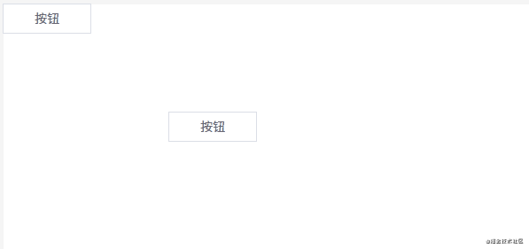

### 优化

在拖拽时如果 6 条标线都显示出来会不太美观。所以我们可以做一下优化，在纵横方向上最多只同时显示一条线。实现原理如下：

1. a 组件在左边不动，我们拖着 b 组件往 a 组件靠近。
2. 这时它们最先对齐的是 a 的右边和 b 的左边，所以只需要一条线就够了。
3. 如果 ab 组件已经靠近，并且 b 组件继续往左边移动，这时就要判断它们俩的中间是否对齐。
4. b 组件继续拖动，这时需要判断 a 组件的左边和 b 组件的右边是否对齐，也是只需要一条线。

可以发现，关键的地方是我们要知道两个组件的方向。即 ab 两个组件靠近，我们要知道到底 b 是在 a 的左边还是右边。

这一点可以通过鼠标移动事件来判断，之前在讲解拖拽的时候说过，`mousedown` 事件触发时会记录起点坐标。所以每次触发 `mousemove` 事件时，用当前坐标减去原来的坐标，就可以判断组件方向。例如 x 方向上，如果 `b.x - a.x` 的差值为正，说明是 b 在 a 右边，否则为左边。

```js
// 触发元素移动事件，用于显示标线、吸附功能
// 后面两个参数代表鼠标移动方向
// currY - startY > 0 true 表示向下移动 false 表示向上移动
// currX - startX > 0 true 表示向右移动 false 表示向左移动
eventBus.$emit('move', this.$el, currY - startY > 0, currX - startX > 0)

```


## 8. 组件属性设置

每个组件都有一些通用属性和独有的属性，我们需要提供一个能显示和修改属性的地方。

```js
// 每个组件数据大概是这样
{
    component: 'v-text', // 组件名称，需要提前注册到 Vue
    label: '文字', // 左侧组件列表中显示的名字
    propValue: '文字', // 组件所使用的值
    icon: 'el-icon-edit', // 左侧组件列表中显示的名字
    animations: [], // 动画列表
    events: {}, // 事件列表
    style: { // 组件样式
        width: 200,
        height: 33,
        fontSize: 14,
        fontWeight: 500,
        lineHeight: '',
        letterSpacing: 0,
        textAlign: '',
        color: '',
    },
}

```

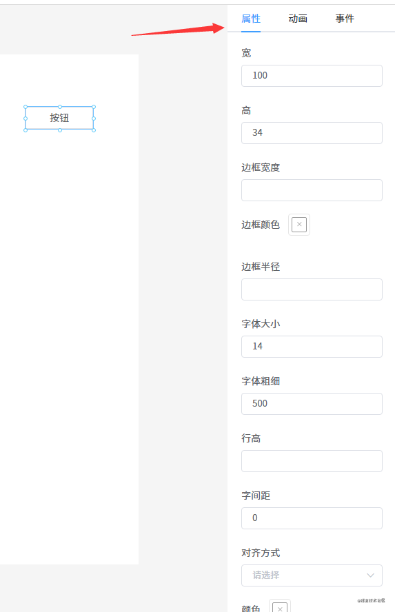

我定义了一个 `AttrList` 组件，用于显示每个组件的属性。

```html
<template>
    <div class="attr-list">
        <el-form>
            <el-form-item v-for="(key, index) in styleKeys" :key="index" :label="map[key]">
                <el-color-picker v-if="key == 'borderColor'" v-model="curComponent.style[key]"></el-color-picker>
                <el-color-picker v-else-if="key == 'color'" v-model="curComponent.style[key]"></el-color-picker>
                <el-color-picker v-else-if="key == 'backgroundColor'" v-model="curComponent.style[key]"></el-color-picker>
                <el-select v-else-if="key == 'textAlign'" v-model="curComponent.style[key]">
                    <el-option
                        v-for="item in options"
                        :key="item.value"
                        :label="item.label"
                        :value="item.value"
                    ></el-option>
                </el-select>
                <el-input type="number" v-else v-model="curComponent.style[key]" />
            </el-form-item>
            <el-form-item label="内容" v-if="curComponent && curComponent.propValue && !excludes.includes(curComponent.component)">
                <el-input type="textarea" v-model="curComponent.propValue" />
            </el-form-item>
        </el-form>
    </div>
</template>

```

代码逻辑很简单，就是遍历组件的 `style` 对象，将每一个属性遍历出来。并且需要根据具体的属性用不同的组件显示出来，例如颜色属性，需要用颜色选择器显示；数值类的属性需要用 `type=number` 的 input 组件显示等等。

为了方便用户修改属性值，我使用 `v-model` 将组件和值绑定在一起。

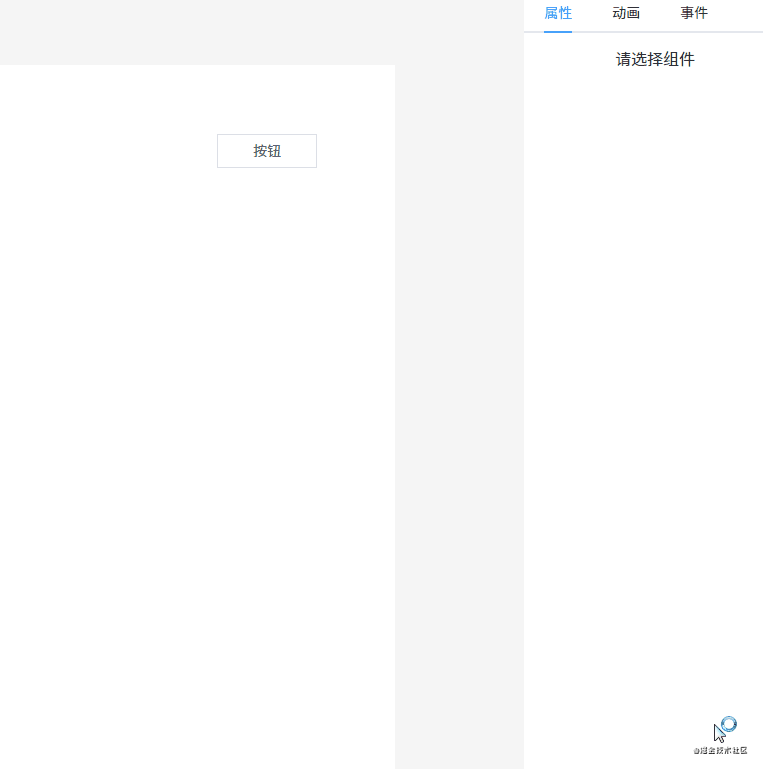

## 9. 预览、保存代码

预览和编辑的渲染原理是一样的，区别是不需要编辑功能。所以只需要将原先渲染组件的代码稍微改一下就可以了。

```html
<!--页面组件列表展示-->
<Shape v-for="(item, index) in componentData"
    :defaultStyle="item.style"
    :style="getShapeStyle(item.style, index)"
    :key="item.id"
    :active="item === curComponent"
    :element="item"
    :zIndex="index"
>
    <component
        class="component"
        :is="item.component"
        :style="getComponentStyle(item.style)"
        :propValue="item.propValue"
    />
</Shape>

```

经过刚才的介绍，我们知道 `Shape` 组件具备了拖拽、放大缩小的功能。现在只需要将 `Shape` 组件去掉，外面改成套一个普通的 DIV 就可以了（其实不用这个 DIV 也行，但为了绑定事件这个功能，所以需要加上）。

```html
<!--页面组件列表展示-->
<div v-for="(item, index) in componentData" :key="item.id">
    <component
        class="component"
        :is="item.component"
        :style="getComponentStyle(item.style)"
        :propValue="item.propValue"
    />
</div>

```

保存代码的功能也特别简单，只需要保存画布上的数据 `componentData` 即可。保存有两种选择：

1. 保存到服务器
2. 本地保存

在 DEMO 上我使用的 `localStorage` 保存在本地。

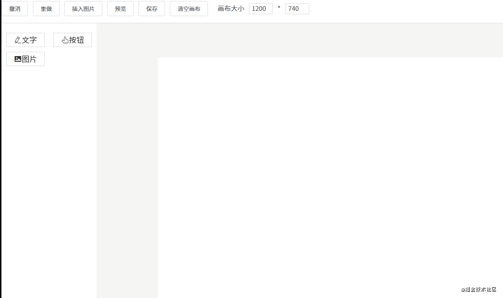

## 10. 绑定事件

每个组件有一个 `events` 对象，用于存储绑定的事件。目前我只定义了两个事件：

- alert 事件
- redirect 事件

```js
// 编辑器自定义事件
const events = {
    redirect(url) {
        if (url) {
            window.location.href = url
        }
    },

    alert(msg) {
        if (msg) {
            alert(msg)
        }
    },
}

const mixins = {
    methods: events,
}

const eventList = [
    {
        key: 'redirect',
        label: '跳转事件',
        event: events.redirect,
        param: '',
    },
    {
        key: 'alert',
        label: 'alert 事件',
        event: events.alert,
        param: '',
    },
]

export {
    mixins,
    events,
    eventList,
}

```

不过不能在编辑的时候触发，可以在预览的时候触发。


### 添加事件

通过 `v-for` 指令将事件列表渲染出来：

```html
<el-tabs v-model="eventActiveName">
    <el-tab-pane v-for="item in eventList" :key="item.key" :label="item.label" :name="item.key" style="padding: 0 20px">
        <el-input v-if="item.key == 'redirect'" v-model="item.param" type="textarea" placeholder="请输入完整的 URL" />
        <el-input v-if="item.key == 'alert'" v-model="item.param" type="textarea" placeholder="请输入要 alert 的内容" />
        <el-button style="margin-top: 20px;" @click="addEvent(item.key, item.param)">确定</el-button>
    </el-tab-pane>
</el-tabs>

```

选中事件时将事件添加到组件的 `events` 对象。

### 触发事件

预览或真正渲染页面时，也需要在每个组件外面套一层 DIV，这样就可以在 DIV 上绑定一个点击事件，点击时触发我们刚才添加的事件。

```html
<template>
    <div @click="handleClick">
        <component
            class="conponent"
            :is="config.component"
            :style="getStyle(config.style)"
            :propValue="config.propValue"
        />
    </div>
</template>

handleClick() {
    const events = this.config.events
    // 循环触发绑定的事件
    Object.keys(events).forEach(event => {
        this[event](events[event])
    })
}

```

## 11. 绑定动画

动画和事件的原理是一样的，先将所有的动画通过 `v-for` 指令渲染出来，然后点击动画将对应的动画添加到组件的 `animations` 数组里。同事件一样，执行的时候也是遍历组件所有的动画并执行。

为了方便，我们使用了 [animate.css](https://animate.style/) 动画库。

```js
// main.js
import '@/styles/animate.css'

```

现在我们提前定义好所有的动画数据：

```js
export default [
    {
        label: '进入',
        children: [
            { label: '渐显', value: 'fadeIn' },
            { label: '向右进入', value: 'fadeInLeft' },
            { label: '向左进入', value: 'fadeInRight' },
            { label: '向上进入', value: 'fadeInUp' },
            { label: '向下进入', value: 'fadeInDown' },
            { label: '向右长距进入', value: 'fadeInLeftBig' },
            { label: '向左长距进入', value: 'fadeInRightBig' },
            { label: '向上长距进入', value: 'fadeInUpBig' },
            { label: '向下长距进入', value: 'fadeInDownBig' },
            { label: '旋转进入', value: 'rotateIn' },
            { label: '左顺时针旋转', value: 'rotateInDownLeft' },
            { label: '右逆时针旋转', value: 'rotateInDownRight' },
            { label: '左逆时针旋转', value: 'rotateInUpLeft' },
            { label: '右逆时针旋转', value: 'rotateInUpRight' },
            { label: '弹入', value: 'bounceIn' },
            { label: '向右弹入', value: 'bounceInLeft' },
            { label: '向左弹入', value: 'bounceInRight' },
            { label: '向上弹入', value: 'bounceInUp' },
            { label: '向下弹入', value: 'bounceInDown' },
            { label: '光速从右进入', value: 'lightSpeedInRight' },
            { label: '光速从左进入', value: 'lightSpeedInLeft' },
            { label: '光速从右退出', value: 'lightSpeedOutRight' },
            { label: '光速从左退出', value: 'lightSpeedOutLeft' },
            { label: 'Y轴旋转', value: 'flip' },
            { label: '中心X轴旋转', value: 'flipInX' },
            { label: '中心Y轴旋转', value: 'flipInY' },
            { label: '左长半径旋转', value: 'rollIn' },
            { label: '由小变大进入', value: 'zoomIn' },
            { label: '左变大进入', value: 'zoomInLeft' },
            { label: '右变大进入', value: 'zoomInRight' },
            { label: '向上变大进入', value: 'zoomInUp' },
            { label: '向下变大进入', value: 'zoomInDown' },
            { label: '向右滑动展开', value: 'slideInLeft' },
            { label: '向左滑动展开', value: 'slideInRight' },
            { label: '向上滑动展开', value: 'slideInUp' },
            { label: '向下滑动展开', value: 'slideInDown' },
        ],
    },
    {
        label: '强调',
        children: [
            { label: '弹跳', value: 'bounce' },
            { label: '闪烁', value: 'flash' },
            { label: '放大缩小', value: 'pulse' },
            { label: '放大缩小弹簧', value: 'rubberBand' },
            { label: '左右晃动', value: 'headShake' },
            { label: '左右扇形摇摆', value: 'swing' },
            { label: '放大晃动缩小', value: 'tada' },
            { label: '扇形摇摆', value: 'wobble' },
            { label: '左右上下晃动', value: 'jello' },
            { label: 'Y轴旋转', value: 'flip' },
        ],
    },
    {
        label: '退出',
        children: [
            { label: '渐隐', value: 'fadeOut' },
            { label: '向左退出', value: 'fadeOutLeft' },
            { label: '向右退出', value: 'fadeOutRight' },
            { label: '向上退出', value: 'fadeOutUp' },
            { label: '向下退出', value: 'fadeOutDown' },
            { label: '向左长距退出', value: 'fadeOutLeftBig' },
            { label: '向右长距退出', value: 'fadeOutRightBig' },
            { label: '向上长距退出', value: 'fadeOutUpBig' },
            { label: '向下长距退出', value: 'fadeOutDownBig' },
            { label: '旋转退出', value: 'rotateOut' },
            { label: '左顺时针旋转', value: 'rotateOutDownLeft' },
            { label: '右逆时针旋转', value: 'rotateOutDownRight' },
            { label: '左逆时针旋转', value: 'rotateOutUpLeft' },
            { label: '右逆时针旋转', value: 'rotateOutUpRight' },
            { label: '弹出', value: 'bounceOut' },
            { label: '向左弹出', value: 'bounceOutLeft' },
            { label: '向右弹出', value: 'bounceOutRight' },
            { label: '向上弹出', value: 'bounceOutUp' },
            { label: '向下弹出', value: 'bounceOutDown' },
            { label: '中心X轴旋转', value: 'flipOutX' },
            { label: '中心Y轴旋转', value: 'flipOutY' },
            { label: '左长半径旋转', value: 'rollOut' },
            { label: '由小变大退出', value: 'zoomOut' },
            { label: '左变大退出', value: 'zoomOutLeft' },
            { label: '右变大退出', value: 'zoomOutRight' },
            { label: '向上变大退出', value: 'zoomOutUp' },
            { label: '向下变大退出', value: 'zoomOutDown' },
            { label: '向左滑动收起', value: 'slideOutLeft' },
            { label: '向右滑动收起', value: 'slideOutRight' },
            { label: '向上滑动收起', value: 'slideOutUp' },
            { label: '向下滑动收起', value: 'slideOutDown' },
        ],
    },
]

```

然后用 `v-for` 指令渲染出来动画列表。


### 添加动画

```html
<el-tabs v-model="animationActiveName">
    <el-tab-pane v-for="item in animationClassData" :key="item.label" :label="item.label" :name="item.label">
        <el-scrollbar class="animate-container">
            <div
                class="animate"
                v-for="(animate, index) in item.children"
                :key="index"
                @mouseover="hoverPreviewAnimate = animate.value"
                @click="addAnimation(animate)"
            >
                <div :class="[hoverPreviewAnimate === animate.value && animate.value + ' animated']">
                    {{ animate.label }}
                </div>
            </div>
        </el-scrollbar>
    </el-tab-pane>
</el-tabs>

```

点击动画将调用 `addAnimation(animate)` 将动画添加到组件的 `animations` 数组。

### 触发动画

运行动画的代码：

```js
export default async function runAnimation($el, animations = []) {
    const play = (animation) => new Promise(resolve => {
        $el.classList.add(animation.value, 'animated')
        const removeAnimation = () => {
            $el.removeEventListener('animationend', removeAnimation)
            $el.removeEventListener('animationcancel', removeAnimation)
            $el.classList.remove(animation.value, 'animated')
            resolve()
        }
            
        $el.addEventListener('animationend', removeAnimation)
        $el.addEventListener('animationcancel', removeAnimation)
    })

    for (let i = 0, len = animations.length; i < len; i++) {
        await play(animations[i])
    }
}

```

运行动画需要两个参数：组件对应的 DOM 元素（在组件使用 `this.$el` 获取）和它的动画数据 `animations`。并且需要监听 `animationend` 事件和 `animationcancel` 事件：一个是动画结束时触发，一个是动画意外终止时触发。

利用这一点再配合 `Promise` 一起使用，就可以逐个运行组件的每个动画了。

## 12. 导入 PSD

由于时间关系，这个功能我还没做。现在简单的描述一下怎么做这个功能。那就是使用 [psd.js](https://github.com/meltingice/psd.js#readme) 库，它可以解析 PSD 文件。

使用 `psd` 库解析 PSD 文件得出的数据如下：

```js
{ children: 
   [ { type: 'group',
       visible: false,
       opacity: 1,
       blendingMode: 'normal',
       name: 'Version D',
       left: 0,
       right: 900,
       top: 0,
       bottom: 600,
       height: 600,
       width: 900,
       children: 
        [ { type: 'layer',
            visible: true,
            opacity: 1,
            blendingMode: 'normal',
            name: 'Make a change and save.',
            left: 275,
            right: 636,
            top: 435,
            bottom: 466,
            height: 31,
            width: 361,
            mask: {},
            text: 
             { value: 'Make a change and save.',
               font: 
                { name: 'HelveticaNeue-Light',
                  sizes: [ 33 ],
                  colors: [ [ 85, 96, 110, 255 ] ],
                  alignment: [ 'center' ] },
               left: 0,
               top: 0,
               right: 0,
               bottom: 0,
               transform: { xx: 1, xy: 0, yx: 0, yy: 1, tx: 456, ty: 459 } },
            image: {} } ] } ],
    document: 
       { width: 900,
         height: 600,
         resources: 
          { layerComps: 
             [ { id: 692243163, name: 'Version A', capturedInfo: 1 },
               { id: 725235304, name: 'Version B', capturedInfo: 1 },
               { id: 730932877, name: 'Version C', capturedInfo: 1 } ],
            guides: [],
            slices: [] } } }

```

从以上代码可以发现，这些数据和 css 非常像。根据这一点，只需要写一个转换函数，将这些数据转换成我们组件所需的数据，就能实现 PSD 文件转成渲染组件的功能。目前 [quark-h5](https://github.com/huangwei9527/quark-h5) 和 [luban-h5](https://github.com/ly525/luban-h5) 都是这样实现的 PSD 转换功能。

## 13. 手机模式

由于画布是可以调整大小的，我们可以使用 iphone6 的分辨率来开发手机页面。

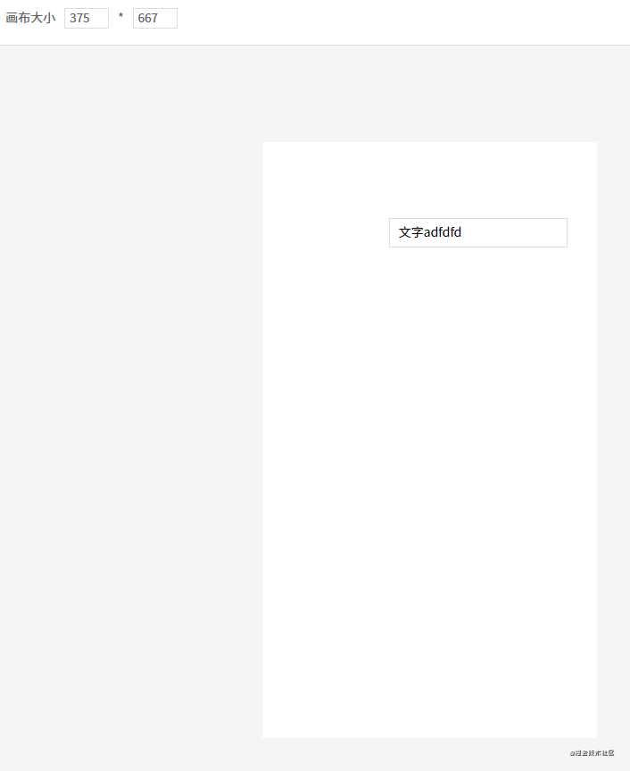

这样开发出来的页面也可以在手机下正常浏览，但可能会有样式偏差。因为我自定义的三个组件是没有做适配的，如果你需要开发手机页面，那自定义组件必须使用移动端的 UI 组件库。或者自己开发移动端专用的自定义组件。
